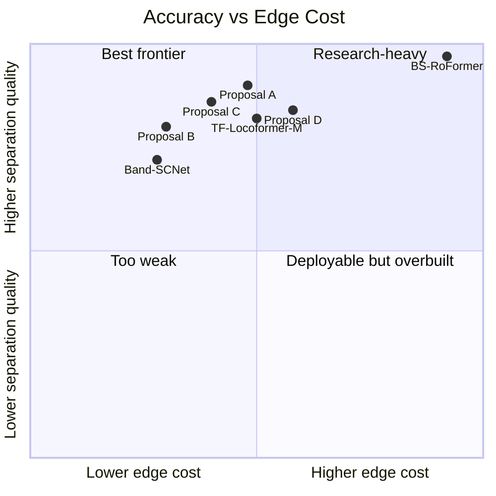
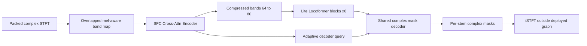

# Edge-Ready State-of-the-Art Audio Source Separation Models and Design Proposals

## Executive summary

The current literature does **not** offer a single model that is simultaneously the absolute state of the art on separation quality, comfortably small in parameters and GMACs, and already proven for strict edge real-time deployment across **music**, **speech**, and **cinematic/general audio** source separation. Instead, the frontier is split. For **music source separation**, the best reported quality is still in the **BS-RoFormer / Mel-Band RoFormer / strong Demucs-family** regime, which is very difficult to deploy on small edge devices. For **speech separation**, the strongest reported 2024-era results come from **SepReformer**, **MossFormer2**, and **TF-Locoformer**, with TF-Locoformer offering the cleanest quality-to-complexity tradeoff among the papers I found. For **real-time music separation**, **Band-SCNet** is the clearest paper-backed compromise: causal, 2.59M parameters, 17.59 G/s, 92 ms latency, and 7.79 dB SDR on MUSDB18-HQ. For **multi-task/unified separation**, **TUSS**, **FasTUSS**, and especially **SFC** are the most important recent developments because they point to a way of keeping quality high while reducing full-frequency modeling cost. citeturn26view4turn28view2turn28view3turn30view3turn30view4turn26view3turn26view2turn27view2

For your specific repository, the strongest base to build on is **not** the smallest NPU-first models. The most promising path is the combination already visible in the repo: **`spectral_feature_compression`** for adaptive compression, **TF-Locoformer-style** separators, and the stronger **BandSFCNetNPU** design direction. By contrast, the repo explicitly marks **EdgeFusionNPU** as a *deployment-first scaffold* rather than a trained checkpoint, and **BandSCNetNPU**’s quality-comparison file still has results marked **TBD**, which strongly suggests that those very small models are better treated as engineering baselines than as likely SOTA-quality candidates. citeturn35view0turn13view3turn14view0turn36view0

My overall recommendation is therefore straightforward. If your priority is **best expected separation quality while still remaining moderate enough for edge deployment**, the highest-probability architecture family is:

1. **Adaptive Mel-SFC Locoformer-Lite** as the main research target.
2. **Causal BandSFC-CNB** as the strict-streaming / NPU-safe target.
3. **Sparse U-Net Mel-SFC** as the music-first backup if you can tolerate chunked rather than fully frame-synchronous inference.
4. **Prompted Asymmetric SFC** if you need one model that can span speech, music, effects, and future query-based separation. citeturn27view5turn22search4turn26view4turn24search0turn31view0

## What the recent literature actually says

A useful way to read the 2022–2026 literature is to separate it into three threads. The first is **absolute-quality models**, where larger RoFormer- and Demucs-family systems dominate music MSS. The second is **quality-efficient TF dual-path models**, where speech separation has moved toward stronger time-frequency modeling with either attention plus local convolution or hybrid recurrent-free structures. The third is **deployment-aware compressed-band modeling**, where the key idea is to stop processing the full 44.1 kHz spectrogram densely and instead compress frequency information first, then spend modeling capacity on the compressed representation. The 2025 review paper is broadly consistent with that framing and also emphasizes that modern source separation has shifted from simple masking toward dual-/multi-path architectures, complex-domain modeling, and task-specific dataset/metric ecosystems. citeturn34view0turn27view5turn27view6turn28view3turn30view3

For datasets, the core benchmarks remain stable. **MUSDB18** contains 150 stereo music tracks at 44.1 kHz with 100 train and 50 test songs, and remains the standard four-stem MSS benchmark. **DnR** is the canonical speech/music/effects benchmark for cinematic audio source separation. **FUSS** provides arbitrary open-domain sound mixtures and is still the reference for universal sound separation. **DNS** remains the main speech-enhancement / robustness challenge family, while speech-separation papers still commonly use **WSJ0-2mix**, **WSJ0-3mix**, **Libri2Mix**, and **WHAM!/WHAMR!**. Across these tasks, music papers still lean heavily on **SDR/uSDR/cSDR**, while speech papers more often report **SI-SDRi / SI-SNRi**, and noisy-speech papers sometimes add **PESQ** and **STOI**. citeturn21search1turn21search2turn24academia21turn21search13turn21search29turn28view3turn30view3turn30view0

### Selected paper-backed frontier models

| Model | Year | Task / dataset | Representative reported result | Params | Compute / latency | Why it matters for your problem | Sources |
|---|---:|---|---|---:|---|---|---|
| Conv-TasNet | 2019 baseline used in later comparisons | Speech, WSJ0-2mix / Libri2Mix | 15.3 dB SI-SDRi on WSJ0-2mix; 14.7 dB on Libri2Mix | 5.1M | not reported in the cited tables | Still the canonical efficient time-domain baseline; useful lower bound on quality/size | citeturn30view3turn29view2 |
| DPRNN | 2020 baseline used in later comparisons | Speech, WSJ0-2mix | 18.8 dB SI-SDRi | 2.6M | not reported in the cited table | Very strong efficiency baseline; dual-path idea remains foundational | citeturn30view3 |
| MossFormer2 | 2024 | Speech, WSJ0-2mix / Libri2Mix / WHAMR! | 24.1 dB SI-SDRi on WSJ0-2mix; 21.7 on Libri2Mix; 17.0 / – on WHAMR! SI-SNRi / SDRi | 55.7M | RTF 0.053 on WSJ0-2mix test; compute not reported in that paper | Excellent quality, but already drifting out of “moderate” edge territory | citeturn30view3turn29view2 |
| TF-Locoformer (M) | 2024 | Speech / noisy speech, Libri2Mix / DNS2020 / WHAMR! | 22.1 dB SI-SNRi and 22.2 dB SDRi on Libri2Mix; 23.3 SI-SNR, 98.8 STOI, 3.72 PESQ-WB on DNS2020; 18.5 / 16.9 on WHAMR! | 15.0M | not given as GMACs in paper; clearly smaller than MossFormer2 and well below SepReformer-L | The cleanest modern speech-separation compromise between performance and moderate size | citeturn29view2turn28view3 |
| SepReformer-L | 2024 | Speech, WSJ0-2mix / WHAM! / WHAMR! | 25.4 dB SI-SNRi on WSJ0-2mix; 18.4 / 18.7 on WHAM!; 17.2 / 16.0 on WHAMR! | 59.4M | 155.5 G/s | Absolute-quality speech model, but far beyond the cost regime you want for edge | citeturn30view4 |
| BSRNN + fine-tuning | 2022 | Music, MUSDB18-HQ | 8.97 all-stem cSDR on MUSDB18-HQ after fine-tuning | not reported in the cited table | not reported | The key band-split baseline that inspired much of the 2023–2026 frontier | citeturn30view0 |
| HT Demucs, sparse fine-tuned | 2022 | Music, MUSDB-HQ with 800 extra songs | 9.20 dB average SDR | not reported in cited table | not reported | Strong quality benchmark, but not edge-oriented | citeturn28view2turn23search10 |
| SCNet | 2024 | Music, MUSDB18-HQ | 9.00 dB average SDR | 10.08M | not reported in the original abstract; later comparison tables cite it as the non-causal parent of Band-SCNet | Important because it shows sparse compression is a real quality-saving efficiency move | citeturn27view6turn26view4 |
| BS-RoFormer | 2023 | Music, MUSDB18HQ / SDX’23 | 9.80 dB average SDR on MUSDB18HQ without extra data for a smaller benchmarked version; first place in SDX’23 with 500 extra songs | later literature describes 72.2M parameters for a single-stem model | heavy; not edge friendly | This is the quality target you are implicitly chasing, but not the architecture budget you want | citeturn28view1turn23search4 |
| Band-SCNet | 2025 | Real-time music, MUSDB18-HQ | 7.79 dB SDR | 2.59M | 17.59 G/s, 92 ms latency | Best explicit paper-backed real-time MSS compromise in the scanned literature | citeturn26view4 |

### Recent papers that matter even when the abstract does not expose a full metric table

| Paper / model | Why it matters | What the paper explicitly claims | Sources |
|---|---|---|---|
| Mel-Band RoFormer | Best evidence that **overlapped perceptual / mel-style bands** improve over heuristic fixed non-overlapping splits | On MUSDB18HQ, it outperforms BS-RoFormer on vocals, drums, and other stems | citeturn27view8 |
| BandIt | Best paper-backed CASS family to learn from when targeting speech/music/effects | Its best model sets SOTA on DnR and exceeds the ideal ratio mask for dialogue | citeturn27view7turn24search2 |
| TUSS | Strongest recent unified separation design for one model across multiple contradictory tasks | Uses prompts to cover SE, SS, USS, MSS, and CASS; medium and large models have 11.1M and 38.2M params | citeturn31view0turn31view2 |
| FasTUSS | Best explicit operations-vs-performance optimization paper for unified TF source separation | 8.3G and 11.7G variants reduce operations by 81% and 73%, with only 1.2 dB and 0.4 dB average performance drops | citeturn27view2turn27view3 |
| SFC | The single most relevant 2026 development for your repo because it attacks the cost of the frequency axis directly | Cross-attention and Mamba SFC variants consistently outperform band-split modules across separator sizes and compression ratios on MSS and CASS | citeturn27view5turn22search2 |
| Moises-Light | Shows that a carefully designed lightweight music separator can be competitive with much larger systems | Reports competitive MUSDB-HQ results versus models with up to 13× more parameters | citeturn27view1turn25search0 |

The most important conclusion from this survey is that **the quality-efficient path is no longer “make the separator bigger.”** The more recent papers repeatedly improve the frontier by doing one or more of the following: compressing the frequency axis better, using better band definitions, separating local from global modeling responsibilities, moving to dual-path TF-domain processing, or making the decoder/shared-output side lighter and more flexible. That is exactly the design space your next model should exploit. citeturn27view5turn27view8turn27view6turn28view3turn31view0

## What the ASS repository currently offers

The repository is not one model. It is a **collection of research and deployment branches** around a common packed-complex STFT workflow. At the top level it includes `BandSCNetNPU`, `BandSFCNetNPU`, `DolphinSFC`, `DolphinSFCNPU`, `EdgeFusionNPU`, `TF-MLPNet`, `TIGER`, and `spectral_feature_compression`, plus recipes, tools, and documentation. That matters because some subtrees are clearly **research-quality model implementations**, while others are openly **deployment-first experiments** or **engineering scaffolds**. Treating them as equally mature model candidates would be a mistake. citeturn35view0

### Repo families, code references, and what they appear to be good for

| Family | Main code references | What it does | Repo-reported size / budget | My reading |
|---|---|---|---|---|
| `spectral_feature_compression` | `spectral_feature_compression/...`; README exposes `CrossAttnEncoder`, `CrossAttnDecoder`, `MambaEncoder`, `MambaDecoder`, `BanditEncoder`, `BanditDecoder`, and `BSLocoformer` | The research-grade adaptive compression front-end, with pretrained TF-Locoformer-based models for MUSDB18HQ and DnR | Pretrained weights are offered for MUSDB18HQ and DnR; a small TF-Locoformer separator is already wired into the API | This is the best starting point in the repo for a serious quality-driven redesign | citeturn35view0 |
| `TIGER` | `TIGER/tiger.py`, `TIGER/tiger_online.py`, `TIGER/tiger_npu_edge_v2.py`, `docs/TIGER_TRAINING_RECIPES.md` | Fixed-band STFT model with recurrent separator blocks, UConv-style multiresolution processing, 2D attention, plus online / NPU-safe variants | Recipes list deployable, tiger-like, ctx, and NPU presets, but the docs inspected do not expose one consolidated param/GMAC/quality table | Useful for engineering ideas and causal export tricks, but not the most promising path to SOTA quality | citeturn10view1turn10view4turn9view2turn8view2 |
| `BandSCNetNPU` | `BandSCNetNPU/band_scnet_npu.py`, `blocks.py`, `sparse_io.py`, `streaming.py`, `presets.py`, `training_wrapper.py` | NPU-native sparse encoder/decoder with cross-band and narrow-band blocks | `edge_small`: 10,411 params, 0.2055 G/s; `rt192k`: 62,115 params, 1.2588 G/s; `rt192k_plus`: 72,915 params, 1.6178 G/s. Quality-comparison document still has results as TBD | Excellent deployment baseline, but almost certainly too small to be your final SOTA-quality answer | citeturn12view0turn15view0turn14view0 |
| `BandSFCNetNPU` | `BandSFCNetNPU/band_sfc_net_npu.py`, `presets.py`, `training_wrapper.py` | Hybrid of SFC compression and BandSCNet-style cross-/narrow-band processing | `safe`: 442,251 params, 128.12 KiB state; `quality`: 2,092,715 params, 186.00 KiB state; `quality6m` is listed as a higher-capacity probe | The strongest NPU-aligned direction in the repo; this is the family most worth deepening | citeturn36view0turn15view1 |
| `DolphinSFC` and `DolphinSFCNPU` | `DolphinSFC/dolphin_sfc.py`; `DolphinSFCNPU/dolphin_sfc.py`, `training_wrapper.py` | Audio-only adaptation of Dolphin-style multi-scale global/local attention, with SFC-style compressed-band priors | NPU revision exposes `edge_small`, `slim_4m`, `slim_6m`, `slim_8m` at about 3.6M / 5.0M / 7.7M params, with fp16 state roughly 144 / 162 / 186 KiB | More capacity than BandSCNetNPU, but farther from the strongest published MSS/CASS design line | citeturn36view1turn36view2turn15view2 |
| `TF-MLPNet` | `TF-MLPNet/tf_mlpnet/tiger_edge_mlp.py`, `legacy_v1.py`, `export_onnx.py`, `npu_utils.py` | Edge-oriented TIGER separator replacement built from small TF MLP/conv mixers | README calls the main implemented path the “v2 conservative export” variant with hidden=96 and 6 blocks for the edge preset in recipe docs | Good for export discipline, not the best quality ceiling | citeturn13view4turn10view1 |
| `EdgeFusionNPU` | `EdgeFusionNPU/edge_fusion_npu.py`, `export_compile.py`, `training_wrapper.py` | Hybrid scaffold fusing BandSCNet / TF-MLPNet / Moises-Light windowed-attention lessons | README explicitly says it is “not a trained checkpoint” and is a small architecture scaffold for the next run | Useful as design notes, not as evidence of current model quality | citeturn13view3 |

The strongest evidence inside the repo is therefore very uneven. On the one hand, the repo already contains genuinely valuable building blocks: adaptive SFC compression, TF-Locoformer separators, NPU-safe conv/norm modules, state-size accounting, and deployable packed-state wrappers. On the other hand, several of the tiny NPU targets seem intentionally minimized to satisfy strict memory and operation constraints first, with quality validation either absent or explicitly unfinished. That matches your own qualitative impression that separation quality is not yet where it needs to be. citeturn35view0turn15view0turn15view1turn13view3turn14view0

`TIGER` is worth a closer note because it explains why it may sound weaker than the repo’s best SFC variants. In `TIGER/tiger.py`, the model explicitly constructs a **fixed handcrafted band partition** and then applies a band-wise `GroupNorm + Conv1d` lift into a shared feature width before feeding a `Recurrent` separator that alternates `UConvBlock` and 2D self-attention along frequency/frame axes. That is a respectable design, but compared with the 2024–2026 frontier it has two disadvantages: the band partition is **fixed rather than input-adaptive**, and the separator’s quality bottleneck is still tied to that hand-designed split. The online and NPU branches then simplify further for exportability. citeturn11view0turn9view2turn11view3turn8view2

The repo’s most promising subtree is instead the **SFC line**. The top-level README states that the repository supports `CrossAttnEncoder/Decoder`, `MambaEncoder/Decoder`, `BanditEncoder/Decoder`, and a `BSLocoformer` separator, and that pretrained weights are provided for both **MUSDB18HQ** and **DnR**. That combination of adaptive compression plus a proven TF-domain separator is much closer to what the recent literature says is working. citeturn35view0

## What to keep and what to discard

The literature and the repo audit point to a fairly consistent “keep” set. The first is **frequency compression before heavy separation**. This is the big lesson of **BSRNN**, **SCNet**, **Band-SCNet**, **SFC**, and the repo’s `spectral_feature_compression` subtree: at music/CASS sample rates, spending large models on the raw `F=1025` or `2049` frequency axis is wasteful. Compress first, separate second. citeturn30view0turn27view6turn26view4turn27view5turn35view0

The second is **better band design**. Fixed, non-overlapping, heuristic bands were a major step forward, but **Mel-Band RoFormer** shows that overlapping perceptually informed bands improve over plain heuristic non-overlapping band splits, and **SFC** shows that input-adaptive transport can improve further by letting the model decide where information should flow. In practical terms, you should retain the *band-aware inductive bias* but stop treating the current fixed band map as sacred. citeturn27view8turn27view5

The third is **split local and global modeling responsibilities** rather than asking one block to do everything. The papers that look strongest on the efficiency frontier almost all do this in one form or another: **TF-Locoformer** uses local convolution inside transformer FFNs so attention can focus on longer context; **Band-SCNet** separates cross-band and narrow-band modeling; **Dolphin** itself is built around multi-scale global/local processing; and **SepReformer** gains by making the separation and reconstruction sides asymmetric instead of forcing a single heavy latent stack to do both jobs. citeturn22search7turn26view4turn32search18turn28view5

The fourth is **shared decoding or prompt-conditioned decoding when stem flexibility matters**. This matters more for CASS or unified/product models than for classic fixed 4-stem MSS. The evidence is now strong enough to take seriously: **TUSS** uses prompts to handle contradictory tasks with one model, and the later BandIt/Banquet-style 4-stem cinematic work reports that the query-style single-decoder path outperformed the dedicated-decoder Bandit variant while using about half the parameters. If you want a future-proof product model, a shared decoder is a better default than four or more stem-specialized decoders. citeturn31view0turn24search9

What should be discarded or at least deprioritized is equally clear. First, avoid **full-frequency stateful modules** in strict streaming mode; the DolphinSFCNPU redesign is practically a case study in why this becomes a memory disaster. Second, avoid **full-sequence, full-frequency attention** at music sample rates unless you accept research-only compute. Third, do not expect **sub-100k-parameter** models like the smallest BandSCNetNPU presets to be credible candidates for SOTA-quality separation, even if they are very useful engineering references. Finally, avoid architectures whose main virtue is “can be exported” if the repo itself does not yet have trained evidence that they separate well. citeturn36view2turn15view0turn13view3turn28view2



The plotted literature points reflect the paper-backed tradeoffs discussed above, while the proposal points are my estimates from the designs below under a common 44.1 kHz stereo, `n_fft=2048`, `hop=512`, four-stem assumption, with STFT/iSTFT excluded when the model is designed to run those stages host-side as in the repo. citeturn26view4turn28view3turn28view2turn35view0

## Proposal set for SOTA-quality edge models

For all estimates below, I assume three edge classes rather than one fixed target. A **small edge class** means roughly **≤4M parameters** and **≤5 GMAC/s** for the separator core, usually with strict causal or frame-streaming execution and a state budget around the repo’s TV/DSP style constraints. A **medium edge class** means roughly **4–12M parameters** and **5–12 GMAC/s**, typically realistic for mobile NPUs, laptop NPUs, or stronger ARM CPU targets with chunked inference. A **large edge class** means **12–20M parameters** and **12–20 GMAC/s**, still far below research-only models but no longer ultra-tiny. Those are my design assumptions, not claims from a benchmark.

### Proposal A — Adaptive Mel-SFC Locoformer-Lite

This is the proposal I would implement first. It combines the most compelling ideas from the literature without inheriting their worst costs: **mel-style overlapping bands** from Mel-Band RoFormer, **input-adaptive transport** from SFC, and **conv-augmented TF dual-path blocks** from TF-Locoformer. It is intentionally **not** a full RoFormer. The goal is to preserve the part of RoFormer that matters most — strong band-aware temporal/frequency modeling — while replacing the expensive parts with lighter local-conv and linear-attention style operations. That gives you a real chance of approaching the “strong small model” zone rather than sitting in today’s gap between Band-SCNet and BS-RoFormer. citeturn27view8turn27view5turn22search4



A concrete high-level design that stays moderate is:

| Component | Suggested setting |
|---|---|
| Input | stereo packed-complex STFT, `n_fft=2048`, `hop=512`, `F=1025` |
| Band front-end | overlapped mel-style mapping into 80 initial perceptual bands |
| Adaptive compressor | SFC cross-attention encoder, `d_model=96`, `d_inner=64`, compressed to 64 latent bands |
| Separator | 6 Lite-Locoformer blocks |
| Each block | time mixer = depthwise-separable local-conv FFN + linear/low-rank attention over time within each band; frequency mixer = cross-band grouped attention + 1×1 fusion |
| Decoder | shared complex mask decoder with adaptive query from encoder |
| Output stems | fixed 4-stem MSS or 3-stem CASS variant via decoder head change |

**Estimated size and cost.** With the above dimensions, the full model should land around **8–10M parameters** and **7–10 GMAC/s** for the separator core in MSS mode. That is heavier than Band-SCNet but dramatically lighter than large RoFormer or SepReformer-class systems, and still squarely in the “medium edge” band. This estimate assumes STFT/iSTFT stay outside the deployed core, following both the repo’s NPU-first designs and the SFC codebase. citeturn35view0turn36view0

**Why this should be better than the current repo models.** It removes TIGER’s fixed-band bottleneck, gives the model better low-frequency emphasis than plain non-overlapping bands, keeps strong local modeling where short-time detail matters, and still lets the separator spend most of its capacity on a compressed frequency representation. That is almost exactly what the recent literature says works well at moderate scale. citeturn11view0turn27view8turn27view5turn28view3

**Training recipe.** For MUSDB-HQ, I would train with a hybrid objective: waveform SI-SDR or SNR-style loss, multi-resolution complex STFT loss, and a small log-magnitude consistency term. I would add source-activity-aware segmentation in the BSRNN style to avoid wasting batches on long inactive stretches, and use remix augmentation, gain perturbation, polarity/stereo swap, mild pitch/time perturbation, and stem dropout. Optimizer: AdamW; 250–300 epochs; cosine decay after 10 warmup epochs; EMA on weights. For DnR/CASS, keep the same recipe but add category-balanced sampling so speech/music/effects do not collapse toward the dominant spectral class. The recipe is a design proposal, but it is aligned with the things the strongest recent papers emphasized: segmented training for music, strong TF-domain objectives, and large but efficient compressed-band models. citeturn30view0turn24search0turn31view0

**Core module sketch.**

```python
class LiteLocoBlock(nn.Module):
    def __init__(self, d_model: int, n_bands: int, n_heads: int = 4):
        super().__init__()
        self.time_pre = DWConvFFN2D(d_model, kernel_t=5, dilation_t=1)
        self.time_attn = LinearTimeBandAttention(d_model, n_heads=n_heads)
        self.time_post = DWConvFFN2D(d_model, kernel_t=5, dilation_t=2)

        self.freq_pre = GroupedBandFFN(d_model, groups=4)
        self.freq_attn = CrossBandAttention(d_model, n_heads=n_heads)
        self.freq_post = GroupedBandFFN(d_model, groups=4)

    def forward(self, z):  # z: [B, C, T, Bands]
        z = z + self.time_pre(z)
        z = z + self.time_attn(z)
        z = z + self.time_post(z)
        z = z + self.freq_pre(z)
        z = z + self.freq_attn(z)
        z = z + self.freq_post(z)
        return z

class AdaptiveMelSFCSeparator(nn.Module):
    def __init__(self, encoder, decoder, n_blocks=6, d_model=96, n_bands=64):
        super().__init__()
        self.encoder = encoder
        self.blocks = nn.ModuleList([LiteLocoBlock(d_model, n_bands) for _ in range(n_blocks)])
        self.decoder = decoder

    def forward(self, x):
        z, query = self.encoder(x)
        for blk in self.blocks:
            z = blk(z)
        y, _ = self.decoder(z, query=query)
        return y
```

### Proposal B — Causal BandSFC-CNB

This is the proposal I would prioritize when **strict streaming** and **edge deployment discipline** matter more than absolute peak quality. It merges the best part of **Band-SCNet** — explicit **cross-band** and **narrow-band** separation in compressed space — with the best part of **SFC** — adaptive frequency transport — while dropping the ultra-tiny parameter budgets that are likely suppressing separation quality in today’s `BandSCNetNPU` presets. If Proposal A is the best “quality-first moderate model,” Proposal B is the best “actually shippable causal model.” citeturn26view4turn27view5turn36view0


A practical configuration would be:

| Component | Suggested setting |
|---|---|
| Input mode | causal chunked streaming, 1–4 frames per step |
| Compressor | soft-band SFC for safest export path; switchable cross-attn SFC for higher quality |
| Hidden width | `d_model=64` small, `80` medium |
| Separator depth | 5 CNB stages |
| Narrow-band memory | FSMN-style or very small Mamba-style causal memory; no long full-frequency cache |
| Fusion | CSA-style channel-shared attention/fusion module |
| Decoder | shared mask head; optional query path only if CASS flexibility is needed |

**Estimated size and cost.** In a practical medium version, expect about **3–5M parameters**, **3–6 GMAC/s**, and algorithmic latency in the **46–92 ms** range depending on chunking. More importantly, it should be possible to keep the streaming state below a few hundred KiB, which is already part of the repo’s design discipline. citeturn15view0turn15view1turn36view2

**Why this should beat the current repo’s BandSCNetNPU.** The current `rt192k` and `rt192k_plus` presets are almost unbelievably small, with only about 62k–73k parameters. That is impressive engineering, but it is too far from the current literature’s quality frontier to be a likely winner. Proposal B keeps the same **operator hygiene** and **streaming mindset** but restores enough modeling capacity to make the architecture competitive. citeturn15view0turn14view0turn26view4

**Training recipe.** Start offline, then distill into causal mode. Concretely: train a non-causal teacher with the same compressed-band layout but a slightly stronger time mixer; then train the causal student with teacher features, teacher masks, and standard separation loss. Curriculum the chunk size from 64 frames down to 8, then to deployment chunk size. Use quantization-aware fine-tuning at the end, especially for input/output activations, because the quantization literature on source separation shows that these are the most sensitive sites. citeturn33search0turn33search4

**Core module sketch.**

```python
class CausalCNBBlock(nn.Module):
    def __init__(self, d_model: int):
        super().__init__()
        self.cross_band = CrossBandMixer(d_model, grouped=True)
        self.narrow_band = CausalFSMNBandMixer(d_model, kernel_t=5, dilation_schedule=(1, 2, 4))
        self.csa = CompressedSelfAttentionFusion(d_model)

    def forward(self, z, state):
        z = z + self.cross_band(z)
        narrow_out, state = self.narrow_band(z, state)
        z = z + narrow_out
        z = z + self.csa(z)
        return z, state
```

### Proposal C — Sparse U-Net Mel-SFC

This is the best **music-first** proposal if you can tolerate **chunked** low-latency inference rather than strict frame-by-frame streaming. It synthesizes three ideas that increasingly look compatible: SCNet/Band-SCNet’s **sparse multiscale compression**, Moises-Light’s **resource-efficient U-Net mentality**, and SFC’s **adaptive input compression**. The central intuition is that a lightweight U-Net is still very strong for MSS if you give it a better front-end and a smaller but cleaner bottleneck than the giant transformer families use. citeturn27view6turn25search0turn27view5

A good configuration here is an SFC or mel-overlap front-end into a sparse asymmetric U-Net with low/mid/high-band branches, two or four bottleneck TF-Locoformer-lite blocks, and a shared stem-decoder head. Compared with Proposal A, this shifts more capacity into multiscale analysis and less into repeated dual-path attention blocks. That is exactly why I view it as the best backup if your product target is still mostly **music separation** rather than general source separation.

**Estimated size and cost.** Around **5–7M parameters** and **4–7 GMAC/s** is realistic for a serious medium build. In exchange, you lose some of Proposal A’s flexibility and probably some speech/generalization headroom, but you gain a very believable path to strong MUSDB-style metrics at moderate cost. This is also the proposal most likely to benefit from MoisesDB-style additional training data if you later want to scale quality without changing the core architecture. citeturn25search3turn25search0

**Training recipe.** Use MUSDB-HQ as the core benchmark, then optional continuation on larger music corpora such as MoisesDB. Bias the loss toward spectral correctness and transients: complex MR-STFT, subband-weighted magnitude loss, waveform SI-SDR/SNR, and transient emphasis on drums. Use segmentation with activity detection as in BSRNN to keep training efficient on long tracks. citeturn21search1turn30view0

**Core sketch.**

```python
class SparseUNetMelSFC(nn.Module):
    def __init__(self, encoder, channels=(48, 96, 160), bottleneck_blocks=4):
        super().__init__()
        self.encoder = encoder
        self.down = SparseBandUNetEncoder(channels)
        self.bottleneck = nn.Sequential(*[
            LiteLocoBlock(channels[-1], n_bands=64) for _ in range(bottleneck_blocks)
        ])
        self.up = SparseBandUNetDecoder(channels)
        self.head = SharedComplexMaskHead(channels[0])

    def forward(self, x):
        z, q = self.encoder(x)
        skips, z = self.down(z)
        z = self.bottleneck(z)
        z = self.up(z, skips)
        return self.head(z, q)
```

### Proposal D — Prompted Asymmetric SFC

This is the architecture I would choose if you want one model family that can plausibly cover **MSS + CASS + speech separation + future query-based variants** without multiplying the decoder and head count every time the product adds a new stem type. The paper evidence here is not that it is best for any single benchmark, but that it is the best direction if flexibility matters: **TUSS** demonstrates prompt-based unification; later **Bandit/Banquet-style** cinematic work shows that shared/query decoding can beat dedicated decoders even at lower parameter count; and **SFC** provides the right compressed front-end so the unified model does not pay a full-frequency tax. citeturn31view0turn24search9turn27view5

The architecture would use an SFC encoder, a stronger asymmetric encoder-than-decoder core, and a prompt-conditioned shared decoder. Prompts would represent source classes such as `<Speech>`, `<Music-mix>`, `<SFX-mix>`, `<Vocals>`, `<Drums>`, and so on. For fixed 4-stem MSS, the prompts are static. For DnR/CASS or future user-facing products, prompts can vary at inference time. That avoids retraining or spinning a new decoder stack for every new output configuration.

**Estimated size and cost.** Roughly **10–13M parameters** and **8–12 GMAC/s** in a useful medium build. That is not the lightest option, but it is still moderate compared with large unified models and much more future-proof than your current fixed-output branches. TUSS itself reports medium and large models at **11.1M** and **38.2M** parameters, so this target regime is directly credible. citeturn31view2

**Training recipe.** Start with a fixed-output multi-task schedule, then shift to prompt dropout so the model learns subsets of outputs cleanly. Use category-aware PIT only where multiple same-class outputs exist, mirroring the logic from TUSS. Fine-tune decoders on task-specific losses only after the shared body is stable. This should also make ONNX export simpler than stem-specific decoder forests. citeturn27view4turn31view0

**Core sketch.**

```python
class PromptedAsymmetricSFC(nn.Module):
    def __init__(self, encoder, d_model=128, n_prompts=8):
        super().__init__()
        self.encoder = encoder
        self.prompt_emb = nn.Embedding(n_prompts, d_model)
        self.cross_prompt = CrossPromptTFBlocks(d_model=d_model, n_blocks=4)
        self.cond_sep = SharedConditionalSeparator(d_model=d_model, n_blocks=3)
        self.decoder = SharedPromptDecoder(d_model=d_model)

    def forward(self, x, prompt_ids):
        z, q = self.encoder(x)                # [B, C, T, Bands]
        prompts = self.prompt_emb(prompt_ids) # [N, C]
        z = self.cross_prompt(z, prompts)
        z = self.cond_sep(z, prompts)
        return self.decoder(z, q, prompts)
```

### Proposal priority

| Rank | Proposal | Best use case | Expected quality ceiling | Edge friendliness | Why it ranks here |
|---|---|---|---|---|---|
| Highest | Adaptive Mel-SFC Locoformer-Lite | Default next-generation repo model | Highest among the moderate models | Medium edge | Best synthesis of SFC + Mel bands + TF-Locoformer evidence |
| Very high | Causal BandSFC-CNB | Strict real-time / NPU deployment | Slightly below Proposal A | Best | Most realistic route to high quality under causal constraints |
| High | Sparse U-Net Mel-SFC | Music-first chunked inference | Strong on MSS | Very good | Likely easier to train than Proposal A and still strong on MUSDB-style tasks |
| Medium-high | Prompted Asymmetric SFC | Unified product model | Strong but task-dependent | Good | Best flexibility, but not the cleanest path to best single-task score |

## Evaluation, deployment, and priority order

The evaluation plan should be explicitly two-track. The first track is **quality benchmarking** against the strongest papers and the stronger repo baselines. The second is **deployment benchmarking** under the exact runtime conditions you care about, because the repo documentation is correct that offline metrics alone do not decide deployability. The most common failure pattern in source separation is that a model looks strong in SDR/SI-SDR but becomes unusable once state size, ONNX I/O count, unsupported operators, or chunk-by-chunk latency enter the picture. citeturn9view6turn10view0

### Recommended benchmark matrix

| Task | Training / validation data | Test benchmark | Primary metrics | Secondary metrics |
|---|---|---|---|---|
| MSS | MUSDB18-HQ, optional MoisesDB continuation | MUSDB18-HQ test | SDR, per-stem SDR | latency, GMAC/s, stem-wise artifact listening |
| CASS | DnR v2/v3 | DnR test | SI-SDR / SNR-style stem scores | speech intelligibility and music leakage listening |
| Speech separation | WSJ0-2mix / Libri2Mix / WHAM! / WHAMR! | official test splits | SI-SDRi / SI-SNRi, SDRi | RTF, PESQ/STOI where relevant |
| Universal / robustness | FUSS, DNS | FUSS / DNS test | SI-SDRi or SI-SNR, task-specific challenge metrics | STOI, PESQ, generalization under prompt subsets |

The dataset choices above mirror the current paper ecosystem: MUSDB-HQ for music, DnR for cinematic speech/music/effects, FUSS for open-domain sound separation, WSJ0/Libri2Mix/WHAM!/WHAMR! for speech separation, and DNS for noisy speech robustness. citeturn21search1turn21search2turn24academia21turn21search13turn21search29turn28view3turn30view3

### Baselines that actually matter

For in-repo baselines, I would compare against:

- `spectral_feature_compression` small TF-Locoformer + SFC pretrained model.
- `BandSFCNetNPU` **safe** and **quality** presets.
- `BandSCNetNPU` `rt192k_plus`.
- the strongest `TIGER` online/NPU recipe you have.
- `DolphinSFCNPU slim_6m`.
- `EdgeFusionNPU` only as a scaffold, not as a serious quality baseline. citeturn35view0turn36view0turn15view0turn10view1turn15view2turn13view3

For external baselines, I would use:

- **Band-SCNet** as the real-time music reference.
- **BS-RoFormer** or **Mel-Band RoFormer** as the MSS quality ceiling.
- **TF-Locoformer-M** as the speech quality-efficiency reference.
- **BandIt** for CASS.
- **TUSS/FasTUSS** for unified or prompt-conditioned comparisons. citeturn26view4turn28view1turn27view8turn28view3turn24search0turn27view2turn31view0

### Ablation studies worth running

The most informative ablations are not random hyperparameter sweeps. They are architectural switches that test the central thesis behind the proposals:

1. **Band mapping**: fixed bands vs mel-overlap vs SFC-CA vs SFC-Mamba.
2. **Separator core**: CNB blocks vs Lite-Locoformer vs sparse U-Net bottleneck.
3. **Decoder**: per-stem head vs shared decoder vs prompt-conditioned shared decoder.
4. **Causality mode**: offline teacher, chunk-causal student, strict frame-streaming student.
5. **Quantization**: FP16, INT8 PTQ, INT8 QAT, and if tooling allows, mixed precision for sensitive input/output activations. citeturn27view5turn22search4turn26view4turn33search0turn33search4turn32search8

### Deployment guidance

For deployment, the repo’s current discipline is broadly correct and should be kept. Keep **STFT / iSTFT outside the exported graph** for the strict edge builds. Prefer **4D tensors**, static shapes, and explicit packed-state interfaces. Avoid operators that already caused export pain in the repo, and prefer channel-wise or RMS-like normalization over normalization schemes that explode into awkward ONNX fragments. The NPU-first branches in the repo are valuable exactly because they have already paid some of this engineering tax. citeturn12view0turn13view3turn8view2turn10view0

Quantization should not be an afterthought. The recent source-separation quantization work shows that source-separation models are especially sensitive to **input/output activation quantization** and that **QAT with a distillation-style objective** is much more promising than naïve PTQ if you care about preserving high-SDR behavior. In practice, I would therefore quantize only after the FP32/FP16 model is already strong, introduce QAT with frozen architecture, and if necessary leave only the most sensitive input/output edges at higher precision on the smallest devices. ONNX Runtime’s quantization toolchain is a sensible default export target for this step. citeturn33search0turn33search4turn32search8

### Final priority order for implementation in this repo

If I were turning this report directly into engineering work inside `minjunmy619-spec/ASS`, I would proceed in this order.

First, I would build **Adaptive Mel-SFC Locoformer-Lite** directly on top of the existing `spectral_feature_compression` interfaces, because that subtree already gives you the most valuable reusable abstractions: adaptive encoders/decoders and a TF-Locoformer separator API. Second, I would build **Causal BandSFC-CNB** as the serious deployable branch, because it stays closest to the repository’s NPU/state-size constraints while fixing the most likely cause of weak quality, namely under-capacity. Third, I would use **Sparse U-Net Mel-SFC** as the most conservative “strong music model” fallback, because it is easier to stabilize than a heavier dual-path attention stack. Fourth, I would only invest early in **Prompted Asymmetric SFC** if the product requirement is genuinely multi-task or query-conditioned; otherwise it is strategically excellent but not the fastest route to the best single benchmark score. citeturn35view0turn36view0turn27view5turn22search4turn26view4turn31view0

The single most important practical takeaway is this: **do not keep iterating around the tiny NPU baselines as if more tuning will make them SOTA**. The literature and the repo both point in the same direction. The right way forward is to **keep the repo’s deployment discipline**, but move the modeling center of gravity to **SFC-style adaptive compression plus a stronger moderate-size compressed-band separator**. That is the shortest path from your current codebase to a model that is both credibly edge-deployable and credibly close to the current separation frontier. citeturn14view0turn15view0turn36view0turn27view5turn28view3turn26view4