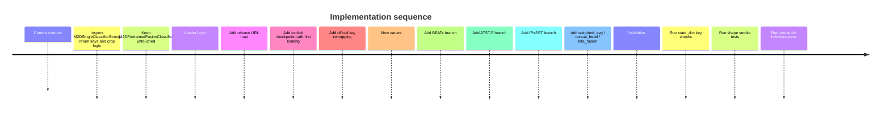

# Extracted Chat History

<div style="border:1px solid #d7deea;border-left:6px solid #5b8def;background:#f8fbff;border-radius:16px;padding:20px 22px;margin:8px 0 24px 0;"><div style="display:flex;align-items:center;gap:10px;"><span style="font-size:28px;font-weight:800;color:#172033;margin-bottom:10px;">Timeline View</span></div><div style="margin:8px 0;"><div style="font-size:12px;font-weight:700;letter-spacing:0.08em;color:#5a6b85;text-transform:uppercase;">Source folder</div><div style="font-size:16px;font-weight:600;color:#172033;margin-top:2px;">/home/cmj/.codex/sessions/2026/05/07</div></div><div style="margin:8px 0;"><div style="font-size:12px;font-weight:700;letter-spacing:0.08em;color:#5a6b85;text-transform:uppercase;">JSONL files scanned</div><div style="font-size:16px;font-weight:600;color:#172033;margin-top:2px;">1</div></div><div style="margin:8px 0;"><div style="font-size:12px;font-weight:700;letter-spacing:0.08em;color:#5a6b85;text-transform:uppercase;">Time range</div><div style="font-size:16px;font-weight:600;color:#172033;margin-top:2px;">2026-05-07 23:55:26 CST -&gt; 2026-05-08 06:38:42 CST</div></div><div style="margin:8px 0;"><div style="font-size:12px;font-weight:700;letter-spacing:0.08em;color:#5a6b85;text-transform:uppercase;">Fork-history duplicates removed</div><div style="font-size:16px;font-weight:600;color:#172033;margin-top:2px;">0</div></div><div style="margin:8px 0;"><div style="font-size:12px;font-weight:700;letter-spacing:0.08em;color:#5a6b85;text-transform:uppercase;">Messages written after merge</div><div style="font-size:16px;font-weight:600;color:#172033;margin-top:2px;">13</div></div></div>


<meta class="nav-message" data-anchor="msg-user-1-2026-05-07-23-55-26-cst" data-role="user" data-label="1. User" data-session="timeline">
<details id="msg-user-1-2026-05-07-23-55-26-cst" class="message-card" data-role="user" data-search="User # Integrating PretrainedSED Branches into ASS as a New M2D Variant

## Executive Summary

The cleanest way to add the requested ensemble into the ASS repository is to introduce one new class in `dcase2026baseline/dcase2026_task4_baseline/src/models/m2dat/m2d_sc.py` that subclasses the existing stronger M2D source-classifier path, preserves the current `forward(input_dict)` contract, and adds a multi-branch auxiliary encoder stack built from the official PretrainedSED wrappers and the v0.0.1 release checkpoints. The existing ASS file already contains the exact extension pattern to follow: `M2DSingleClassifierStrong` defines the public return contract, `FrozenPretrainedAudioEncoder` wraps one frozen auxiliary encoder, and `M2DPretrainedFusionClassifier` fuses one auxiliary branch into the M2D embedding without changing downstream keys. citeturn8view3turn11view0turn9view1

Two repository-grounded caveats matter immediately. First, the official PretrainedSED repo and release expose BEATs, ATST-F, fPaSST, ASiT, M2D, and low-complexity MobileNets; they do **not** expose a distinct “AST” wrapper in the repo’s inference imports, README checkpoint list, or v0.0.1 release notes. If you want to remain strictly faithful to the official repo and release assets, the third branch should be **fPaSST**, and if you need an `&quot;AST&quot;` config name for user convenience, it should be treated as an alias to `fpasst`, not as a separate AST model. citeturn40view1turn23view0turn27view0

Second, PretrainedSED’s own results justify multi-model fusion. In its AudioSet Strong teacher analysis, the average single-model teacher performance is reported as 44.9 PSDS1, while the ensemble reaches 47.1 PSDS1, indicating that ensembling materially improves robustness over individual models. At the same time, their inference path standardizes all branches to 16 kHz audio, 10-second chunks, and a temporally aligned output sequence of length 250, which makes shared fusion logic practical. citeturn26view3turn40view1turn30view1

My recommended default for ASS is `fusion_strategy=&quot;weighted_avg&quot;` with frozen PretrainedSED branches, shared projection to 512 dimensions, and release checkpoints `BEATs_strong_1.pt`, `ATST-F_strong_1.pt`, and `fpasst_strong_1.pt`. That choice keeps the current ASS classifier contract intact, adds fewer parameters than a raw concatenation MLP, and is more trainable inside the current ArcFace-style classification flow than pure late fusion. Late fusion should still be supported, but I would treat it as the simplest **inference ensemble** mode rather than the default **training** mode for the new ASS variant. citeturn11view0turn29view4turn50calculator0turn50calculator1

## Official Repo Grounding

The official PretrainedSED loading paths are not ambiguous: `inference.py` and `ex_dcase2016task2.py` import `ATSTWrapper` from `models/atstframe/ATSTF_wrapper.py`, `BEATsWrapper` from `models/beats/BEATs_wrapper.py`, `FPaSSTWrapper` from `models/frame_passt/fpasst_wrapper.py`, and `PredictionsWrapper` from `models/prediction_wrapper.py`. Those same scripts instantiate the wrappers with zero-argument constructors, then attach release-trained heads through `PredictionsWrapper`. citeturn25view0turn39view0turn39view4

The release asset mapping is also explicit in `config.py`. PretrainedSED defines `RESOURCES_FOLDER = &quot;resources&quot;` and `GITHUB_RELEASE_URL = &quot;https://github.com/fschmid56/PretrainedSED/releases/download/v0.0.1/&quot;`, then maps strong, weak, and SSL checkpoints by name. For the three relevant branches, the strong release assets are `BEATs_strong_1.pt`, `ATST-F_strong_1.pt`, and `fpasst_strong_1.pt`. The same file also defines `BEATs_weak`, `ATST-F_weak`, `fpasst_weak`, `BEATs_ssl`, `ATST-F_ssl`, and `fpasst_ssl` release assets. citeturn28view0turn46view0turn46view2

One detail is easy to miss but important for reproducibility: the README table lists the external fPaSST SSL checkpoint as `fpasst_im.pt`, while the release-loader logic in `config.py` uses the release asset name `fpasst_ssl.pt`. If you are integrating against the v0.0.1 release and relying on the official loader logic, you should follow `config.py`, not the README’s external-checkpoint naming. citeturn23view0turn46view0

ASS’s current `m2d_sc.py` is already structurally aligned with this integration. It exposes `FrozenPretrainedAudioEncoder` with supported paths for BEATs and fPaSST, defines a `PretrainedFusionHead` with `concat_mlp` and `gated_mlp`, and provides `M2DPretrainedFusionClassifier` that subclasses `M2DSingleClassifierStrong`, keeps the same output behavior, and overrides `_embed_waveform` to fuse one auxiliary encoder into the M2D branch. That is the exact extension seam to preserve. citeturn8view3turn8view4turn11view0turn9view1

The table below summarizes the exact official definitions and release files to anchor the implementation. It is distilled from the official repo’s imports, config, and loader code. citeturn25view0turn39view0turn28view0turn29view4

| Branch | Official model definition path in PretrainedSED | Wrapper class | Official strong checkpoint name | Canonical release asset URL pattern |
|---|---|---|---|---|
| BEATs | `models/beats/BEATs_wrapper.py` | `BEATsWrapper` | `BEATs_strong_1` | `.../releases/download/v0.0.1/BEATs_strong_1.pt` |
| ATST-F | `models/atstframe/ATSTF_wrapper.py` | `ATSTWrapper` | `ATST-F_strong_1` | `.../releases/download/v0.0.1/ATST-F_strong_1.pt` |
| fPaSST | `models/frame_passt/fpasst_wrapper.py` | `FPaSSTWrapper` | `fpasst_strong_1` | `.../releases/download/v0.0.1/fpasst_strong_1.pt` |

A practical ASS-specific warning follows from this. PretrainedSED uses top-level imports like `from models...`, while ASS already lives under `src/models/...`. In a quick prototype you can temporarily prepend the external PretrainedSED clone to `sys.path` before importing the wrappers, but for a durable in-repo integration I recommend vendoring the exact official files under a namespaced path such as `src/third_party/pretrainedsed_v001/` so the two `models` packages never collide. That recommendation is an engineering consequence of the official import style plus the user-specified ASS path. citeturn25view0turn39view0

## ASS-Compatible Architecture

The existing ASS strong classifier contract is straightforward: it takes `input_dict[&quot;waveform&quot;]`, optionally uses evaluation cropping, computes an embedding, derives `plain_logits` and ArcFace-conditioned `logits`, and returns a dict whose core keys are `embedding`, `logits`, `plain_logits`, and `energy`. A non-breaking multi-branch implementation should preserve exactly those keys and only add optional diagnostics such as `branch_weights` or `branch_plain_logits`. citeturn8view3turn49view0

The right new class is therefore an additive subclass, for example `M2DPretrainedSEDFusionClassifier(M2DSingleClassifierStrong)`. Its job is to keep the M2D attentive embedding path intact, resample the same waveform to 16 kHz for the PretrainedSED branches, obtain one clip-level embedding per external branch, and then fuse the M2D and PretrainedSED embeddings through one of three modes: weighted averaging, feature concatenation plus fusion head, or late fusion. The branch list should default to `(&quot;BEATs&quot;, &quot;ATST-F&quot;, &quot;fpasst&quot;)`, with `&quot;AST&quot;` accepted only as a compatibility alias that canonicalizes to `fpasst`. This mirrors the official release instead of inventing an unsupported AST path. citeturn11view0turn40view1turn23view0

A second official detail simplifies the design more than it first appears. `PredictionsWrapper` standardizes sequence length to `seq_len=250`; if a base model produces more frames, it uses adaptive average pooling, and if it produces fewer, it uses linear interpolation. The comments in `prediction_wrapper.py` explicitly note approximate pre-alignment sequence lengths of 250 for ATST-F and fPaSST and 496 for BEATs. That means that if you ever want to move from clip-level pooled fusion to time-aligned frame-level fusion later, the official repo already gives you a common temporal grid. citeturn30view1turn30view3

The flow below captures the architecture I recommend for ASS. It preserves the current classifier contract while adding the three requested fusion modes.

```mermaid
flowchart TD
    A[Mixture or source waveform] --&gt; B[M2D branch&lt;br/&gt;existing ASS path]
    A --&gt; C[Resample to 16 kHz]
    C --&gt; D[BEATs wrapper]
    C --&gt; E[ATST-F wrapper]
    C --&gt; F[fPaSST wrapper]
    B --&gt; G[M2D embedding]
    D --&gt; H[BEATs embedding]
    E --&gt; I[ATST-F embedding]
    F --&gt; J[fPaSST embedding]
    G --&gt; K[Fusion module]
    H --&gt; K
    I --&gt; K
    J --&gt; K
    K --&gt; L[Shared classifier / ArcMargin head]
    L --&gt; M[logits]
    L --&gt; N[plain_logits]
    N --&gt; O[energy = -logsumexp]
```

For ASS, the fusion-mode tradeoff is not just about accuracy; it is also about whether the mode fits the current training contract cleanly. The table below is my repo-consistent recommendation matrix, supported by the official repo’s ensemble gains and by the existing ASS ArcFace-based strong-classifier structure. citeturn26view3turn49view0

| Fusion strategy | Mechanism | Best fit in ASS | Complexity | Strengths | Weaknesses | Recommendation |
|---|---|---|---|---|---|---|
| `weighted_avg` | Project each branch to common dim, apply learned or fixed softmax weights, average embeddings, then use shared classifier | Training and inference | Medium | Small parameter increase, stable, preserves single embedding contract | Slightly less expressive than concat MLP | **Recommended default** |
| `concat_head` | Concatenate projected branch embeddings and pass through MLP fusion head | Training and inference | Highest | Most expressive learned fusion | Larger memory and parameter cost | Use when you have enough data and memory |
| `late_fusion` | Compute per-branch logits and average them with fixed or learned weights | Inference-first, optional training | Medium | Closest to official ensemble behavior, easiest to debug | Less natural fit for current ASS ArcFace training semantics | Keep as supported mode, but not the default |

For the proposed default dimensions — one 512-dimensional M2D branch, three 768-dimensional PretrainedSED branches, and a 512-dimensional common projection — weighted averaging needs about 1.44M parameters in the branch projectors, while a raw 2816→1024→512 concat MLP needs about 3.41M parameters before the classifier. That is a meaningful gap in a repo whose current fusion path is deliberately compact. citeturn50calculator0turn50calculator1

## Checkpoint Loading and Key Mapping

The official PretrainedSED checkpoint-loading behavior is in `models/prediction_wrapper.py`. `PredictionsWrapper.load_checkpoint()` looks for `&lt;checkpoint&gt;.pt` under the configured `resources/` folder; if the file is absent, it downloads the file from `CHECKPOINT_URLS[checkpoint]`, loads the state dict on CPU, then performs model-specific key remapping for fPaSST, M2D, BEATs, and ASiT before calling `load_state_dict`. It also strips or tolerates classification-head keys depending on whether `head_type` is present and allows missing mel-transform parameters for compatibility. citeturn29view4turn29view2turn29view5

The key remapping the official code performs is the critical weight-conversion logic you asked for. ATST-F needs no special renaming in the public loader; its checkpoint keys already align. BEATs maps keys beginning with `model.model.` to `model.beats.`, fPaSST maps keys beginning with `model.` to `model.fpasst.`, M2D maps `model.` to `model.m2d.` unless the prefix is already present, and ASiT maps `model.` to `model.asit.`. When you load these checkpoints as **feature extractors** rather than as full strong-prediction heads, you should remove `weak_head.*` and `strong_head.*` before loading, exactly as the official wrapper does when `head_type=None`. citeturn29view4turn29view2turn29view3

The table below is the loader-conversion map you should implement in ASS. It is a direct synthesis of the official PretrainedSED loader plus the official release URL mapping. citeturn29view4turn28view0turn46view0

| Checkpoint | Recommended local ASS path | Official auto-download path behavior | Required key remap | Remove for feature-only mode |
|---|---|---|---|---|
| `BEATs_strong_1.pt` | `checkpoint/pretrainedsed/BEATs_strong_1.pt` | `resources/BEATs_strong_1.pt` | `model.model.* -&gt; model.beats.*` | `weak_head.*`, `strong_head.*` |
| `ATST-F_strong_1.pt` | `checkpoint/pretrainedsed/ATST-F_strong_1.pt` | `resources/ATST-F_strong_1.pt` | none | `weak_head.*`, `strong_head.*` |
| `fpasst_strong_1.pt` | `checkpoint/pretrainedsed/fpasst_strong_1.pt` | `resources/fpasst_strong_1.pt` | `model.* -&gt; model.fpasst.*` | `weak_head.*`, `strong_head.*` |

The following helper block is the smallest robust implementation for ASS if you keep an external clone of PretrainedSED available. It follows the official import paths, official release asset names, and official state-dict remapping logic, but uses explicit local checkpoint files first so you are not forced to rely on the external repo’s `resources/` directory. The same logic also works if you later switch the imports to a vendored namespace. The code below is a faithful implementation of the official loader behavior with the repository-specific adjustments needed for ASS. citeturn25view0turn39view0turn28view0turn29view4

```python
# put near the fusion classes in
# dcase2026baseline/dcase2026_task4_baseline/src/models/m2dat/m2d_sc.py

import os
import sys
from collections import OrderedDict
from pathlib import Path
from typing import Dict, Iterable, Optional, Sequence, Tuple

import torch
import torch.nn as nn
from torch.hub import download_url_to_file

_PRETRAINEDSED_RELEASE_URL = &quot;https://github.com/fschmid56/PretrainedSED/releases/download/v0.0.1&quot;
_PRETRAINEDSED_ASSETS = {
    &quot;BEATs_strong_1&quot;: f&quot;{_PRETRAINEDSED_RELEASE_URL}/BEATs_strong_1.pt&quot;,
    &quot;ATST-F_strong_1&quot;: f&quot;{_PRETRAINEDSED_RELEASE_URL}/ATST-F_strong_1.pt&quot;,
    &quot;fpasst_strong_1&quot;: f&quot;{_PRETRAINEDSED_RELEASE_URL}/fpasst_strong_1.pt&quot;,
    &quot;BEATs_weak&quot;: f&quot;{_PRETRAINEDSED_RELEASE_URL}/BEATs_weak.pt&quot;,
    &quot;ATST-F_weak&quot;: f&quot;{_PRETRAINEDSED_RELEASE_URL}/ATST-F_weak.pt&quot;,
    &quot;fpasst_weak&quot;: f&quot;{_PRETRAINEDSED_RELEASE_URL}/fpasst_weak.pt&quot;,
    &quot;BEATs_ssl&quot;: f&quot;{_PRETRAINEDSED_RELEASE_URL}/BEATs_ssl.pt&quot;,
    &quot;ATST-F_ssl&quot;: f&quot;{_PRETRAINEDSED_RELEASE_URL}/ATST-F_ssl.pt&quot;,
    &quot;fpasst_ssl&quot;: f&quot;{_PRETRAINEDSED_RELEASE_URL}/fpasst_ssl.pt&quot;,
}

def _canonical_pretrainedsed_model_name(name: str) -&gt; str:
    aliases = {
        &quot;AST&quot;: &quot;fpasst&quot;,      # convenience alias only; official repo exposes fPaSST, not AST
        &quot;fPaSST&quot;: &quot;fpasst&quot;,
        &quot;PaSST&quot;: &quot;fpasst&quot;,
        &quot;ATST&quot;: &quot;ATST-F&quot;,
    }
    return aliases.get(name, name)

def _add_pretrainedsed_repo(repo_root: str) -&gt; None:
    repo_root = str(Path(repo_root).resolve())
    if repo_root not in sys.path:
        sys.path.insert(0, repo_root)

def _import_pretrainedsed(repo_root: str):
    _add_pretrainedsed_repo(repo_root)
    from models.atstframe.ATSTF_wrapper import ATSTWrapper
    from models.beats.BEATs_wrapper import BEATsWrapper
    from models.frame_passt.fpasst_wrapper import FPaSSTWrapper
    from models.prediction_wrapper import PredictionsWrapper
    return ATSTWrapper, BEATsWrapper, FPaSSTWrapper, PredictionsWrapper

def _checkpoint_name_for(model_name: str, variant: str) -&gt; str:
    model_name = _canonical_pretrainedsed_model_name(model_name)
    if model_name not in {&quot;BEATs&quot;, &quot;ATST-F&quot;, &quot;fpasst&quot;}:
        raise ValueError(f&quot;Unsupported PretrainedSED model: {model_name}&quot;)
    if variant not in {&quot;strong_1&quot;, &quot;weak&quot;, &quot;ssl&quot;}:
        raise ValueError(f&quot;Unsupported checkpoint variant: {variant}&quot;)
    return f&quot;{model_name}_{variant}&quot;

def _remap_pretrainedsed_state_dict(checkpoint_name: str, state_dict: Dict[str, torch.Tensor]) -&gt; Dict[str, torch.Tensor]:
    # allow checkpoint wrappers like {&quot;state_dict&quot;: ...}
    if isinstance(state_dict, dict) and &quot;state_dict&quot; in state_dict and isinstance(state_dict[&quot;state_dict&quot;], dict):
        state_dict = state_dict[&quot;state_dict&quot;]

if &quot;fpasst&quot; in checkpoint_name:
        state_dict = {
            (&quot;model.fpasst.&quot; + k[len(&quot;model.&quot;):]) if k.startswith(&quot;model.&quot;) else k: v
            for k, v in state_dict.items()
        }
    elif &quot;M2D&quot; in checkpoint_name:
        state_dict = {
            (&quot;model.m2d.&quot; + k[len(&quot;model.&quot;):]) if (k.startswith(&quot;model.&quot;) and not k.startswith(&quot;model.m2d.&quot;)) else k: v
            for k, v in state_dict.items()
        }
    elif &quot;BEATs&quot; in checkpoint_name:
        state_dict = {
            (&quot;model.beats.&quot; + k[len(&quot;model.model.&quot;):]) if k.startswith(&quot;model.model.&quot;) else k: v
            for k, v in state_dict.items()
        }
    elif &quot;ASIT&quot; in checkpoint_name:
        state_dict = {
            (&quot;model.asit.&quot; + k[len(&quot;model.&quot;):]) if k.startswith(&quot;model.&quot;) else k: v
            for k, v in state_dict.items()
        }
    # ATST-F uses no special remap in the official loader
    return state_dict

def _drop_prediction_heads(state_dict: Dict[str, torch.Tensor]) -&gt; Dict[str, torch.Tensor]:
    return {
        k: v for k, v in state_dict.items()
        if not (
            k.startswith(&quot;weak_head.&quot;)
            or k.startswith(&quot;strong_head.&quot;)
        )
    }

def _ensure_local_checkpoint(checkpoint_path: Path, checkpoint_name: str) -&gt; Path:
    checkpoint_path.parent.mkdir(parents=True, exist_ok=True)
    if not checkpoint_path.exists():
        url = _PRETRAINEDSED_ASSETS[checkpoint_name]
        download_url_to_file(url, str(checkpoint_path))
    return checkpoint_path

def _load_feature_wrapper(wrapper: nn.Module, checkpoint_name: str, checkpoint_path: Path) -&gt; Tuple[Sequence[str], Sequence[str]]:
    checkpoint_path = _ensure_local_checkpoint(checkpoint_path, checkpoint_name)
    state_dict = torch.load(str(checkpoint_path), map_location=&quot;cpu&quot;)
    state_dict = _remap_pretrainedsed_state_dict(checkpoint_name, state_dict)
    state_dict = _drop_prediction_heads(state_dict)

missing, unexpected = wrapper.load_state_dict(state_dict, strict=False)

allowed_missing = {
        k for k in wrapper.state_dict().keys()
        if k.startswith(&quot;weak_head.&quot;)
        or k.startswith(&quot;strong_head.&quot;)
        or &quot;mel_transform&quot; in k
    }
    bad_missing = sorted(set(missing) - allowed_missing)
    if bad_missing or unexpected:
        raise RuntimeError(
            f&quot;Checkpoint load mismatch for {checkpoint_name}: &quot;
            f&quot;bad_missing={bad_missing}, unexpected={list(unexpected)}&quot;
        )
    return missing, unexpected
```

## Reference Implementation

The code below is the ASS-side implementation I would add as the new M2D variant. It preserves the strong-classifier contract, uses the current M2D branch exactly as ASS already does, and adds three official PretrainedSED branches with the requested fusion modes. The branch encoders use `PredictionsWrapper(..., head_type=None)` so that the loaded checkpoints act as feature extractors instead of as standalone AudioSet-Strong prediction heads. That matches the official behavior where `head_type=None` causes the wrapper to return the sequence instead of `strong` and `weak` predictions. citeturn30view4turn30view3

```python
class _PretrainedSEDBranch(nn.Module):
    def __init__(
        self,
        repo_root: str,
        model_name: str,
        checkpoint_dir: str,
        checkpoint_variant: str = &quot;strong_1&quot;,
        pooling: str = &quot;mean&quot;,
        freeze: bool = True,
    ):
        super().__init__()
        model_name = _canonical_pretrainedsed_model_name(model_name)
        ATSTWrapper, BEATsWrapper, FPaSSTWrapper, PredictionsWrapper = _import_pretrainedsed(repo_root)

if model_name == &quot;BEATs&quot;:
            base_model = BEATsWrapper()
            embed_dim = 768
        elif model_name == &quot;ATST-F&quot;:
            base_model = ATSTWrapper()
            embed_dim = 768
        elif model_name == &quot;fpasst&quot;:
            base_model = FPaSSTWrapper()
            embed_dim = 768
        else:
            raise ValueError(f&quot;Unsupported PretrainedSED model: {model_name}&quot;)

# Feature-extractor mode: return aligned sequence instead of strong/weak heads.
        self.wrapper = PredictionsWrapper(
            base_model,
            checkpoint=None,
            embed_dim=embed_dim,
            seq_len=250,
            head_type=None,
        )
        ckpt_name = _checkpoint_name_for(model_name, checkpoint_variant)
        ckpt_path = Path(checkpoint_dir) / f&quot;{ckpt_name}.pt&quot;
        _load_feature_wrapper(self.wrapper, ckpt_name, ckpt_path)

self.model_name = model_name
        self.output_dim = embed_dim
        self.sample_rate = 16000
        self.pooling = pooling

if freeze:
            self.wrapper.eval()
            for p in self.wrapper.parameters():
                p.requires_grad = False

def _pool_sequence(self, seq: torch.Tensor) -&gt; torch.Tensor:
        if self.pooling == &quot;mean&quot;:
            return seq.mean(dim=1)
        if self.pooling == &quot;max&quot;:
            return seq.amax(dim=1)
        if self.pooling == &quot;cls&quot;:
            return seq[:, 0]
        raise ValueError(f&quot;Unsupported pooling: {self.pooling}&quot;)

def forward(self, waveform_16k: torch.Tensor) -&gt; torch.Tensor:
        x = self.wrapper.mel_forward(waveform_16k)
        seq = self.wrapper(x)   # shape: [B, 250, 768]
        if isinstance(seq, tuple):
            raise RuntimeError(&quot;Expected sequence output in head_type=None mode.&quot;)
        return self._pool_sequence(seq)

class _MultiBranchFusion(nn.Module):
    def __init__(
        self,
        branch_dims: &quot;OrderedDict[str, int]&quot;,
        output_dim: int,
        hidden_dim: int = 1024,
        dropout: float = 0.2,
        fusion_strategy: str = &quot;weighted_avg&quot;,
    ):
        super().__init__()
        self.branch_names = tuple(branch_dims.keys())
        self.fusion_strategy = fusion_strategy

self.projectors = nn.ModuleDict({
            name: nn.Sequential(
                nn.LayerNorm(dim),
                nn.Linear(dim, output_dim),
            )
            for name, dim in branch_dims.items()
        })

self.branch_weight_logits = nn.Parameter(torch.zeros(len(self.branch_names)))

if fusion_strategy == &quot;concat_head&quot;:
            concat_dim = output_dim * len(self.branch_names)
            self.concat_head = nn.Sequential(
                nn.LayerNorm(concat_dim),
                nn.Linear(concat_dim, hidden_dim),
                nn.GELU(),
                nn.Dropout(dropout),
                nn.Linear(hidden_dim, output_dim),
                nn.LayerNorm(output_dim),
            )
        elif fusion_strategy in {&quot;weighted_avg&quot;, &quot;late_fusion&quot;}:
            self.concat_head = None
        else:
            raise ValueError(f&quot;Unsupported fusion strategy: {fusion_strategy}&quot;)

def project(self, branch_embeddings: &quot;OrderedDict[str, torch.Tensor]&quot;) -&gt; &quot;OrderedDict[str, torch.Tensor]&quot;:
        return OrderedDict(
            (name, self.projectors[name](emb))
            for name, emb in branch_embeddings.items()
        )

def global_weights(self) -&gt; torch.Tensor:
        return torch.softmax(self.branch_weight_logits, dim=0)

def fuse(self, projected: &quot;OrderedDict[str, torch.Tensor]&quot;) -&gt; Tuple[torch.Tensor, Optional[torch.Tensor]]:
        if self.fusion_strategy == &quot;concat_head&quot;:
            fused = self.concat_head(torch.cat([projected[n] for n in self.branch_names], dim=-1))
            return fused, None

w = self.global_weights()
        fused = sum(w[i] * projected[name] for i, name in enumerate(self.branch_names))
        return fused, w

class M2DPretrainedSEDFusionClassifier(M2DSingleClassifierStrong):
    &quot;&quot;&quot;
    New ASS M2D variant:
      - keeps M2D source-classifier contract
      - supports: weighted_avg, concat_head, late_fusion
    &quot;&quot;&quot;
    def __init__(
        self,
        weight_file,
        num_classes=18,
        embedding_dim=512,
        m2d_embedding_dim=None,
        finetuning_layers=&quot;2_blocks&quot;,
        pooling_hidden_dim=512,
        projection_hidden_dim=1024,
        dropout=0.2,
        energy_thresholds=None,
        ref_channel=None,
        eval_crop_seconds=None,
        eval_crop_hop_seconds=None,
        pretrainedsed_repo_root=None,
        pretrainedsed_checkpoint_dir=&quot;checkpoint/pretrainedsed&quot;,
        pretrainedsed_models=(&quot;BEATs&quot;, &quot;ATST-F&quot;, &quot;fpasst&quot;),
        pretrainedsed_checkpoint_variant=&quot;strong_1&quot;,
        pretrainedsed_pooling=&quot;mean&quot;,
        freeze_pretrainedsed=True,
        fusion_strategy=&quot;weighted_avg&quot;,
        fusion_hidden_dim=1024,
    ):
        self.m2d_embedding_dim = m2d_embedding_dim or embedding_dim

super().__init__(
            weight_file=weight_file,
            num_classes=num_classes,
            embedding_dim=self.m2d_embedding_dim,
            finetuning_layers=finetuning_layers,
            pooling_hidden_dim=pooling_hidden_dim,
            projection_hidden_dim=projection_hidden_dim,
            dropout=dropout,
            energy_thresholds=energy_thresholds,
            ref_channel=ref_channel,
            eval_crop_seconds=eval_crop_seconds,
            eval_crop_hop_seconds=eval_crop_hop_seconds,
        )

if pretrainedsed_repo_root is None:
            raise ValueError(&quot;pretrainedsed_repo_root must point to a PretrainedSED clone.&quot;)

self.pretrainedsed_models = tuple(_canonical_pretrainedsed_model_name(n) for n in pretrainedsed_models)
        self.pretrainedsed_branches = nn.ModuleDict({
            name: _PretrainedSEDBranch(
                repo_root=pretrainedsed_repo_root,
                model_name=name,
                checkpoint_dir=pretrainedsed_checkpoint_dir,
                checkpoint_variant=pretrainedsed_checkpoint_variant,
                pooling=pretrainedsed_pooling,
                freeze=freeze_pretrainedsed,
            )
            for name in self.pretrainedsed_models
        })

branch_dims = OrderedDict([(&quot;m2d&quot;, self.m2d_embedding_dim)])
        for name, module in self.pretrainedsed_branches.items():
            branch_dims[name] = module.output_dim

self.fusion = _MultiBranchFusion(
            branch_dims=branch_dims,
            output_dim=embedding_dim,
            hidden_dim=fusion_hidden_dim,
            dropout=dropout,
            fusion_strategy=fusion_strategy,
        )
        self.arc_head = ArcMarginProduct(embedding_dim, out_features=num_classes)
        self.input_sample_rate = getattr(
            self.cfg, &quot;sample_rate&quot;,
            32000 if getattr(self.cfg, &quot;sr&quot;, &quot;32k&quot;) == &quot;32k&quot; else 16000
        )

def _collect_branch_embeddings(self, waveform: torch.Tensor) -&gt; &quot;OrderedDict[str, torch.Tensor]&quot;:
        branch_embeddings = OrderedDict()
        branch_embeddings[&quot;m2d&quot;] = super()._embed_waveform(waveform)

waveform_16k = _resample_waveform(
            waveform,
            input_sample_rate=self.input_sample_rate,
            target_sample_rate=16000,
        )
        for name, module in self.pretrainedsed_branches.items():
            branch_embeddings[name] = module(waveform_16k)
        return branch_embeddings

def _fused_outputs(
        self,
        waveform: torch.Tensor,
        class_index: Optional[torch.Tensor] = None,
    ) -&gt; Tuple[torch.Tensor, torch.Tensor, torch.Tensor, Optional[torch.Tensor]]:
        branches = self._collect_branch_embeddings(waveform)
        projected = self.fusion.project(branches)

if self.fusion.fusion_strategy == &quot;late_fusion&quot;:
            weights = self.fusion.global_weights()
            plain_logits = sum(
                weights[i] * self.arc_head(projected[name], None)
                for i, name in enumerate(self.fusion.branch_names)
            )
            logits = sum(
                weights[i] * self.arc_head(projected[name], class_index)
                for i, name in enumerate(self.fusion.branch_names)
            )
            embedding = sum(
                weights[i] * projected[name]
                for i, name in enumerate(self.fusion.branch_names)
            )
            return embedding, plain_logits, logits, weights

embedding, weights = self.fusion.fuse(projected)
        plain_logits = self.arc_head(embedding, None)
        logits = self.arc_head(embedding, class_index)
        return embedding, plain_logits, logits, weights

def forward(self, input_dict):
        waveform = self._prepare_audio(input_dict[&quot;waveform&quot;])
        class_index = input_dict.get(&quot;class_index&quot;)

if (not self.training) and (self.eval_crop_seconds is not None):
            embeddings = []
            plain_logits_all = []
            logits_all = []
            weight_all = []

for crop in self._iter_eval_crops(waveform):
                emb, plain, logit, weights = self._fused_outputs(crop, class_index)
                embeddings.append(emb)
                plain_logits_all.append(plain)
                logits_all.append(logit)
                if weights is not None:
                    weight_all.append(weights)

embedding = torch.stack(embeddings, dim=0).mean(dim=0)
            plain_logits = torch.stack(plain_logits_all, dim=0).mean(dim=0)
            logits = torch.stack(logits_all, dim=0).mean(dim=0)
            branch_weights = torch.stack(weight_all, dim=0).mean(dim=0) if weight_all else None
        else:
            embedding, plain_logits, logits, branch_weights = self._fused_outputs(waveform, class_index)

energy = -torch.logsumexp(plain_logits, dim=-1)
        out = {
            &quot;embedding&quot;: embedding,
            &quot;logits&quot;: logits,
            &quot;plain_logits&quot;: plain_logits,
            &quot;energy&quot;: energy,
        }
        if branch_weights is not None:
            out[&quot;branch_weights&quot;] = branch_weights
        return out
```

Because your original request also asked for an example that outputs **SED predictions**, the most direct and fully official path is a standalone strong-prediction ensemble script that keeps the PretrainedSED heads intact and fuses the branch logits. This sits naturally beside the ASS integration rather than replacing it, because ASS’s current M2D variant is a source-classifier path, while PretrainedSED’s official inference script is a frame-level AudioSet Strong SED path. The script below follows PretrainedSED’s own inference assumptions: 16 kHz mono audio, 10-second chunks, `mel_forward()` for per-model preprocessing, and strong predictions shaped on the 250-frame time grid. citeturn40view1turn41view1turn30view1turn30view4

```python
# examples/infer_pretrainedsed_fusion.py
# CPU-safe, no GPU-specific assumptions.

import argparse
from pathlib import Path

import librosa
import torch
from torch.hub import download_url_to_file

# Reuse the helper functions shown earlier:
#   _add_pretrainedsed_repo
#   _import_pretrainedsed
#   _checkpoint_name_for
#   _remap_pretrainedsed_state_dict
#   _ensure_local_checkpoint

def build_strong_model(repo_root: str, model_name: str, checkpoint_dir: str, variant: str = &quot;strong_1&quot;):
    model_name = _canonical_pretrainedsed_model_name(model_name)
    ATSTWrapper, BEATsWrapper, FPaSSTWrapper, PredictionsWrapper = _import_pretrainedsed(repo_root)

if model_name == &quot;BEATs&quot;:
        base_model = BEATsWrapper()
        embed_dim = 768
    elif model_name == &quot;ATST-F&quot;:
        base_model = ATSTWrapper()
        embed_dim = 768
    elif model_name == &quot;fpasst&quot;:
        base_model = FPaSSTWrapper()
        embed_dim = 768
    else:
        raise ValueError(model_name)

model = PredictionsWrapper(
        base_model,
        checkpoint=None,
        embed_dim=embed_dim,
        seq_len=250,
        head_type=&quot;linear&quot;,
    )

ckpt_name = _checkpoint_name_for(model_name, variant)
    ckpt_path = _ensure_local_checkpoint(Path(checkpoint_dir) / f&quot;{ckpt_name}.pt&quot;, ckpt_name)
    state_dict = torch.load(str(ckpt_path), map_location=&quot;cpu&quot;)
    state_dict = _remap_pretrainedsed_state_dict(ckpt_name, state_dict)

missing, unexpected = model.load_state_dict(state_dict, strict=False)
    if unexpected:
        raise RuntimeError(f&quot;Unexpected keys for {ckpt_name}: {unexpected}&quot;)
    return model.eval()

def chunked_strong_logits(model, waveform: torch.Tensor, sample_rate: int = 16000, chunk_seconds: int = 10):
    chunk_samples = sample_rate * chunk_seconds
    outputs = []
    total = waveform.shape[-1]

for start in range(0, total, chunk_samples):
        end = min(start + chunk_samples, total)
        chunk = waveform[:, start:end]
        if chunk.shape[-1] &lt; chunk_samples:
            chunk = torch.nn.functional.pad(chunk, (0, chunk_samples - chunk.shape[-1]))

with torch.inference_mode():
            feat = model.mel_forward(chunk)
            strong_logits, _ = model(feat)         # [B, 447, 250]
        outputs.append(strong_logits)

return torch.cat(outputs, dim=2)              # concatenate in time

def main():
    parser = argparse.ArgumentParser()
    parser.add_argument(&quot;--pretrainedsed_root&quot;, required=True)
    parser.add_argument(&quot;--checkpoint_dir&quot;, default=&quot;checkpoint/pretrainedsed&quot;)
    parser.add_argument(&quot;--audio_file&quot;, required=True)
    parser.add_argument(&quot;--weights&quot;, nargs=3, type=float, default=[1/3, 1/3, 1/3])
    args = parser.parse_args()

sr = 16000
    wav, _ = librosa.load(args.audio_file, sr=sr, mono=True)
    waveform = torch.from_numpy(wav).float().unsqueeze(0)

branch_names = [&quot;BEATs&quot;, &quot;ATST-F&quot;, &quot;fpasst&quot;]
    branches = [
        build_strong_model(args.pretrainedsed_root, name, args.checkpoint_dir, variant=&quot;strong_1&quot;)
        for name in branch_names
    ]

strong_logits = []
    for model in branches:
        strong_logits.append(chunked_strong_logits(model, waveform, sample_rate=sr))

weights = torch.tensor(args.weights, dtype=strong_logits[0].dtype)
    weights = weights / weights.sum()
    fused_logits = sum(weights[i] * strong_logits[i] for i in range(len(strong_logits)))
    fused_probs = torch.sigmoid(fused_logits)     # [1, 447, T]

print(&quot;fused_probs shape:&quot;, tuple(fused_probs.shape))
    # Save raw strong predictions; decode downstream exactly as in PretrainedSED if desired.
    out_file = Path(args.audio_file).with_suffix(&quot;.pretrainedsed_fused.pt&quot;)
    torch.save({&quot;strong_probs&quot;: fused_probs.cpu()}, out_file)
    print(&quot;saved:&quot;, out_file)

if __name__ == &quot;__main__&quot;:
    main()
```

The implementation sequence below is the fastest low-risk path.



## Validation, Footprint, and Reproduction

The first sanity checks should be structural, not accuracy-driven. Because `PredictionsWrapper` defaults to `n_classes_strong=447` and `seq_len=250`, a 10-second strong-prediction forward pass should produce tensors of shape `[B, 447, 250]`; because `head_type=None` returns the sequence itself, the feature-extractor mode should produce `[B, 250, 768]` for the three relevant PretrainedSED branches after temporal alignment. On the ASS side, your new classifier should still return the same dict keys that `M2DSingleClassifierStrong` returns now. citeturn30view1turn30view4turn49view0

The test file below is intentionally lightweight but catches the most likely integration failures: wrong checkpoint remapping, wrong shape assumptions, and silent interface drift.

```python
# tests/test_m2d_pretrainedsed.py

from pathlib import Path
import torch

from src.models.m2dat.m2d_sc import (
    _remap_pretrainedsed_state_dict,
    M2DPretrainedSEDFusionClassifier,
)

def test_beats_key_remap():
    raw = {
        &quot;model.model.encoder.weight&quot;: torch.randn(8, 8),
        &quot;strong_head.weight&quot;: torch.randn(447, 768),
        &quot;weak_head.weight&quot;: torch.randn(447, 768),
    }
    out = _remap_pretrainedsed_state_dict(&quot;BEATs_strong_1&quot;, raw)
    assert &quot;model.beats.encoder.weight&quot; in out
    assert &quot;model.model.encoder.weight&quot; not in out

def test_fpasst_key_remap():
    raw = {&quot;model.net.weight&quot;: torch.randn(8, 8)}
    out = _remap_pretrainedsed_state_dict(&quot;fpasst_strong_1&quot;, raw)
    assert &quot;model.fpasst.net.weight&quot; in out

def test_forward_contract_smoke(pretrainedsed_root, m2d_weight_file):
    model = M2DPretrainedSEDFusionClassifier(
        weight_file=m2d_weight_file,
        pretrainedsed_repo_root=pretrainedsed_root,
        pretrainedsed_checkpoint_dir=&quot;checkpoint/pretrainedsed&quot;,
        pretrainedsed_models=(&quot;BEATs&quot;, &quot;ATST-F&quot;, &quot;fpasst&quot;),
        fusion_strategy=&quot;weighted_avg&quot;,
        freeze_pretrainedsed=True,
        num_classes=18,
    ).eval()

# ASS source-classifier path typically uses batch x channel x sample
    x = torch.randn(1, 1, 32000 * 10)
    out = model({&quot;waveform&quot;: x, &quot;class_index&quot;: None})

assert set([&quot;embedding&quot;, &quot;logits&quot;, &quot;plain_logits&quot;, &quot;energy&quot;]).issubset(out.keys())
    assert out[&quot;embedding&quot;].shape[0] == 1
    assert out[&quot;logits&quot;].shape == out[&quot;plain_logits&quot;].shape
    assert out[&quot;energy&quot;].shape == (1,)

def test_parameter_counts(pretrainedsed_root, m2d_weight_file):
    model = M2DPretrainedSEDFusionClassifier(
        weight_file=m2d_weight_file,
        pretrainedsed_repo_root=pretrainedsed_root,
        pretrainedsed_checkpoint_dir=&quot;checkpoint/pretrainedsed&quot;,
        pretrainedsed_models=(&quot;BEATs&quot;, &quot;ATST-F&quot;, &quot;fpasst&quot;),
        fusion_strategy=&quot;concat_head&quot;,
        freeze_pretrainedsed=True,
    )
    total = sum(p.numel() for p in model.parameters())
    trainable = sum(p.numel() for p in model.parameters() if p.requires_grad)
    assert total &gt; 0
    assert trainable &gt; 0
```

On CPU, the footprint-reduction priorities are clear. Use `model.eval()` plus `torch.inference_mode()` for evaluation, because PyTorch documents that inference mode removes additional autograd overhead beyond `no_grad`. Freeze the PretrainedSED branches by default, because the existing ASS fusion path is already designed around a frozen auxiliary encoder and a small trainable fusion head. For post-training compression, dynamic quantization is the first option to try on the fusion MLP and any linear or recurrent layers, because PyTorch’s documented `torch.ao.quantization.quantize_dynamic()` targets large `Linear` and RNN-style layers and offers a weight-only path that often reduces model size and improves inference latency. Mixed precision is more situational: PyTorch documents AMP for lower-precision execution, but on generic CPU deployments the safer bets are full precision or CPU `bfloat16` only where supported; I would not make half precision the default CPU path here. citeturn45search0turn48search0turn48search2turn45search5turn45search6

There is also one architecture-specific memory note worth acting on: PretrainedSED’s wrapper comments show that the base models do not all emit the same native sequence length before alignment — roughly 496 for BEATs and 250 for ATST-F/fPaSST — so doing your fusion **after** the official wrapper’s temporal alignment is cleaner and usually cheaper than trying to fuse native sequences manually. For clip-level ASS fusion, pooled embeddings are cheaper still. citeturn30view1

The reproduction commands below assume a fresh checkout in entity[&quot;organization&quot;,&quot;GitHub&quot;,&quot;software hosting platform&quot;], keep the release assets under the ASS repo’s `checkpoint/` folder, and stay close to the official installation guidance from both repos. PretrainedSED’s README explicitly documents `pip install -r requirements.txt`, `librosa`, and optional `minimp3py` for mp3 decoding, while the DCASE baseline documents installing its own `requirements.txt` or `environment.yml`. citeturn23view0turn47view0turn44search0

```bash
# clone both repos
git clone https://github.com/minjunmy619-spec/ASS.git
git clone https://github.com/fschmid56/PretrainedSED.git external/PretrainedSED

# enter the ASS baseline root
cd ASS/dcase2026baseline/dcase2026_task4_baseline

# create environment; the added code is Python 3.8+ compatible,
# but the upstream DCASE baseline currently documents a 3.11 venv example.
python -m venv .venv
source .venv/bin/activate

# baseline + PretrainedSED dependencies
python -m pip install --upgrade pip
python -m pip install -r requirements.txt
python -m pip install -r ../../../external/PretrainedSED/requirements.txt

# optional, only if you need mp3 decoding exactly as in PretrainedSED examples
CFLAGS=&#x27;-O3 -march=native&#x27; pip install https://github.com/f0k/minimp3py/archive/master.zip

# release checkpoints
mkdir -p checkpoint/pretrainedsed
python - &lt;&lt;&#x27;PY&#x27;
from pathlib import Path
from torch.hub import download_url_to_file

base = &quot;https://github.com/fschmid56/PretrainedSED/releases/download/v0.0.1&quot;
dst = Path(&quot;checkpoint/pretrainedsed&quot;)
dst.mkdir(parents=True, exist_ok=True)

for name in [
    &quot;BEATs_strong_1.pt&quot;,
    &quot;ATST-F_strong_1.pt&quot;,
    &quot;fpasst_strong_1.pt&quot;,
]:
    download_url_to_file(f&quot;{base}/{name}&quot;, str(dst / name))
PY

# add the new class to:
#   src/models/m2dat/m2d_sc.py
# add the example script to:
#   examples/infer_pretrainedsed_fusion.py
# add the tests to:
#   tests/test_m2d_pretrainedsed.py

# run tests
pytest -q tests/test_m2d_pretrainedsed.py

# run standalone fused SED inference
python examples/infer_pretrainedsed_fusion.py \
  --pretrainedsed_root ../../../external/PretrainedSED \
  --checkpoint_dir checkpoint/pretrainedsed \
  --audio_file /path/to/audio.wav
```

Open questions and limitations remain, but they are narrow. I could verify the official wrapper entry points, release asset names, loader behavior, checkpoint remapping, strong-classifier contract, and inference assumptions directly from the public repo files and release metadata. I could **not** directly inspect every wrapper file under the PretrainedSED subdirectories because of GitHub page-fetch limitations in the browser tool, so the branch constructors beyond their zero-argument use in the official scripts were inferred from those official import-and-instantiation sites. The more important unresolved product decision is semantic, not technical: if you truly need a distinct original AST branch rather than the repo-faithful fPaSST branch, that would be an **additional** integration beyond what the official PretrainedSED v0.0.1 repo and release currently expose.

Please according above research, implement the M2D SC model integreated with the pretrainedSEDs 019e0325-9420-7061-a685-0f641036fafd" open><summary style="border:1px solid #dce5f3;border-left:8px solid #4f7cff;background:#f7faff;border-radius:18px;padding:22px 24px;margin:14px 0 22px 0;box-shadow:0 6px 18px rgba(79,124,255,0.08);padding-bottom:14px;"><div style="display:flex;align-items:center;gap:10px;"><span style="font-size:12px;font-weight:800;letter-spacing:0.08em;padding:4px 10px;border-radius:999px;background:#e2ebff;color:#234ca8;">USER</span><span style="font-size:26px;font-weight:800;color:#172033;">1. User</span><span class="summary-chevron">&#8250;</span></div></summary><div style="border:1px solid #dce5f3;border-left:8px solid #4f7cff;background:#f7faff;border-radius:18px;padding:22px 24px;margin:14px 0 22px 0;box-shadow:0 6px 18px rgba(79,124,255,0.08);margin-top:-8px;"><div style="display:flex;flex-wrap:wrap;gap:10px;"><div style="min-width:180px;flex:1 1 220px;background:rgba(255,255,255,0.72);border-radius:12px;padding:10px 12px;"><div style="font-size:11px;font-weight:800;letter-spacing:0.08em;color:#5a6b85;text-transform:uppercase;">Time</div><div style="font-size:15px;font-weight:600;color:#223049;margin-top:4px;">2026-05-07 23:55:26 CST</div></div><div style="min-width:180px;flex:1 1 220px;background:rgba(255,255,255,0.72);border-radius:12px;padding:10px 12px;"><div style="font-size:11px;font-weight:800;letter-spacing:0.08em;color:#5a6b85;text-transform:uppercase;">Source</div><div style="font-size:15px;font-weight:600;color:#223049;margin-top:4px;">rollout-2026-05-07T23-54-14-019e0325-9420-7061-a685-0f641036fafd.jsonl</div></div><div style="min-width:180px;flex:1 1 220px;background:rgba(255,255,255,0.72);border-radius:12px;padding:10px 12px;"><div style="font-size:11px;font-weight:800;letter-spacing:0.08em;color:#5a6b85;text-transform:uppercase;">Session</div><div style="font-size:15px;font-weight:600;color:#223049;margin-top:4px;">019e0325-9420-7061-a685-0f641036fafd</div></div></div><div class="message-body" style="margin-top:16px;font-size:18px;line-height:1.75;color:#1d2738;white-space:pre-wrap;"><p style="margin:0 0 14px 0;"># Integrating PretrainedSED Branches into ASS as a New M2D Variant</p><p style="margin:0 0 14px 0;">## Executive Summary</p><p style="margin:0 0 14px 0;">The cleanest way to add the requested ensemble into the ASS repository is to introduce one new class in <code style="background:#eef3ff;color:#213b86;border:1px solid #cfdbff;border-radius:6px;padding:1px 6px;font-size:0.92em;font-family:SFMono-Regular,Consolas,'Liberation Mono',Menlo,monospace;">dcase2026baseline/dcase2026_task4_baseline/src/models/m2dat/m2d_sc.py</code> that subclasses the existing stronger M2D source-classifier path, preserves the current <code style="background:#eef3ff;color:#213b86;border:1px solid #cfdbff;border-radius:6px;padding:1px 6px;font-size:0.92em;font-family:SFMono-Regular,Consolas,'Liberation Mono',Menlo,monospace;">forward(input_dict)</code> contract, and adds a multi-branch auxiliary encoder stack built from the official PretrainedSED wrappers and the v0.0.1 release checkpoints. The existing ASS file already contains the exact extension pattern to follow: <code style="background:#eef3ff;color:#213b86;border:1px solid #cfdbff;border-radius:6px;padding:1px 6px;font-size:0.92em;font-family:SFMono-Regular,Consolas,'Liberation Mono',Menlo,monospace;">M2DSingleClassifierStrong</code> defines the public return contract, <code style="background:#eef3ff;color:#213b86;border:1px solid #cfdbff;border-radius:6px;padding:1px 6px;font-size:0.92em;font-family:SFMono-Regular,Consolas,'Liberation Mono',Menlo,monospace;">FrozenPretrainedAudioEncoder</code> wraps one frozen auxiliary encoder, and <code style="background:#eef3ff;color:#213b86;border:1px solid #cfdbff;border-radius:6px;padding:1px 6px;font-size:0.92em;font-family:SFMono-Regular,Consolas,'Liberation Mono',Menlo,monospace;">M2DPretrainedFusionClassifier</code> fuses one auxiliary branch into the M2D embedding without changing downstream keys. citeturn8view3turn11view0turn9view1</p><p style="margin:0 0 14px 0;">Two repository-grounded caveats matter immediately. First, the official PretrainedSED repo and release expose BEATs, ATST-F, fPaSST, ASiT, M2D, and low-complexity MobileNets; they do **not** expose a distinct “AST” wrapper in the repo’s inference imports, README checkpoint list, or v0.0.1 release notes. If you want to remain strictly faithful to the official repo and release assets, the third branch should be **fPaSST**, and if you need an <code style="background:#eef3ff;color:#213b86;border:1px solid #cfdbff;border-radius:6px;padding:1px 6px;font-size:0.92em;font-family:SFMono-Regular,Consolas,'Liberation Mono',Menlo,monospace;">&quot;AST&quot;</code> config name for user convenience, it should be treated as an alias to <code style="background:#eef3ff;color:#213b86;border:1px solid #cfdbff;border-radius:6px;padding:1px 6px;font-size:0.92em;font-family:SFMono-Regular,Consolas,'Liberation Mono',Menlo,monospace;">fpasst</code>, not as a separate AST model. citeturn40view1turn23view0turn27view0</p><p style="margin:0 0 14px 0;">Second, PretrainedSED’s own results justify multi-model fusion. In its AudioSet Strong teacher analysis, the average single-model teacher performance is reported as 44.9 PSDS1, while the ensemble reaches 47.1 PSDS1, indicating that ensembling materially improves robustness over individual models. At the same time, their inference path standardizes all branches to 16 kHz audio, 10-second chunks, and a temporally aligned output sequence of length 250, which makes shared fusion logic practical. citeturn26view3turn40view1turn30view1</p><p style="margin:0 0 14px 0;">My recommended default for ASS is <code style="background:#eef3ff;color:#213b86;border:1px solid #cfdbff;border-radius:6px;padding:1px 6px;font-size:0.92em;font-family:SFMono-Regular,Consolas,'Liberation Mono',Menlo,monospace;">fusion_strategy=&quot;weighted_avg&quot;</code> with frozen PretrainedSED branches, shared projection to 512 dimensions, and release checkpoints <code style="background:#eef3ff;color:#213b86;border:1px solid #cfdbff;border-radius:6px;padding:1px 6px;font-size:0.92em;font-family:SFMono-Regular,Consolas,'Liberation Mono',Menlo,monospace;">BEATs_strong_1.pt</code>, <code style="background:#eef3ff;color:#213b86;border:1px solid #cfdbff;border-radius:6px;padding:1px 6px;font-size:0.92em;font-family:SFMono-Regular,Consolas,'Liberation Mono',Menlo,monospace;">ATST-F_strong_1.pt</code>, and <code style="background:#eef3ff;color:#213b86;border:1px solid #cfdbff;border-radius:6px;padding:1px 6px;font-size:0.92em;font-family:SFMono-Regular,Consolas,'Liberation Mono',Menlo,monospace;">fpasst_strong_1.pt</code>. That choice keeps the current ASS classifier contract intact, adds fewer parameters than a raw concatenation MLP, and is more trainable inside the current ArcFace-style classification flow than pure late fusion. Late fusion should still be supported, but I would treat it as the simplest **inference ensemble** mode rather than the default **training** mode for the new ASS variant. citeturn11view0turn29view4turn50calculator0turn50calculator1</p><p style="margin:0 0 14px 0;">## Official Repo Grounding</p><p style="margin:0 0 14px 0;">The official PretrainedSED loading paths are not ambiguous: <code style="background:#eef3ff;color:#213b86;border:1px solid #cfdbff;border-radius:6px;padding:1px 6px;font-size:0.92em;font-family:SFMono-Regular,Consolas,'Liberation Mono',Menlo,monospace;">inference.py</code> and <code style="background:#eef3ff;color:#213b86;border:1px solid #cfdbff;border-radius:6px;padding:1px 6px;font-size:0.92em;font-family:SFMono-Regular,Consolas,'Liberation Mono',Menlo,monospace;">ex_dcase2016task2.py</code> import <code style="background:#eef3ff;color:#213b86;border:1px solid #cfdbff;border-radius:6px;padding:1px 6px;font-size:0.92em;font-family:SFMono-Regular,Consolas,'Liberation Mono',Menlo,monospace;">ATSTWrapper</code> from <code style="background:#eef3ff;color:#213b86;border:1px solid #cfdbff;border-radius:6px;padding:1px 6px;font-size:0.92em;font-family:SFMono-Regular,Consolas,'Liberation Mono',Menlo,monospace;">models/atstframe/ATSTF_wrapper.py</code>, <code style="background:#eef3ff;color:#213b86;border:1px solid #cfdbff;border-radius:6px;padding:1px 6px;font-size:0.92em;font-family:SFMono-Regular,Consolas,'Liberation Mono',Menlo,monospace;">BEATsWrapper</code> from <code style="background:#eef3ff;color:#213b86;border:1px solid #cfdbff;border-radius:6px;padding:1px 6px;font-size:0.92em;font-family:SFMono-Regular,Consolas,'Liberation Mono',Menlo,monospace;">models/beats/BEATs_wrapper.py</code>, <code style="background:#eef3ff;color:#213b86;border:1px solid #cfdbff;border-radius:6px;padding:1px 6px;font-size:0.92em;font-family:SFMono-Regular,Consolas,'Liberation Mono',Menlo,monospace;">FPaSSTWrapper</code> from <code style="background:#eef3ff;color:#213b86;border:1px solid #cfdbff;border-radius:6px;padding:1px 6px;font-size:0.92em;font-family:SFMono-Regular,Consolas,'Liberation Mono',Menlo,monospace;">models/frame_passt/fpasst_wrapper.py</code>, and <code style="background:#eef3ff;color:#213b86;border:1px solid #cfdbff;border-radius:6px;padding:1px 6px;font-size:0.92em;font-family:SFMono-Regular,Consolas,'Liberation Mono',Menlo,monospace;">PredictionsWrapper</code> from <code style="background:#eef3ff;color:#213b86;border:1px solid #cfdbff;border-radius:6px;padding:1px 6px;font-size:0.92em;font-family:SFMono-Regular,Consolas,'Liberation Mono',Menlo,monospace;">models/prediction_wrapper.py</code>. Those same scripts instantiate the wrappers with zero-argument constructors, then attach release-trained heads through <code style="background:#eef3ff;color:#213b86;border:1px solid #cfdbff;border-radius:6px;padding:1px 6px;font-size:0.92em;font-family:SFMono-Regular,Consolas,'Liberation Mono',Menlo,monospace;">PredictionsWrapper</code>. citeturn25view0turn39view0turn39view4</p><p style="margin:0 0 14px 0;">The release asset mapping is also explicit in <code style="background:#eef3ff;color:#213b86;border:1px solid #cfdbff;border-radius:6px;padding:1px 6px;font-size:0.92em;font-family:SFMono-Regular,Consolas,'Liberation Mono',Menlo,monospace;">config.py</code>. PretrainedSED defines <code style="background:#eef3ff;color:#213b86;border:1px solid #cfdbff;border-radius:6px;padding:1px 6px;font-size:0.92em;font-family:SFMono-Regular,Consolas,'Liberation Mono',Menlo,monospace;">RESOURCES_FOLDER = &quot;resources&quot;</code> and <code style="background:#eef3ff;color:#213b86;border:1px solid #cfdbff;border-radius:6px;padding:1px 6px;font-size:0.92em;font-family:SFMono-Regular,Consolas,'Liberation Mono',Menlo,monospace;">GITHUB_RELEASE_URL = &quot;https://github.com/fschmid56/PretrainedSED/releases/download/v0.0.1/&quot;</code>, then maps strong, weak, and SSL checkpoints by name. For the three relevant branches, the strong release assets are <code style="background:#eef3ff;color:#213b86;border:1px solid #cfdbff;border-radius:6px;padding:1px 6px;font-size:0.92em;font-family:SFMono-Regular,Consolas,'Liberation Mono',Menlo,monospace;">BEATs_strong_1.pt</code>, <code style="background:#eef3ff;color:#213b86;border:1px solid #cfdbff;border-radius:6px;padding:1px 6px;font-size:0.92em;font-family:SFMono-Regular,Consolas,'Liberation Mono',Menlo,monospace;">ATST-F_strong_1.pt</code>, and <code style="background:#eef3ff;color:#213b86;border:1px solid #cfdbff;border-radius:6px;padding:1px 6px;font-size:0.92em;font-family:SFMono-Regular,Consolas,'Liberation Mono',Menlo,monospace;">fpasst_strong_1.pt</code>. The same file also defines <code style="background:#eef3ff;color:#213b86;border:1px solid #cfdbff;border-radius:6px;padding:1px 6px;font-size:0.92em;font-family:SFMono-Regular,Consolas,'Liberation Mono',Menlo,monospace;">BEATs_weak</code>, <code style="background:#eef3ff;color:#213b86;border:1px solid #cfdbff;border-radius:6px;padding:1px 6px;font-size:0.92em;font-family:SFMono-Regular,Consolas,'Liberation Mono',Menlo,monospace;">ATST-F_weak</code>, <code style="background:#eef3ff;color:#213b86;border:1px solid #cfdbff;border-radius:6px;padding:1px 6px;font-size:0.92em;font-family:SFMono-Regular,Consolas,'Liberation Mono',Menlo,monospace;">fpasst_weak</code>, <code style="background:#eef3ff;color:#213b86;border:1px solid #cfdbff;border-radius:6px;padding:1px 6px;font-size:0.92em;font-family:SFMono-Regular,Consolas,'Liberation Mono',Menlo,monospace;">BEATs_ssl</code>, <code style="background:#eef3ff;color:#213b86;border:1px solid #cfdbff;border-radius:6px;padding:1px 6px;font-size:0.92em;font-family:SFMono-Regular,Consolas,'Liberation Mono',Menlo,monospace;">ATST-F_ssl</code>, and <code style="background:#eef3ff;color:#213b86;border:1px solid #cfdbff;border-radius:6px;padding:1px 6px;font-size:0.92em;font-family:SFMono-Regular,Consolas,'Liberation Mono',Menlo,monospace;">fpasst_ssl</code> release assets. citeturn28view0turn46view0turn46view2</p><p style="margin:0 0 14px 0;">One detail is easy to miss but important for reproducibility: the README table lists the external fPaSST SSL checkpoint as <code style="background:#eef3ff;color:#213b86;border:1px solid #cfdbff;border-radius:6px;padding:1px 6px;font-size:0.92em;font-family:SFMono-Regular,Consolas,'Liberation Mono',Menlo,monospace;">fpasst_im.pt</code>, while the release-loader logic in <code style="background:#eef3ff;color:#213b86;border:1px solid #cfdbff;border-radius:6px;padding:1px 6px;font-size:0.92em;font-family:SFMono-Regular,Consolas,'Liberation Mono',Menlo,monospace;">config.py</code> uses the release asset name <code style="background:#eef3ff;color:#213b86;border:1px solid #cfdbff;border-radius:6px;padding:1px 6px;font-size:0.92em;font-family:SFMono-Regular,Consolas,'Liberation Mono',Menlo,monospace;">fpasst_ssl.pt</code>. If you are integrating against the v0.0.1 release and relying on the official loader logic, you should follow <code style="background:#eef3ff;color:#213b86;border:1px solid #cfdbff;border-radius:6px;padding:1px 6px;font-size:0.92em;font-family:SFMono-Regular,Consolas,'Liberation Mono',Menlo,monospace;">config.py</code>, not the README’s external-checkpoint naming. citeturn23view0turn46view0</p><p style="margin:0 0 14px 0;">ASS’s current <code style="background:#eef3ff;color:#213b86;border:1px solid #cfdbff;border-radius:6px;padding:1px 6px;font-size:0.92em;font-family:SFMono-Regular,Consolas,'Liberation Mono',Menlo,monospace;">m2d_sc.py</code> is already structurally aligned with this integration. It exposes <code style="background:#eef3ff;color:#213b86;border:1px solid #cfdbff;border-radius:6px;padding:1px 6px;font-size:0.92em;font-family:SFMono-Regular,Consolas,'Liberation Mono',Menlo,monospace;">FrozenPretrainedAudioEncoder</code> with supported paths for BEATs and fPaSST, defines a <code style="background:#eef3ff;color:#213b86;border:1px solid #cfdbff;border-radius:6px;padding:1px 6px;font-size:0.92em;font-family:SFMono-Regular,Consolas,'Liberation Mono',Menlo,monospace;">PretrainedFusionHead</code> with <code style="background:#eef3ff;color:#213b86;border:1px solid #cfdbff;border-radius:6px;padding:1px 6px;font-size:0.92em;font-family:SFMono-Regular,Consolas,'Liberation Mono',Menlo,monospace;">concat_mlp</code> and <code style="background:#eef3ff;color:#213b86;border:1px solid #cfdbff;border-radius:6px;padding:1px 6px;font-size:0.92em;font-family:SFMono-Regular,Consolas,'Liberation Mono',Menlo,monospace;">gated_mlp</code>, and provides <code style="background:#eef3ff;color:#213b86;border:1px solid #cfdbff;border-radius:6px;padding:1px 6px;font-size:0.92em;font-family:SFMono-Regular,Consolas,'Liberation Mono',Menlo,monospace;">M2DPretrainedFusionClassifier</code> that subclasses <code style="background:#eef3ff;color:#213b86;border:1px solid #cfdbff;border-radius:6px;padding:1px 6px;font-size:0.92em;font-family:SFMono-Regular,Consolas,'Liberation Mono',Menlo,monospace;">M2DSingleClassifierStrong</code>, keeps the same output behavior, and overrides <code style="background:#eef3ff;color:#213b86;border:1px solid #cfdbff;border-radius:6px;padding:1px 6px;font-size:0.92em;font-family:SFMono-Regular,Consolas,'Liberation Mono',Menlo,monospace;">_embed_waveform</code> to fuse one auxiliary encoder into the M2D branch. That is the exact extension seam to preserve. citeturn8view3turn8view4turn11view0turn9view1</p><p style="margin:0 0 14px 0;">The table below summarizes the exact official definitions and release files to anchor the implementation. It is distilled from the official repo’s imports, config, and loader code. citeturn25view0turn39view0turn28view0turn29view4</p><div style="margin:10px 0 18px 0;overflow:auto;"><table style="border-collapse:collapse;min-width:420px;width:100%;border:1px solid #d6dce8;"><thead><tr><th style="border:1px solid #d6dce8;padding:10px 12px;background:#edf4ff;color:#1d355f;font-size:14px;text-align:left;">Branch</th><th style="border:1px solid #d6dce8;padding:10px 12px;background:#edf4ff;color:#1d355f;font-size:14px;text-align:left;">Official model definition path in PretrainedSED</th><th style="border:1px solid #d6dce8;padding:10px 12px;background:#edf4ff;color:#1d355f;font-size:14px;text-align:left;">Wrapper class</th><th style="border:1px solid #d6dce8;padding:10px 12px;background:#edf4ff;color:#1d355f;font-size:14px;text-align:left;">Official strong checkpoint name</th><th style="border:1px solid #d6dce8;padding:10px 12px;background:#edf4ff;color:#1d355f;font-size:14px;text-align:left;">Canonical release asset URL pattern</th></tr></thead><tbody><tr><td style="border:1px solid #d6dce8;padding:10px 12px;background:#fafcff;font-size:14px;vertical-align:top;">BEATs</td><td style="border:1px solid #d6dce8;padding:10px 12px;background:#fafcff;font-size:14px;vertical-align:top;"><code style="background:#eef3ff;color:#213b86;border:1px solid #cfdbff;border-radius:6px;padding:1px 6px;font-size:0.92em;font-family:SFMono-Regular,Consolas,'Liberation Mono',Menlo,monospace;">models/beats/BEATs_wrapper.py</code></td><td style="border:1px solid #d6dce8;padding:10px 12px;background:#fafcff;font-size:14px;vertical-align:top;"><code style="background:#eef3ff;color:#213b86;border:1px solid #cfdbff;border-radius:6px;padding:1px 6px;font-size:0.92em;font-family:SFMono-Regular,Consolas,'Liberation Mono',Menlo,monospace;">BEATsWrapper</code></td><td style="border:1px solid #d6dce8;padding:10px 12px;background:#fafcff;font-size:14px;vertical-align:top;"><code style="background:#eef3ff;color:#213b86;border:1px solid #cfdbff;border-radius:6px;padding:1px 6px;font-size:0.92em;font-family:SFMono-Regular,Consolas,'Liberation Mono',Menlo,monospace;">BEATs_strong_1</code></td><td style="border:1px solid #d6dce8;padding:10px 12px;background:#fafcff;font-size:14px;vertical-align:top;"><code style="background:#eef3ff;color:#213b86;border:1px solid #cfdbff;border-radius:6px;padding:1px 6px;font-size:0.92em;font-family:SFMono-Regular,Consolas,'Liberation Mono',Menlo,monospace;">.../releases/download/v0.0.1/BEATs_strong_1.pt</code></td></tr><tr><td style="border:1px solid #d6dce8;padding:10px 12px;background:#ffffff;font-size:14px;vertical-align:top;">ATST-F</td><td style="border:1px solid #d6dce8;padding:10px 12px;background:#ffffff;font-size:14px;vertical-align:top;"><code style="background:#eef3ff;color:#213b86;border:1px solid #cfdbff;border-radius:6px;padding:1px 6px;font-size:0.92em;font-family:SFMono-Regular,Consolas,'Liberation Mono',Menlo,monospace;">models/atstframe/ATSTF_wrapper.py</code></td><td style="border:1px solid #d6dce8;padding:10px 12px;background:#ffffff;font-size:14px;vertical-align:top;"><code style="background:#eef3ff;color:#213b86;border:1px solid #cfdbff;border-radius:6px;padding:1px 6px;font-size:0.92em;font-family:SFMono-Regular,Consolas,'Liberation Mono',Menlo,monospace;">ATSTWrapper</code></td><td style="border:1px solid #d6dce8;padding:10px 12px;background:#ffffff;font-size:14px;vertical-align:top;"><code style="background:#eef3ff;color:#213b86;border:1px solid #cfdbff;border-radius:6px;padding:1px 6px;font-size:0.92em;font-family:SFMono-Regular,Consolas,'Liberation Mono',Menlo,monospace;">ATST-F_strong_1</code></td><td style="border:1px solid #d6dce8;padding:10px 12px;background:#ffffff;font-size:14px;vertical-align:top;"><code style="background:#eef3ff;color:#213b86;border:1px solid #cfdbff;border-radius:6px;padding:1px 6px;font-size:0.92em;font-family:SFMono-Regular,Consolas,'Liberation Mono',Menlo,monospace;">.../releases/download/v0.0.1/ATST-F_strong_1.pt</code></td></tr><tr><td style="border:1px solid #d6dce8;padding:10px 12px;background:#fafcff;font-size:14px;vertical-align:top;">fPaSST</td><td style="border:1px solid #d6dce8;padding:10px 12px;background:#fafcff;font-size:14px;vertical-align:top;"><code style="background:#eef3ff;color:#213b86;border:1px solid #cfdbff;border-radius:6px;padding:1px 6px;font-size:0.92em;font-family:SFMono-Regular,Consolas,'Liberation Mono',Menlo,monospace;">models/frame_passt/fpasst_wrapper.py</code></td><td style="border:1px solid #d6dce8;padding:10px 12px;background:#fafcff;font-size:14px;vertical-align:top;"><code style="background:#eef3ff;color:#213b86;border:1px solid #cfdbff;border-radius:6px;padding:1px 6px;font-size:0.92em;font-family:SFMono-Regular,Consolas,'Liberation Mono',Menlo,monospace;">FPaSSTWrapper</code></td><td style="border:1px solid #d6dce8;padding:10px 12px;background:#fafcff;font-size:14px;vertical-align:top;"><code style="background:#eef3ff;color:#213b86;border:1px solid #cfdbff;border-radius:6px;padding:1px 6px;font-size:0.92em;font-family:SFMono-Regular,Consolas,'Liberation Mono',Menlo,monospace;">fpasst_strong_1</code></td><td style="border:1px solid #d6dce8;padding:10px 12px;background:#fafcff;font-size:14px;vertical-align:top;"><code style="background:#eef3ff;color:#213b86;border:1px solid #cfdbff;border-radius:6px;padding:1px 6px;font-size:0.92em;font-family:SFMono-Regular,Consolas,'Liberation Mono',Menlo,monospace;">.../releases/download/v0.0.1/fpasst_strong_1.pt</code></td></tr></tbody></table></div><p style="margin:0 0 14px 0;">A practical ASS-specific warning follows from this. PretrainedSED uses top-level imports like <code style="background:#eef3ff;color:#213b86;border:1px solid #cfdbff;border-radius:6px;padding:1px 6px;font-size:0.92em;font-family:SFMono-Regular,Consolas,'Liberation Mono',Menlo,monospace;">from models...</code>, while ASS already lives under <code style="background:#eef3ff;color:#213b86;border:1px solid #cfdbff;border-radius:6px;padding:1px 6px;font-size:0.92em;font-family:SFMono-Regular,Consolas,'Liberation Mono',Menlo,monospace;">src/models/...</code>. In a quick prototype you can temporarily prepend the external PretrainedSED clone to <code style="background:#eef3ff;color:#213b86;border:1px solid #cfdbff;border-radius:6px;padding:1px 6px;font-size:0.92em;font-family:SFMono-Regular,Consolas,'Liberation Mono',Menlo,monospace;">sys.path</code> before importing the wrappers, but for a durable in-repo integration I recommend vendoring the exact official files under a namespaced path such as <code style="background:#eef3ff;color:#213b86;border:1px solid #cfdbff;border-radius:6px;padding:1px 6px;font-size:0.92em;font-family:SFMono-Regular,Consolas,'Liberation Mono',Menlo,monospace;">src/third_party/pretrainedsed_v001/</code> so the two <code style="background:#eef3ff;color:#213b86;border:1px solid #cfdbff;border-radius:6px;padding:1px 6px;font-size:0.92em;font-family:SFMono-Regular,Consolas,'Liberation Mono',Menlo,monospace;">models</code> packages never collide. That recommendation is an engineering consequence of the official import style plus the user-specified ASS path. citeturn25view0turn39view0</p><p style="margin:0 0 14px 0;">## ASS-Compatible Architecture</p><p style="margin:0 0 14px 0;">The existing ASS strong classifier contract is straightforward: it takes <code style="background:#eef3ff;color:#213b86;border:1px solid #cfdbff;border-radius:6px;padding:1px 6px;font-size:0.92em;font-family:SFMono-Regular,Consolas,'Liberation Mono',Menlo,monospace;">input_dict[&quot;waveform&quot;]</code>, optionally uses evaluation cropping, computes an embedding, derives <code style="background:#eef3ff;color:#213b86;border:1px solid #cfdbff;border-radius:6px;padding:1px 6px;font-size:0.92em;font-family:SFMono-Regular,Consolas,'Liberation Mono',Menlo,monospace;">plain_logits</code> and ArcFace-conditioned <code style="background:#eef3ff;color:#213b86;border:1px solid #cfdbff;border-radius:6px;padding:1px 6px;font-size:0.92em;font-family:SFMono-Regular,Consolas,'Liberation Mono',Menlo,monospace;">logits</code>, and returns a dict whose core keys are <code style="background:#eef3ff;color:#213b86;border:1px solid #cfdbff;border-radius:6px;padding:1px 6px;font-size:0.92em;font-family:SFMono-Regular,Consolas,'Liberation Mono',Menlo,monospace;">embedding</code>, <code style="background:#eef3ff;color:#213b86;border:1px solid #cfdbff;border-radius:6px;padding:1px 6px;font-size:0.92em;font-family:SFMono-Regular,Consolas,'Liberation Mono',Menlo,monospace;">logits</code>, <code style="background:#eef3ff;color:#213b86;border:1px solid #cfdbff;border-radius:6px;padding:1px 6px;font-size:0.92em;font-family:SFMono-Regular,Consolas,'Liberation Mono',Menlo,monospace;">plain_logits</code>, and <code style="background:#eef3ff;color:#213b86;border:1px solid #cfdbff;border-radius:6px;padding:1px 6px;font-size:0.92em;font-family:SFMono-Regular,Consolas,'Liberation Mono',Menlo,monospace;">energy</code>. A non-breaking multi-branch implementation should preserve exactly those keys and only add optional diagnostics such as <code style="background:#eef3ff;color:#213b86;border:1px solid #cfdbff;border-radius:6px;padding:1px 6px;font-size:0.92em;font-family:SFMono-Regular,Consolas,'Liberation Mono',Menlo,monospace;">branch_weights</code> or <code style="background:#eef3ff;color:#213b86;border:1px solid #cfdbff;border-radius:6px;padding:1px 6px;font-size:0.92em;font-family:SFMono-Regular,Consolas,'Liberation Mono',Menlo,monospace;">branch_plain_logits</code>. citeturn8view3turn49view0</p><p style="margin:0 0 14px 0;">The right new class is therefore an additive subclass, for example <code style="background:#eef3ff;color:#213b86;border:1px solid #cfdbff;border-radius:6px;padding:1px 6px;font-size:0.92em;font-family:SFMono-Regular,Consolas,'Liberation Mono',Menlo,monospace;">M2DPretrainedSEDFusionClassifier(M2DSingleClassifierStrong)</code>. Its job is to keep the M2D attentive embedding path intact, resample the same waveform to 16 kHz for the PretrainedSED branches, obtain one clip-level embedding per external branch, and then fuse the M2D and PretrainedSED embeddings through one of three modes: weighted averaging, feature concatenation plus fusion head, or late fusion. The branch list should default to <code style="background:#eef3ff;color:#213b86;border:1px solid #cfdbff;border-radius:6px;padding:1px 6px;font-size:0.92em;font-family:SFMono-Regular,Consolas,'Liberation Mono',Menlo,monospace;">(&quot;BEATs&quot;, &quot;ATST-F&quot;, &quot;fpasst&quot;)</code>, with <code style="background:#eef3ff;color:#213b86;border:1px solid #cfdbff;border-radius:6px;padding:1px 6px;font-size:0.92em;font-family:SFMono-Regular,Consolas,'Liberation Mono',Menlo,monospace;">&quot;AST&quot;</code> accepted only as a compatibility alias that canonicalizes to <code style="background:#eef3ff;color:#213b86;border:1px solid #cfdbff;border-radius:6px;padding:1px 6px;font-size:0.92em;font-family:SFMono-Regular,Consolas,'Liberation Mono',Menlo,monospace;">fpasst</code>. This mirrors the official release instead of inventing an unsupported AST path. citeturn11view0turn40view1turn23view0</p><p style="margin:0 0 14px 0;">A second official detail simplifies the design more than it first appears. <code style="background:#eef3ff;color:#213b86;border:1px solid #cfdbff;border-radius:6px;padding:1px 6px;font-size:0.92em;font-family:SFMono-Regular,Consolas,'Liberation Mono',Menlo,monospace;">PredictionsWrapper</code> standardizes sequence length to <code style="background:#eef3ff;color:#213b86;border:1px solid #cfdbff;border-radius:6px;padding:1px 6px;font-size:0.92em;font-family:SFMono-Regular,Consolas,'Liberation Mono',Menlo,monospace;">seq_len=250</code>; if a base model produces more frames, it uses adaptive average pooling, and if it produces fewer, it uses linear interpolation. The comments in <code style="background:#eef3ff;color:#213b86;border:1px solid #cfdbff;border-radius:6px;padding:1px 6px;font-size:0.92em;font-family:SFMono-Regular,Consolas,'Liberation Mono',Menlo,monospace;">prediction_wrapper.py</code> explicitly note approximate pre-alignment sequence lengths of 250 for ATST-F and fPaSST and 496 for BEATs. That means that if you ever want to move from clip-level pooled fusion to time-aligned frame-level fusion later, the official repo already gives you a common temporal grid. citeturn30view1turn30view3</p><p style="margin:0 0 14px 0;">The flow below captures the architecture I recommend for ASS. It preserves the current classifier contract while adding the three requested fusion modes.</p><div class="code-block" style="margin:10px 0 18px 0;border:1px solid #d6dce8;border-radius:14px;overflow:hidden;box-shadow:inset 0 1px 0 rgba(255,255,255,0.5);"><div style="display:flex;align-items:center;gap:10px;background:#1f2937;color:#e5edf7;font-size:12px;font-weight:800;letter-spacing:0.08em;text-transform:uppercase;padding:9px 12px;"><span>mermaid</span><button class="copy-btn" type="button" onclick="copyCode(this)">Copy</button></div><pre style="margin:0;background:#0f1720;color:#e8eef6;padding:16px 18px;overflow:auto;font-size:14px;line-height:1.6;"><code>flowchart TD
    A[Mixture or source waveform] --&gt; B[M2D branch&lt;br/&gt;existing ASS path]
    A --&gt; C[Resample to 16 kHz]
    C --&gt; D[BEATs wrapper]
    C --&gt; E[ATST-F wrapper]
    C --&gt; F[fPaSST wrapper]
    B --&gt; G[M2D embedding]
    D --&gt; H[BEATs embedding]
    E --&gt; I[ATST-F embedding]
    F --&gt; J[fPaSST embedding]
    G --&gt; K[Fusion module]
    H --&gt; K
    I --&gt; K
    J --&gt; K
    K --&gt; L[Shared classifier / ArcMargin head]
    L --&gt; M[logits]
    L --&gt; N[plain_logits]
    N --&gt; O[energy = -logsumexp]</code></pre></div><p style="margin:0 0 14px 0;">For ASS, the fusion-mode tradeoff is not just about accuracy; it is also about whether the mode fits the current training contract cleanly. The table below is my repo-consistent recommendation matrix, supported by the official repo’s ensemble gains and by the existing ASS ArcFace-based strong-classifier structure. citeturn26view3turn49view0</p><div style="margin:10px 0 18px 0;overflow:auto;"><table style="border-collapse:collapse;min-width:420px;width:100%;border:1px solid #d6dce8;"><thead><tr><th style="border:1px solid #d6dce8;padding:10px 12px;background:#edf4ff;color:#1d355f;font-size:14px;text-align:left;">Fusion strategy</th><th style="border:1px solid #d6dce8;padding:10px 12px;background:#edf4ff;color:#1d355f;font-size:14px;text-align:left;">Mechanism</th><th style="border:1px solid #d6dce8;padding:10px 12px;background:#edf4ff;color:#1d355f;font-size:14px;text-align:left;">Best fit in ASS</th><th style="border:1px solid #d6dce8;padding:10px 12px;background:#edf4ff;color:#1d355f;font-size:14px;text-align:left;">Complexity</th><th style="border:1px solid #d6dce8;padding:10px 12px;background:#edf4ff;color:#1d355f;font-size:14px;text-align:left;">Strengths</th><th style="border:1px solid #d6dce8;padding:10px 12px;background:#edf4ff;color:#1d355f;font-size:14px;text-align:left;">Weaknesses</th><th style="border:1px solid #d6dce8;padding:10px 12px;background:#edf4ff;color:#1d355f;font-size:14px;text-align:left;">Recommendation</th></tr></thead><tbody><tr><td style="border:1px solid #d6dce8;padding:10px 12px;background:#fafcff;font-size:14px;vertical-align:top;"><code style="background:#eef3ff;color:#213b86;border:1px solid #cfdbff;border-radius:6px;padding:1px 6px;font-size:0.92em;font-family:SFMono-Regular,Consolas,'Liberation Mono',Menlo,monospace;">weighted_avg</code></td><td style="border:1px solid #d6dce8;padding:10px 12px;background:#fafcff;font-size:14px;vertical-align:top;">Project each branch to common dim, apply learned or fixed softmax weights, average embeddings, then use shared classifier</td><td style="border:1px solid #d6dce8;padding:10px 12px;background:#fafcff;font-size:14px;vertical-align:top;">Training and inference</td><td style="border:1px solid #d6dce8;padding:10px 12px;background:#fafcff;font-size:14px;vertical-align:top;">Medium</td><td style="border:1px solid #d6dce8;padding:10px 12px;background:#fafcff;font-size:14px;vertical-align:top;">Small parameter increase, stable, preserves single embedding contract</td><td style="border:1px solid #d6dce8;padding:10px 12px;background:#fafcff;font-size:14px;vertical-align:top;">Slightly less expressive than concat MLP</td><td style="border:1px solid #d6dce8;padding:10px 12px;background:#fafcff;font-size:14px;vertical-align:top;">**Recommended default**</td></tr><tr><td style="border:1px solid #d6dce8;padding:10px 12px;background:#ffffff;font-size:14px;vertical-align:top;"><code style="background:#eef3ff;color:#213b86;border:1px solid #cfdbff;border-radius:6px;padding:1px 6px;font-size:0.92em;font-family:SFMono-Regular,Consolas,'Liberation Mono',Menlo,monospace;">concat_head</code></td><td style="border:1px solid #d6dce8;padding:10px 12px;background:#ffffff;font-size:14px;vertical-align:top;">Concatenate projected branch embeddings and pass through MLP fusion head</td><td style="border:1px solid #d6dce8;padding:10px 12px;background:#ffffff;font-size:14px;vertical-align:top;">Training and inference</td><td style="border:1px solid #d6dce8;padding:10px 12px;background:#ffffff;font-size:14px;vertical-align:top;">Highest</td><td style="border:1px solid #d6dce8;padding:10px 12px;background:#ffffff;font-size:14px;vertical-align:top;">Most expressive learned fusion</td><td style="border:1px solid #d6dce8;padding:10px 12px;background:#ffffff;font-size:14px;vertical-align:top;">Larger memory and parameter cost</td><td style="border:1px solid #d6dce8;padding:10px 12px;background:#ffffff;font-size:14px;vertical-align:top;">Use when you have enough data and memory</td></tr><tr><td style="border:1px solid #d6dce8;padding:10px 12px;background:#fafcff;font-size:14px;vertical-align:top;"><code style="background:#eef3ff;color:#213b86;border:1px solid #cfdbff;border-radius:6px;padding:1px 6px;font-size:0.92em;font-family:SFMono-Regular,Consolas,'Liberation Mono',Menlo,monospace;">late_fusion</code></td><td style="border:1px solid #d6dce8;padding:10px 12px;background:#fafcff;font-size:14px;vertical-align:top;">Compute per-branch logits and average them with fixed or learned weights</td><td style="border:1px solid #d6dce8;padding:10px 12px;background:#fafcff;font-size:14px;vertical-align:top;">Inference-first, optional training</td><td style="border:1px solid #d6dce8;padding:10px 12px;background:#fafcff;font-size:14px;vertical-align:top;">Medium</td><td style="border:1px solid #d6dce8;padding:10px 12px;background:#fafcff;font-size:14px;vertical-align:top;">Closest to official ensemble behavior, easiest to debug</td><td style="border:1px solid #d6dce8;padding:10px 12px;background:#fafcff;font-size:14px;vertical-align:top;">Less natural fit for current ASS ArcFace training semantics</td><td style="border:1px solid #d6dce8;padding:10px 12px;background:#fafcff;font-size:14px;vertical-align:top;">Keep as supported mode, but not the default</td></tr></tbody></table></div><p style="margin:0 0 14px 0;">For the proposed default dimensions — one 512-dimensional M2D branch, three 768-dimensional PretrainedSED branches, and a 512-dimensional common projection — weighted averaging needs about 1.44M parameters in the branch projectors, while a raw 2816→1024→512 concat MLP needs about 3.41M parameters before the classifier. That is a meaningful gap in a repo whose current fusion path is deliberately compact. citeturn50calculator0turn50calculator1</p><p style="margin:0 0 14px 0;">## Checkpoint Loading and Key Mapping</p><p style="margin:0 0 14px 0;">The official PretrainedSED checkpoint-loading behavior is in <code style="background:#eef3ff;color:#213b86;border:1px solid #cfdbff;border-radius:6px;padding:1px 6px;font-size:0.92em;font-family:SFMono-Regular,Consolas,'Liberation Mono',Menlo,monospace;">models/prediction_wrapper.py</code>. <code style="background:#eef3ff;color:#213b86;border:1px solid #cfdbff;border-radius:6px;padding:1px 6px;font-size:0.92em;font-family:SFMono-Regular,Consolas,'Liberation Mono',Menlo,monospace;">PredictionsWrapper.load_checkpoint()</code> looks for <code style="background:#eef3ff;color:#213b86;border:1px solid #cfdbff;border-radius:6px;padding:1px 6px;font-size:0.92em;font-family:SFMono-Regular,Consolas,'Liberation Mono',Menlo,monospace;">&lt;checkpoint&gt;.pt</code> under the configured <code style="background:#eef3ff;color:#213b86;border:1px solid #cfdbff;border-radius:6px;padding:1px 6px;font-size:0.92em;font-family:SFMono-Regular,Consolas,'Liberation Mono',Menlo,monospace;">resources/</code> folder; if the file is absent, it downloads the file from <code style="background:#eef3ff;color:#213b86;border:1px solid #cfdbff;border-radius:6px;padding:1px 6px;font-size:0.92em;font-family:SFMono-Regular,Consolas,'Liberation Mono',Menlo,monospace;">CHECKPOINT_URLS[checkpoint]</code>, loads the state dict on CPU, then performs model-specific key remapping for fPaSST, M2D, BEATs, and ASiT before calling <code style="background:#eef3ff;color:#213b86;border:1px solid #cfdbff;border-radius:6px;padding:1px 6px;font-size:0.92em;font-family:SFMono-Regular,Consolas,'Liberation Mono',Menlo,monospace;">load_state_dict</code>. It also strips or tolerates classification-head keys depending on whether <code style="background:#eef3ff;color:#213b86;border:1px solid #cfdbff;border-radius:6px;padding:1px 6px;font-size:0.92em;font-family:SFMono-Regular,Consolas,'Liberation Mono',Menlo,monospace;">head_type</code> is present and allows missing mel-transform parameters for compatibility. citeturn29view4turn29view2turn29view5</p><p style="margin:0 0 14px 0;">The key remapping the official code performs is the critical weight-conversion logic you asked for. ATST-F needs no special renaming in the public loader; its checkpoint keys already align. BEATs maps keys beginning with <code style="background:#eef3ff;color:#213b86;border:1px solid #cfdbff;border-radius:6px;padding:1px 6px;font-size:0.92em;font-family:SFMono-Regular,Consolas,'Liberation Mono',Menlo,monospace;">model.model.</code> to <code style="background:#eef3ff;color:#213b86;border:1px solid #cfdbff;border-radius:6px;padding:1px 6px;font-size:0.92em;font-family:SFMono-Regular,Consolas,'Liberation Mono',Menlo,monospace;">model.beats.</code>, fPaSST maps keys beginning with <code style="background:#eef3ff;color:#213b86;border:1px solid #cfdbff;border-radius:6px;padding:1px 6px;font-size:0.92em;font-family:SFMono-Regular,Consolas,'Liberation Mono',Menlo,monospace;">model.</code> to <code style="background:#eef3ff;color:#213b86;border:1px solid #cfdbff;border-radius:6px;padding:1px 6px;font-size:0.92em;font-family:SFMono-Regular,Consolas,'Liberation Mono',Menlo,monospace;">model.fpasst.</code>, M2D maps <code style="background:#eef3ff;color:#213b86;border:1px solid #cfdbff;border-radius:6px;padding:1px 6px;font-size:0.92em;font-family:SFMono-Regular,Consolas,'Liberation Mono',Menlo,monospace;">model.</code> to <code style="background:#eef3ff;color:#213b86;border:1px solid #cfdbff;border-radius:6px;padding:1px 6px;font-size:0.92em;font-family:SFMono-Regular,Consolas,'Liberation Mono',Menlo,monospace;">model.m2d.</code> unless the prefix is already present, and ASiT maps <code style="background:#eef3ff;color:#213b86;border:1px solid #cfdbff;border-radius:6px;padding:1px 6px;font-size:0.92em;font-family:SFMono-Regular,Consolas,'Liberation Mono',Menlo,monospace;">model.</code> to <code style="background:#eef3ff;color:#213b86;border:1px solid #cfdbff;border-radius:6px;padding:1px 6px;font-size:0.92em;font-family:SFMono-Regular,Consolas,'Liberation Mono',Menlo,monospace;">model.asit.</code>. When you load these checkpoints as **feature extractors** rather than as full strong-prediction heads, you should remove <code style="background:#eef3ff;color:#213b86;border:1px solid #cfdbff;border-radius:6px;padding:1px 6px;font-size:0.92em;font-family:SFMono-Regular,Consolas,'Liberation Mono',Menlo,monospace;">weak_head.*</code> and <code style="background:#eef3ff;color:#213b86;border:1px solid #cfdbff;border-radius:6px;padding:1px 6px;font-size:0.92em;font-family:SFMono-Regular,Consolas,'Liberation Mono',Menlo,monospace;">strong_head.*</code> before loading, exactly as the official wrapper does when <code style="background:#eef3ff;color:#213b86;border:1px solid #cfdbff;border-radius:6px;padding:1px 6px;font-size:0.92em;font-family:SFMono-Regular,Consolas,'Liberation Mono',Menlo,monospace;">head_type=None</code>. citeturn29view4turn29view2turn29view3</p><p style="margin:0 0 14px 0;">The table below is the loader-conversion map you should implement in ASS. It is a direct synthesis of the official PretrainedSED loader plus the official release URL mapping. citeturn29view4turn28view0turn46view0</p><div style="margin:10px 0 18px 0;overflow:auto;"><table style="border-collapse:collapse;min-width:420px;width:100%;border:1px solid #d6dce8;"><thead><tr><th style="border:1px solid #d6dce8;padding:10px 12px;background:#edf4ff;color:#1d355f;font-size:14px;text-align:left;">Checkpoint</th><th style="border:1px solid #d6dce8;padding:10px 12px;background:#edf4ff;color:#1d355f;font-size:14px;text-align:left;">Recommended local ASS path</th><th style="border:1px solid #d6dce8;padding:10px 12px;background:#edf4ff;color:#1d355f;font-size:14px;text-align:left;">Official auto-download path behavior</th><th style="border:1px solid #d6dce8;padding:10px 12px;background:#edf4ff;color:#1d355f;font-size:14px;text-align:left;">Required key remap</th><th style="border:1px solid #d6dce8;padding:10px 12px;background:#edf4ff;color:#1d355f;font-size:14px;text-align:left;">Remove for feature-only mode</th></tr></thead><tbody><tr><td style="border:1px solid #d6dce8;padding:10px 12px;background:#fafcff;font-size:14px;vertical-align:top;"><code style="background:#eef3ff;color:#213b86;border:1px solid #cfdbff;border-radius:6px;padding:1px 6px;font-size:0.92em;font-family:SFMono-Regular,Consolas,'Liberation Mono',Menlo,monospace;">BEATs_strong_1.pt</code></td><td style="border:1px solid #d6dce8;padding:10px 12px;background:#fafcff;font-size:14px;vertical-align:top;"><code style="background:#eef3ff;color:#213b86;border:1px solid #cfdbff;border-radius:6px;padding:1px 6px;font-size:0.92em;font-family:SFMono-Regular,Consolas,'Liberation Mono',Menlo,monospace;">checkpoint/pretrainedsed/BEATs_strong_1.pt</code></td><td style="border:1px solid #d6dce8;padding:10px 12px;background:#fafcff;font-size:14px;vertical-align:top;"><code style="background:#eef3ff;color:#213b86;border:1px solid #cfdbff;border-radius:6px;padding:1px 6px;font-size:0.92em;font-family:SFMono-Regular,Consolas,'Liberation Mono',Menlo,monospace;">resources/BEATs_strong_1.pt</code></td><td style="border:1px solid #d6dce8;padding:10px 12px;background:#fafcff;font-size:14px;vertical-align:top;"><code style="background:#eef3ff;color:#213b86;border:1px solid #cfdbff;border-radius:6px;padding:1px 6px;font-size:0.92em;font-family:SFMono-Regular,Consolas,'Liberation Mono',Menlo,monospace;">model.model.* -&gt; model.beats.*</code></td><td style="border:1px solid #d6dce8;padding:10px 12px;background:#fafcff;font-size:14px;vertical-align:top;"><code style="background:#eef3ff;color:#213b86;border:1px solid #cfdbff;border-radius:6px;padding:1px 6px;font-size:0.92em;font-family:SFMono-Regular,Consolas,'Liberation Mono',Menlo,monospace;">weak_head.*</code>, <code style="background:#eef3ff;color:#213b86;border:1px solid #cfdbff;border-radius:6px;padding:1px 6px;font-size:0.92em;font-family:SFMono-Regular,Consolas,'Liberation Mono',Menlo,monospace;">strong_head.*</code></td></tr><tr><td style="border:1px solid #d6dce8;padding:10px 12px;background:#ffffff;font-size:14px;vertical-align:top;"><code style="background:#eef3ff;color:#213b86;border:1px solid #cfdbff;border-radius:6px;padding:1px 6px;font-size:0.92em;font-family:SFMono-Regular,Consolas,'Liberation Mono',Menlo,monospace;">ATST-F_strong_1.pt</code></td><td style="border:1px solid #d6dce8;padding:10px 12px;background:#ffffff;font-size:14px;vertical-align:top;"><code style="background:#eef3ff;color:#213b86;border:1px solid #cfdbff;border-radius:6px;padding:1px 6px;font-size:0.92em;font-family:SFMono-Regular,Consolas,'Liberation Mono',Menlo,monospace;">checkpoint/pretrainedsed/ATST-F_strong_1.pt</code></td><td style="border:1px solid #d6dce8;padding:10px 12px;background:#ffffff;font-size:14px;vertical-align:top;"><code style="background:#eef3ff;color:#213b86;border:1px solid #cfdbff;border-radius:6px;padding:1px 6px;font-size:0.92em;font-family:SFMono-Regular,Consolas,'Liberation Mono',Menlo,monospace;">resources/ATST-F_strong_1.pt</code></td><td style="border:1px solid #d6dce8;padding:10px 12px;background:#ffffff;font-size:14px;vertical-align:top;">none</td><td style="border:1px solid #d6dce8;padding:10px 12px;background:#ffffff;font-size:14px;vertical-align:top;"><code style="background:#eef3ff;color:#213b86;border:1px solid #cfdbff;border-radius:6px;padding:1px 6px;font-size:0.92em;font-family:SFMono-Regular,Consolas,'Liberation Mono',Menlo,monospace;">weak_head.*</code>, <code style="background:#eef3ff;color:#213b86;border:1px solid #cfdbff;border-radius:6px;padding:1px 6px;font-size:0.92em;font-family:SFMono-Regular,Consolas,'Liberation Mono',Menlo,monospace;">strong_head.*</code></td></tr><tr><td style="border:1px solid #d6dce8;padding:10px 12px;background:#fafcff;font-size:14px;vertical-align:top;"><code style="background:#eef3ff;color:#213b86;border:1px solid #cfdbff;border-radius:6px;padding:1px 6px;font-size:0.92em;font-family:SFMono-Regular,Consolas,'Liberation Mono',Menlo,monospace;">fpasst_strong_1.pt</code></td><td style="border:1px solid #d6dce8;padding:10px 12px;background:#fafcff;font-size:14px;vertical-align:top;"><code style="background:#eef3ff;color:#213b86;border:1px solid #cfdbff;border-radius:6px;padding:1px 6px;font-size:0.92em;font-family:SFMono-Regular,Consolas,'Liberation Mono',Menlo,monospace;">checkpoint/pretrainedsed/fpasst_strong_1.pt</code></td><td style="border:1px solid #d6dce8;padding:10px 12px;background:#fafcff;font-size:14px;vertical-align:top;"><code style="background:#eef3ff;color:#213b86;border:1px solid #cfdbff;border-radius:6px;padding:1px 6px;font-size:0.92em;font-family:SFMono-Regular,Consolas,'Liberation Mono',Menlo,monospace;">resources/fpasst_strong_1.pt</code></td><td style="border:1px solid #d6dce8;padding:10px 12px;background:#fafcff;font-size:14px;vertical-align:top;"><code style="background:#eef3ff;color:#213b86;border:1px solid #cfdbff;border-radius:6px;padding:1px 6px;font-size:0.92em;font-family:SFMono-Regular,Consolas,'Liberation Mono',Menlo,monospace;">model.* -&gt; model.fpasst.*</code></td><td style="border:1px solid #d6dce8;padding:10px 12px;background:#fafcff;font-size:14px;vertical-align:top;"><code style="background:#eef3ff;color:#213b86;border:1px solid #cfdbff;border-radius:6px;padding:1px 6px;font-size:0.92em;font-family:SFMono-Regular,Consolas,'Liberation Mono',Menlo,monospace;">weak_head.*</code>, <code style="background:#eef3ff;color:#213b86;border:1px solid #cfdbff;border-radius:6px;padding:1px 6px;font-size:0.92em;font-family:SFMono-Regular,Consolas,'Liberation Mono',Menlo,monospace;">strong_head.*</code></td></tr></tbody></table></div><p style="margin:0 0 14px 0;">The following helper block is the smallest robust implementation for ASS if you keep an external clone of PretrainedSED available. It follows the official import paths, official release asset names, and official state-dict remapping logic, but uses explicit local checkpoint files first so you are not forced to rely on the external repo’s <code style="background:#eef3ff;color:#213b86;border:1px solid #cfdbff;border-radius:6px;padding:1px 6px;font-size:0.92em;font-family:SFMono-Regular,Consolas,'Liberation Mono',Menlo,monospace;">resources/</code> directory. The same logic also works if you later switch the imports to a vendored namespace. The code below is a faithful implementation of the official loader behavior with the repository-specific adjustments needed for ASS. citeturn25view0turn39view0turn28view0turn29view4</p><div class="code-block" style="margin:10px 0 18px 0;border:1px solid #d6dce8;border-radius:14px;overflow:hidden;box-shadow:inset 0 1px 0 rgba(255,255,255,0.5);"><div style="display:flex;align-items:center;gap:10px;background:#1f2937;color:#e5edf7;font-size:12px;font-weight:800;letter-spacing:0.08em;text-transform:uppercase;padding:9px 12px;"><span>python</span><button class="copy-btn" type="button" onclick="copyCode(this)">Copy</button></div><pre style="margin:0;background:#0f1720;color:#e8eef6;padding:16px 18px;overflow:auto;font-size:14px;line-height:1.6;"><code># put near the fusion classes in
# dcase2026baseline/dcase2026_task4_baseline/src/models/m2dat/m2d_sc.py

import os
import sys
from collections import OrderedDict
from pathlib import Path
from typing import Dict, Iterable, Optional, Sequence, Tuple

import torch
import torch.nn as nn
from torch.hub import download_url_to_file

_PRETRAINEDSED_RELEASE_URL = &quot;https://github.com/fschmid56/PretrainedSED/releases/download/v0.0.1&quot;
_PRETRAINEDSED_ASSETS = {
    &quot;BEATs_strong_1&quot;: f&quot;{_PRETRAINEDSED_RELEASE_URL}/BEATs_strong_1.pt&quot;,
    &quot;ATST-F_strong_1&quot;: f&quot;{_PRETRAINEDSED_RELEASE_URL}/ATST-F_strong_1.pt&quot;,
    &quot;fpasst_strong_1&quot;: f&quot;{_PRETRAINEDSED_RELEASE_URL}/fpasst_strong_1.pt&quot;,
    &quot;BEATs_weak&quot;: f&quot;{_PRETRAINEDSED_RELEASE_URL}/BEATs_weak.pt&quot;,
    &quot;ATST-F_weak&quot;: f&quot;{_PRETRAINEDSED_RELEASE_URL}/ATST-F_weak.pt&quot;,
    &quot;fpasst_weak&quot;: f&quot;{_PRETRAINEDSED_RELEASE_URL}/fpasst_weak.pt&quot;,
    &quot;BEATs_ssl&quot;: f&quot;{_PRETRAINEDSED_RELEASE_URL}/BEATs_ssl.pt&quot;,
    &quot;ATST-F_ssl&quot;: f&quot;{_PRETRAINEDSED_RELEASE_URL}/ATST-F_ssl.pt&quot;,
    &quot;fpasst_ssl&quot;: f&quot;{_PRETRAINEDSED_RELEASE_URL}/fpasst_ssl.pt&quot;,
}

def _canonical_pretrainedsed_model_name(name: str) -&gt; str:
    aliases = {
        &quot;AST&quot;: &quot;fpasst&quot;,      # convenience alias only; official repo exposes fPaSST, not AST
        &quot;fPaSST&quot;: &quot;fpasst&quot;,
        &quot;PaSST&quot;: &quot;fpasst&quot;,
        &quot;ATST&quot;: &quot;ATST-F&quot;,
    }
    return aliases.get(name, name)

def _add_pretrainedsed_repo(repo_root: str) -&gt; None:
    repo_root = str(Path(repo_root).resolve())
    if repo_root not in sys.path:
        sys.path.insert(0, repo_root)

def _import_pretrainedsed(repo_root: str):
    _add_pretrainedsed_repo(repo_root)
    from models.atstframe.ATSTF_wrapper import ATSTWrapper
    from models.beats.BEATs_wrapper import BEATsWrapper
    from models.frame_passt.fpasst_wrapper import FPaSSTWrapper
    from models.prediction_wrapper import PredictionsWrapper
    return ATSTWrapper, BEATsWrapper, FPaSSTWrapper, PredictionsWrapper

def _checkpoint_name_for(model_name: str, variant: str) -&gt; str:
    model_name = _canonical_pretrainedsed_model_name(model_name)
    if model_name not in {&quot;BEATs&quot;, &quot;ATST-F&quot;, &quot;fpasst&quot;}:
        raise ValueError(f&quot;Unsupported PretrainedSED model: {model_name}&quot;)
    if variant not in {&quot;strong_1&quot;, &quot;weak&quot;, &quot;ssl&quot;}:
        raise ValueError(f&quot;Unsupported checkpoint variant: {variant}&quot;)
    return f&quot;{model_name}_{variant}&quot;

def _remap_pretrainedsed_state_dict(checkpoint_name: str, state_dict: Dict[str, torch.Tensor]) -&gt; Dict[str, torch.Tensor]:
    # allow checkpoint wrappers like {&quot;state_dict&quot;: ...}
    if isinstance(state_dict, dict) and &quot;state_dict&quot; in state_dict and isinstance(state_dict[&quot;state_dict&quot;], dict):
        state_dict = state_dict[&quot;state_dict&quot;]

if &quot;fpasst&quot; in checkpoint_name:
        state_dict = {
            (&quot;model.fpasst.&quot; + k[len(&quot;model.&quot;):]) if k.startswith(&quot;model.&quot;) else k: v
            for k, v in state_dict.items()
        }
    elif &quot;M2D&quot; in checkpoint_name:
        state_dict = {
            (&quot;model.m2d.&quot; + k[len(&quot;model.&quot;):]) if (k.startswith(&quot;model.&quot;) and not k.startswith(&quot;model.m2d.&quot;)) else k: v
            for k, v in state_dict.items()
        }
    elif &quot;BEATs&quot; in checkpoint_name:
        state_dict = {
            (&quot;model.beats.&quot; + k[len(&quot;model.model.&quot;):]) if k.startswith(&quot;model.model.&quot;) else k: v
            for k, v in state_dict.items()
        }
    elif &quot;ASIT&quot; in checkpoint_name:
        state_dict = {
            (&quot;model.asit.&quot; + k[len(&quot;model.&quot;):]) if k.startswith(&quot;model.&quot;) else k: v
            for k, v in state_dict.items()
        }
    # ATST-F uses no special remap in the official loader
    return state_dict

def _drop_prediction_heads(state_dict: Dict[str, torch.Tensor]) -&gt; Dict[str, torch.Tensor]:
    return {
        k: v for k, v in state_dict.items()
        if not (
            k.startswith(&quot;weak_head.&quot;)
            or k.startswith(&quot;strong_head.&quot;)
        )
    }

def _ensure_local_checkpoint(checkpoint_path: Path, checkpoint_name: str) -&gt; Path:
    checkpoint_path.parent.mkdir(parents=True, exist_ok=True)
    if not checkpoint_path.exists():
        url = _PRETRAINEDSED_ASSETS[checkpoint_name]
        download_url_to_file(url, str(checkpoint_path))
    return checkpoint_path

def _load_feature_wrapper(wrapper: nn.Module, checkpoint_name: str, checkpoint_path: Path) -&gt; Tuple[Sequence[str], Sequence[str]]:
    checkpoint_path = _ensure_local_checkpoint(checkpoint_path, checkpoint_name)
    state_dict = torch.load(str(checkpoint_path), map_location=&quot;cpu&quot;)
    state_dict = _remap_pretrainedsed_state_dict(checkpoint_name, state_dict)
    state_dict = _drop_prediction_heads(state_dict)

missing, unexpected = wrapper.load_state_dict(state_dict, strict=False)

allowed_missing = {
        k for k in wrapper.state_dict().keys()
        if k.startswith(&quot;weak_head.&quot;)
        or k.startswith(&quot;strong_head.&quot;)
        or &quot;mel_transform&quot; in k
    }
    bad_missing = sorted(set(missing) - allowed_missing)
    if bad_missing or unexpected:
        raise RuntimeError(
            f&quot;Checkpoint load mismatch for {checkpoint_name}: &quot;
            f&quot;bad_missing={bad_missing}, unexpected={list(unexpected)}&quot;
        )
    return missing, unexpected</code></pre></div><p style="margin:0 0 14px 0;">## Reference Implementation</p><p style="margin:0 0 14px 0;">The code below is the ASS-side implementation I would add as the new M2D variant. It preserves the strong-classifier contract, uses the current M2D branch exactly as ASS already does, and adds three official PretrainedSED branches with the requested fusion modes. The branch encoders use <code style="background:#eef3ff;color:#213b86;border:1px solid #cfdbff;border-radius:6px;padding:1px 6px;font-size:0.92em;font-family:SFMono-Regular,Consolas,'Liberation Mono',Menlo,monospace;">PredictionsWrapper(..., head_type=None)</code> so that the loaded checkpoints act as feature extractors instead of as standalone AudioSet-Strong prediction heads. That matches the official behavior where <code style="background:#eef3ff;color:#213b86;border:1px solid #cfdbff;border-radius:6px;padding:1px 6px;font-size:0.92em;font-family:SFMono-Regular,Consolas,'Liberation Mono',Menlo,monospace;">head_type=None</code> causes the wrapper to return the sequence instead of <code style="background:#eef3ff;color:#213b86;border:1px solid #cfdbff;border-radius:6px;padding:1px 6px;font-size:0.92em;font-family:SFMono-Regular,Consolas,'Liberation Mono',Menlo,monospace;">strong</code> and <code style="background:#eef3ff;color:#213b86;border:1px solid #cfdbff;border-radius:6px;padding:1px 6px;font-size:0.92em;font-family:SFMono-Regular,Consolas,'Liberation Mono',Menlo,monospace;">weak</code> predictions. citeturn30view4turn30view3</p><div class="code-block" style="margin:10px 0 18px 0;border:1px solid #d6dce8;border-radius:14px;overflow:hidden;box-shadow:inset 0 1px 0 rgba(255,255,255,0.5);"><div style="display:flex;align-items:center;gap:10px;background:#1f2937;color:#e5edf7;font-size:12px;font-weight:800;letter-spacing:0.08em;text-transform:uppercase;padding:9px 12px;"><span>python</span><button class="copy-btn" type="button" onclick="copyCode(this)">Copy</button></div><pre style="margin:0;background:#0f1720;color:#e8eef6;padding:16px 18px;overflow:auto;font-size:14px;line-height:1.6;"><code>class _PretrainedSEDBranch(nn.Module):
    def __init__(
        self,
        repo_root: str,
        model_name: str,
        checkpoint_dir: str,
        checkpoint_variant: str = &quot;strong_1&quot;,
        pooling: str = &quot;mean&quot;,
        freeze: bool = True,
    ):
        super().__init__()
        model_name = _canonical_pretrainedsed_model_name(model_name)
        ATSTWrapper, BEATsWrapper, FPaSSTWrapper, PredictionsWrapper = _import_pretrainedsed(repo_root)

if model_name == &quot;BEATs&quot;:
            base_model = BEATsWrapper()
            embed_dim = 768
        elif model_name == &quot;ATST-F&quot;:
            base_model = ATSTWrapper()
            embed_dim = 768
        elif model_name == &quot;fpasst&quot;:
            base_model = FPaSSTWrapper()
            embed_dim = 768
        else:
            raise ValueError(f&quot;Unsupported PretrainedSED model: {model_name}&quot;)

# Feature-extractor mode: return aligned sequence instead of strong/weak heads.
        self.wrapper = PredictionsWrapper(
            base_model,
            checkpoint=None,
            embed_dim=embed_dim,
            seq_len=250,
            head_type=None,
        )
        ckpt_name = _checkpoint_name_for(model_name, checkpoint_variant)
        ckpt_path = Path(checkpoint_dir) / f&quot;{ckpt_name}.pt&quot;
        _load_feature_wrapper(self.wrapper, ckpt_name, ckpt_path)

self.model_name = model_name
        self.output_dim = embed_dim
        self.sample_rate = 16000
        self.pooling = pooling

if freeze:
            self.wrapper.eval()
            for p in self.wrapper.parameters():
                p.requires_grad = False

def _pool_sequence(self, seq: torch.Tensor) -&gt; torch.Tensor:
        if self.pooling == &quot;mean&quot;:
            return seq.mean(dim=1)
        if self.pooling == &quot;max&quot;:
            return seq.amax(dim=1)
        if self.pooling == &quot;cls&quot;:
            return seq[:, 0]
        raise ValueError(f&quot;Unsupported pooling: {self.pooling}&quot;)

def forward(self, waveform_16k: torch.Tensor) -&gt; torch.Tensor:
        x = self.wrapper.mel_forward(waveform_16k)
        seq = self.wrapper(x)   # shape: [B, 250, 768]
        if isinstance(seq, tuple):
            raise RuntimeError(&quot;Expected sequence output in head_type=None mode.&quot;)
        return self._pool_sequence(seq)

class _MultiBranchFusion(nn.Module):
    def __init__(
        self,
        branch_dims: &quot;OrderedDict[str, int]&quot;,
        output_dim: int,
        hidden_dim: int = 1024,
        dropout: float = 0.2,
        fusion_strategy: str = &quot;weighted_avg&quot;,
    ):
        super().__init__()
        self.branch_names = tuple(branch_dims.keys())
        self.fusion_strategy = fusion_strategy

self.projectors = nn.ModuleDict({
            name: nn.Sequential(
                nn.LayerNorm(dim),
                nn.Linear(dim, output_dim),
            )
            for name, dim in branch_dims.items()
        })

self.branch_weight_logits = nn.Parameter(torch.zeros(len(self.branch_names)))

if fusion_strategy == &quot;concat_head&quot;:
            concat_dim = output_dim * len(self.branch_names)
            self.concat_head = nn.Sequential(
                nn.LayerNorm(concat_dim),
                nn.Linear(concat_dim, hidden_dim),
                nn.GELU(),
                nn.Dropout(dropout),
                nn.Linear(hidden_dim, output_dim),
                nn.LayerNorm(output_dim),
            )
        elif fusion_strategy in {&quot;weighted_avg&quot;, &quot;late_fusion&quot;}:
            self.concat_head = None
        else:
            raise ValueError(f&quot;Unsupported fusion strategy: {fusion_strategy}&quot;)

def project(self, branch_embeddings: &quot;OrderedDict[str, torch.Tensor]&quot;) -&gt; &quot;OrderedDict[str, torch.Tensor]&quot;:
        return OrderedDict(
            (name, self.projectors[name](emb))
            for name, emb in branch_embeddings.items()
        )

def global_weights(self) -&gt; torch.Tensor:
        return torch.softmax(self.branch_weight_logits, dim=0)

def fuse(self, projected: &quot;OrderedDict[str, torch.Tensor]&quot;) -&gt; Tuple[torch.Tensor, Optional[torch.Tensor]]:
        if self.fusion_strategy == &quot;concat_head&quot;:
            fused = self.concat_head(torch.cat([projected[n] for n in self.branch_names], dim=-1))
            return fused, None

w = self.global_weights()
        fused = sum(w[i] * projected[name] for i, name in enumerate(self.branch_names))
        return fused, w

class M2DPretrainedSEDFusionClassifier(M2DSingleClassifierStrong):
    &quot;&quot;&quot;
    New ASS M2D variant:
      - keeps M2D source-classifier contract
      - supports: weighted_avg, concat_head, late_fusion
    &quot;&quot;&quot;
    def __init__(
        self,
        weight_file,
        num_classes=18,
        embedding_dim=512,
        m2d_embedding_dim=None,
        finetuning_layers=&quot;2_blocks&quot;,
        pooling_hidden_dim=512,
        projection_hidden_dim=1024,
        dropout=0.2,
        energy_thresholds=None,
        ref_channel=None,
        eval_crop_seconds=None,
        eval_crop_hop_seconds=None,
        pretrainedsed_repo_root=None,
        pretrainedsed_checkpoint_dir=&quot;checkpoint/pretrainedsed&quot;,
        pretrainedsed_models=(&quot;BEATs&quot;, &quot;ATST-F&quot;, &quot;fpasst&quot;),
        pretrainedsed_checkpoint_variant=&quot;strong_1&quot;,
        pretrainedsed_pooling=&quot;mean&quot;,
        freeze_pretrainedsed=True,
        fusion_strategy=&quot;weighted_avg&quot;,
        fusion_hidden_dim=1024,
    ):
        self.m2d_embedding_dim = m2d_embedding_dim or embedding_dim

super().__init__(
            weight_file=weight_file,
            num_classes=num_classes,
            embedding_dim=self.m2d_embedding_dim,
            finetuning_layers=finetuning_layers,
            pooling_hidden_dim=pooling_hidden_dim,
            projection_hidden_dim=projection_hidden_dim,
            dropout=dropout,
            energy_thresholds=energy_thresholds,
            ref_channel=ref_channel,
            eval_crop_seconds=eval_crop_seconds,
            eval_crop_hop_seconds=eval_crop_hop_seconds,
        )

if pretrainedsed_repo_root is None:
            raise ValueError(&quot;pretrainedsed_repo_root must point to a PretrainedSED clone.&quot;)

self.pretrainedsed_models = tuple(_canonical_pretrainedsed_model_name(n) for n in pretrainedsed_models)
        self.pretrainedsed_branches = nn.ModuleDict({
            name: _PretrainedSEDBranch(
                repo_root=pretrainedsed_repo_root,
                model_name=name,
                checkpoint_dir=pretrainedsed_checkpoint_dir,
                checkpoint_variant=pretrainedsed_checkpoint_variant,
                pooling=pretrainedsed_pooling,
                freeze=freeze_pretrainedsed,
            )
            for name in self.pretrainedsed_models
        })

branch_dims = OrderedDict([(&quot;m2d&quot;, self.m2d_embedding_dim)])
        for name, module in self.pretrainedsed_branches.items():
            branch_dims[name] = module.output_dim

self.fusion = _MultiBranchFusion(
            branch_dims=branch_dims,
            output_dim=embedding_dim,
            hidden_dim=fusion_hidden_dim,
            dropout=dropout,
            fusion_strategy=fusion_strategy,
        )
        self.arc_head = ArcMarginProduct(embedding_dim, out_features=num_classes)
        self.input_sample_rate = getattr(
            self.cfg, &quot;sample_rate&quot;,
            32000 if getattr(self.cfg, &quot;sr&quot;, &quot;32k&quot;) == &quot;32k&quot; else 16000
        )

def _collect_branch_embeddings(self, waveform: torch.Tensor) -&gt; &quot;OrderedDict[str, torch.Tensor]&quot;:
        branch_embeddings = OrderedDict()
        branch_embeddings[&quot;m2d&quot;] = super()._embed_waveform(waveform)

waveform_16k = _resample_waveform(
            waveform,
            input_sample_rate=self.input_sample_rate,
            target_sample_rate=16000,
        )
        for name, module in self.pretrainedsed_branches.items():
            branch_embeddings[name] = module(waveform_16k)
        return branch_embeddings

def _fused_outputs(
        self,
        waveform: torch.Tensor,
        class_index: Optional[torch.Tensor] = None,
    ) -&gt; Tuple[torch.Tensor, torch.Tensor, torch.Tensor, Optional[torch.Tensor]]:
        branches = self._collect_branch_embeddings(waveform)
        projected = self.fusion.project(branches)

if self.fusion.fusion_strategy == &quot;late_fusion&quot;:
            weights = self.fusion.global_weights()
            plain_logits = sum(
                weights[i] * self.arc_head(projected[name], None)
                for i, name in enumerate(self.fusion.branch_names)
            )
            logits = sum(
                weights[i] * self.arc_head(projected[name], class_index)
                for i, name in enumerate(self.fusion.branch_names)
            )
            embedding = sum(
                weights[i] * projected[name]
                for i, name in enumerate(self.fusion.branch_names)
            )
            return embedding, plain_logits, logits, weights

embedding, weights = self.fusion.fuse(projected)
        plain_logits = self.arc_head(embedding, None)
        logits = self.arc_head(embedding, class_index)
        return embedding, plain_logits, logits, weights

def forward(self, input_dict):
        waveform = self._prepare_audio(input_dict[&quot;waveform&quot;])
        class_index = input_dict.get(&quot;class_index&quot;)

if (not self.training) and (self.eval_crop_seconds is not None):
            embeddings = []
            plain_logits_all = []
            logits_all = []
            weight_all = []

for crop in self._iter_eval_crops(waveform):
                emb, plain, logit, weights = self._fused_outputs(crop, class_index)
                embeddings.append(emb)
                plain_logits_all.append(plain)
                logits_all.append(logit)
                if weights is not None:
                    weight_all.append(weights)

embedding = torch.stack(embeddings, dim=0).mean(dim=0)
            plain_logits = torch.stack(plain_logits_all, dim=0).mean(dim=0)
            logits = torch.stack(logits_all, dim=0).mean(dim=0)
            branch_weights = torch.stack(weight_all, dim=0).mean(dim=0) if weight_all else None
        else:
            embedding, plain_logits, logits, branch_weights = self._fused_outputs(waveform, class_index)

energy = -torch.logsumexp(plain_logits, dim=-1)
        out = {
            &quot;embedding&quot;: embedding,
            &quot;logits&quot;: logits,
            &quot;plain_logits&quot;: plain_logits,
            &quot;energy&quot;: energy,
        }
        if branch_weights is not None:
            out[&quot;branch_weights&quot;] = branch_weights
        return out</code></pre></div><p style="margin:0 0 14px 0;">Because your original request also asked for an example that outputs **SED predictions**, the most direct and fully official path is a standalone strong-prediction ensemble script that keeps the PretrainedSED heads intact and fuses the branch logits. This sits naturally beside the ASS integration rather than replacing it, because ASS’s current M2D variant is a source-classifier path, while PretrainedSED’s official inference script is a frame-level AudioSet Strong SED path. The script below follows PretrainedSED’s own inference assumptions: 16 kHz mono audio, 10-second chunks, <code style="background:#eef3ff;color:#213b86;border:1px solid #cfdbff;border-radius:6px;padding:1px 6px;font-size:0.92em;font-family:SFMono-Regular,Consolas,'Liberation Mono',Menlo,monospace;">mel_forward()</code> for per-model preprocessing, and strong predictions shaped on the 250-frame time grid. citeturn40view1turn41view1turn30view1turn30view4</p><div class="code-block" style="margin:10px 0 18px 0;border:1px solid #d6dce8;border-radius:14px;overflow:hidden;box-shadow:inset 0 1px 0 rgba(255,255,255,0.5);"><div style="display:flex;align-items:center;gap:10px;background:#1f2937;color:#e5edf7;font-size:12px;font-weight:800;letter-spacing:0.08em;text-transform:uppercase;padding:9px 12px;"><span>python</span><button class="copy-btn" type="button" onclick="copyCode(this)">Copy</button></div><pre style="margin:0;background:#0f1720;color:#e8eef6;padding:16px 18px;overflow:auto;font-size:14px;line-height:1.6;"><code># examples/infer_pretrainedsed_fusion.py
# CPU-safe, no GPU-specific assumptions.

import argparse
from pathlib import Path

import librosa
import torch
from torch.hub import download_url_to_file

# Reuse the helper functions shown earlier:
#   _add_pretrainedsed_repo
#   _import_pretrainedsed
#   _checkpoint_name_for
#   _remap_pretrainedsed_state_dict
#   _ensure_local_checkpoint

def build_strong_model(repo_root: str, model_name: str, checkpoint_dir: str, variant: str = &quot;strong_1&quot;):
    model_name = _canonical_pretrainedsed_model_name(model_name)
    ATSTWrapper, BEATsWrapper, FPaSSTWrapper, PredictionsWrapper = _import_pretrainedsed(repo_root)

if model_name == &quot;BEATs&quot;:
        base_model = BEATsWrapper()
        embed_dim = 768
    elif model_name == &quot;ATST-F&quot;:
        base_model = ATSTWrapper()
        embed_dim = 768
    elif model_name == &quot;fpasst&quot;:
        base_model = FPaSSTWrapper()
        embed_dim = 768
    else:
        raise ValueError(model_name)

model = PredictionsWrapper(
        base_model,
        checkpoint=None,
        embed_dim=embed_dim,
        seq_len=250,
        head_type=&quot;linear&quot;,
    )

ckpt_name = _checkpoint_name_for(model_name, variant)
    ckpt_path = _ensure_local_checkpoint(Path(checkpoint_dir) / f&quot;{ckpt_name}.pt&quot;, ckpt_name)
    state_dict = torch.load(str(ckpt_path), map_location=&quot;cpu&quot;)
    state_dict = _remap_pretrainedsed_state_dict(ckpt_name, state_dict)

missing, unexpected = model.load_state_dict(state_dict, strict=False)
    if unexpected:
        raise RuntimeError(f&quot;Unexpected keys for {ckpt_name}: {unexpected}&quot;)
    return model.eval()

def chunked_strong_logits(model, waveform: torch.Tensor, sample_rate: int = 16000, chunk_seconds: int = 10):
    chunk_samples = sample_rate * chunk_seconds
    outputs = []
    total = waveform.shape[-1]

for start in range(0, total, chunk_samples):
        end = min(start + chunk_samples, total)
        chunk = waveform[:, start:end]
        if chunk.shape[-1] &lt; chunk_samples:
            chunk = torch.nn.functional.pad(chunk, (0, chunk_samples - chunk.shape[-1]))

with torch.inference_mode():
            feat = model.mel_forward(chunk)
            strong_logits, _ = model(feat)         # [B, 447, 250]
        outputs.append(strong_logits)

return torch.cat(outputs, dim=2)              # concatenate in time

def main():
    parser = argparse.ArgumentParser()
    parser.add_argument(&quot;--pretrainedsed_root&quot;, required=True)
    parser.add_argument(&quot;--checkpoint_dir&quot;, default=&quot;checkpoint/pretrainedsed&quot;)
    parser.add_argument(&quot;--audio_file&quot;, required=True)
    parser.add_argument(&quot;--weights&quot;, nargs=3, type=float, default=[1/3, 1/3, 1/3])
    args = parser.parse_args()

sr = 16000
    wav, _ = librosa.load(args.audio_file, sr=sr, mono=True)
    waveform = torch.from_numpy(wav).float().unsqueeze(0)

branch_names = [&quot;BEATs&quot;, &quot;ATST-F&quot;, &quot;fpasst&quot;]
    branches = [
        build_strong_model(args.pretrainedsed_root, name, args.checkpoint_dir, variant=&quot;strong_1&quot;)
        for name in branch_names
    ]

strong_logits = []
    for model in branches:
        strong_logits.append(chunked_strong_logits(model, waveform, sample_rate=sr))

weights = torch.tensor(args.weights, dtype=strong_logits[0].dtype)
    weights = weights / weights.sum()
    fused_logits = sum(weights[i] * strong_logits[i] for i in range(len(strong_logits)))
    fused_probs = torch.sigmoid(fused_logits)     # [1, 447, T]

print(&quot;fused_probs shape:&quot;, tuple(fused_probs.shape))
    # Save raw strong predictions; decode downstream exactly as in PretrainedSED if desired.
    out_file = Path(args.audio_file).with_suffix(&quot;.pretrainedsed_fused.pt&quot;)
    torch.save({&quot;strong_probs&quot;: fused_probs.cpu()}, out_file)
    print(&quot;saved:&quot;, out_file)

if __name__ == &quot;__main__&quot;:
    main()</code></pre></div><p style="margin:0 0 14px 0;">The implementation sequence below is the fastest low-risk path.</p><div class="code-block" style="margin:10px 0 18px 0;border:1px solid #d6dce8;border-radius:14px;overflow:hidden;box-shadow:inset 0 1px 0 rgba(255,255,255,0.5);"><div style="display:flex;align-items:center;gap:10px;background:#1f2937;color:#e5edf7;font-size:12px;font-weight:800;letter-spacing:0.08em;text-transform:uppercase;padding:9px 12px;"><span>mermaid</span><button class="copy-btn" type="button" onclick="copyCode(this)">Copy</button></div><pre style="margin:0;background:#0f1720;color:#e8eef6;padding:16px 18px;overflow:auto;font-size:14px;line-height:1.6;"><code>timeline
    title Implementation sequence
    Current contract
        Inspect M2DSingleClassifierStrong return keys and crop logic
        Keep M2DPretrainedFusionClassifier untouched
    Loader layer
        Add release URL map
        Add explicit checkpoint-path-first loading
        Add official key remapping
    New variant
        Add BEATs branch
        Add ATST-F branch
        Add fPaSST branch
        Add weighted_avg / concat_head / late_fusion
    Validation
        Run state_dict key checks
        Run shape smoke tests
        Run one audio inference pass</code></pre></div><p style="margin:0 0 14px 0;">## Validation, Footprint, and Reproduction</p><p style="margin:0 0 14px 0;">The first sanity checks should be structural, not accuracy-driven. Because <code style="background:#eef3ff;color:#213b86;border:1px solid #cfdbff;border-radius:6px;padding:1px 6px;font-size:0.92em;font-family:SFMono-Regular,Consolas,'Liberation Mono',Menlo,monospace;">PredictionsWrapper</code> defaults to <code style="background:#eef3ff;color:#213b86;border:1px solid #cfdbff;border-radius:6px;padding:1px 6px;font-size:0.92em;font-family:SFMono-Regular,Consolas,'Liberation Mono',Menlo,monospace;">n_classes_strong=447</code> and <code style="background:#eef3ff;color:#213b86;border:1px solid #cfdbff;border-radius:6px;padding:1px 6px;font-size:0.92em;font-family:SFMono-Regular,Consolas,'Liberation Mono',Menlo,monospace;">seq_len=250</code>, a 10-second strong-prediction forward pass should produce tensors of shape <code style="background:#eef3ff;color:#213b86;border:1px solid #cfdbff;border-radius:6px;padding:1px 6px;font-size:0.92em;font-family:SFMono-Regular,Consolas,'Liberation Mono',Menlo,monospace;">[B, 447, 250]</code>; because <code style="background:#eef3ff;color:#213b86;border:1px solid #cfdbff;border-radius:6px;padding:1px 6px;font-size:0.92em;font-family:SFMono-Regular,Consolas,'Liberation Mono',Menlo,monospace;">head_type=None</code> returns the sequence itself, the feature-extractor mode should produce <code style="background:#eef3ff;color:#213b86;border:1px solid #cfdbff;border-radius:6px;padding:1px 6px;font-size:0.92em;font-family:SFMono-Regular,Consolas,'Liberation Mono',Menlo,monospace;">[B, 250, 768]</code> for the three relevant PretrainedSED branches after temporal alignment. On the ASS side, your new classifier should still return the same dict keys that <code style="background:#eef3ff;color:#213b86;border:1px solid #cfdbff;border-radius:6px;padding:1px 6px;font-size:0.92em;font-family:SFMono-Regular,Consolas,'Liberation Mono',Menlo,monospace;">M2DSingleClassifierStrong</code> returns now. citeturn30view1turn30view4turn49view0</p><p style="margin:0 0 14px 0;">The test file below is intentionally lightweight but catches the most likely integration failures: wrong checkpoint remapping, wrong shape assumptions, and silent interface drift.</p><div class="code-block" style="margin:10px 0 18px 0;border:1px solid #d6dce8;border-radius:14px;overflow:hidden;box-shadow:inset 0 1px 0 rgba(255,255,255,0.5);"><div style="display:flex;align-items:center;gap:10px;background:#1f2937;color:#e5edf7;font-size:12px;font-weight:800;letter-spacing:0.08em;text-transform:uppercase;padding:9px 12px;"><span>python</span><button class="copy-btn" type="button" onclick="copyCode(this)">Copy</button></div><pre style="margin:0;background:#0f1720;color:#e8eef6;padding:16px 18px;overflow:auto;font-size:14px;line-height:1.6;"><code># tests/test_m2d_pretrainedsed.py

from pathlib import Path
import torch

from src.models.m2dat.m2d_sc import (
    _remap_pretrainedsed_state_dict,
    M2DPretrainedSEDFusionClassifier,
)

def test_beats_key_remap():
    raw = {
        &quot;model.model.encoder.weight&quot;: torch.randn(8, 8),
        &quot;strong_head.weight&quot;: torch.randn(447, 768),
        &quot;weak_head.weight&quot;: torch.randn(447, 768),
    }
    out = _remap_pretrainedsed_state_dict(&quot;BEATs_strong_1&quot;, raw)
    assert &quot;model.beats.encoder.weight&quot; in out
    assert &quot;model.model.encoder.weight&quot; not in out

def test_fpasst_key_remap():
    raw = {&quot;model.net.weight&quot;: torch.randn(8, 8)}
    out = _remap_pretrainedsed_state_dict(&quot;fpasst_strong_1&quot;, raw)
    assert &quot;model.fpasst.net.weight&quot; in out

def test_forward_contract_smoke(pretrainedsed_root, m2d_weight_file):
    model = M2DPretrainedSEDFusionClassifier(
        weight_file=m2d_weight_file,
        pretrainedsed_repo_root=pretrainedsed_root,
        pretrainedsed_checkpoint_dir=&quot;checkpoint/pretrainedsed&quot;,
        pretrainedsed_models=(&quot;BEATs&quot;, &quot;ATST-F&quot;, &quot;fpasst&quot;),
        fusion_strategy=&quot;weighted_avg&quot;,
        freeze_pretrainedsed=True,
        num_classes=18,
    ).eval()

# ASS source-classifier path typically uses batch x channel x sample
    x = torch.randn(1, 1, 32000 * 10)
    out = model({&quot;waveform&quot;: x, &quot;class_index&quot;: None})

assert set([&quot;embedding&quot;, &quot;logits&quot;, &quot;plain_logits&quot;, &quot;energy&quot;]).issubset(out.keys())
    assert out[&quot;embedding&quot;].shape[0] == 1
    assert out[&quot;logits&quot;].shape == out[&quot;plain_logits&quot;].shape
    assert out[&quot;energy&quot;].shape == (1,)

def test_parameter_counts(pretrainedsed_root, m2d_weight_file):
    model = M2DPretrainedSEDFusionClassifier(
        weight_file=m2d_weight_file,
        pretrainedsed_repo_root=pretrainedsed_root,
        pretrainedsed_checkpoint_dir=&quot;checkpoint/pretrainedsed&quot;,
        pretrainedsed_models=(&quot;BEATs&quot;, &quot;ATST-F&quot;, &quot;fpasst&quot;),
        fusion_strategy=&quot;concat_head&quot;,
        freeze_pretrainedsed=True,
    )
    total = sum(p.numel() for p in model.parameters())
    trainable = sum(p.numel() for p in model.parameters() if p.requires_grad)
    assert total &gt; 0
    assert trainable &gt; 0</code></pre></div><p style="margin:0 0 14px 0;">On CPU, the footprint-reduction priorities are clear. Use <code style="background:#eef3ff;color:#213b86;border:1px solid #cfdbff;border-radius:6px;padding:1px 6px;font-size:0.92em;font-family:SFMono-Regular,Consolas,'Liberation Mono',Menlo,monospace;">model.eval()</code> plus <code style="background:#eef3ff;color:#213b86;border:1px solid #cfdbff;border-radius:6px;padding:1px 6px;font-size:0.92em;font-family:SFMono-Regular,Consolas,'Liberation Mono',Menlo,monospace;">torch.inference_mode()</code> for evaluation, because PyTorch documents that inference mode removes additional autograd overhead beyond <code style="background:#eef3ff;color:#213b86;border:1px solid #cfdbff;border-radius:6px;padding:1px 6px;font-size:0.92em;font-family:SFMono-Regular,Consolas,'Liberation Mono',Menlo,monospace;">no_grad</code>. Freeze the PretrainedSED branches by default, because the existing ASS fusion path is already designed around a frozen auxiliary encoder and a small trainable fusion head. For post-training compression, dynamic quantization is the first option to try on the fusion MLP and any linear or recurrent layers, because PyTorch’s documented <code style="background:#eef3ff;color:#213b86;border:1px solid #cfdbff;border-radius:6px;padding:1px 6px;font-size:0.92em;font-family:SFMono-Regular,Consolas,'Liberation Mono',Menlo,monospace;">torch.ao.quantization.quantize_dynamic()</code> targets large <code style="background:#eef3ff;color:#213b86;border:1px solid #cfdbff;border-radius:6px;padding:1px 6px;font-size:0.92em;font-family:SFMono-Regular,Consolas,'Liberation Mono',Menlo,monospace;">Linear</code> and RNN-style layers and offers a weight-only path that often reduces model size and improves inference latency. Mixed precision is more situational: PyTorch documents AMP for lower-precision execution, but on generic CPU deployments the safer bets are full precision or CPU <code style="background:#eef3ff;color:#213b86;border:1px solid #cfdbff;border-radius:6px;padding:1px 6px;font-size:0.92em;font-family:SFMono-Regular,Consolas,'Liberation Mono',Menlo,monospace;">bfloat16</code> only where supported; I would not make half precision the default CPU path here. citeturn45search0turn48search0turn48search2turn45search5turn45search6</p><p style="margin:0 0 14px 0;">There is also one architecture-specific memory note worth acting on: PretrainedSED’s wrapper comments show that the base models do not all emit the same native sequence length before alignment — roughly 496 for BEATs and 250 for ATST-F/fPaSST — so doing your fusion **after** the official wrapper’s temporal alignment is cleaner and usually cheaper than trying to fuse native sequences manually. For clip-level ASS fusion, pooled embeddings are cheaper still. citeturn30view1</p><p style="margin:0 0 14px 0;">The reproduction commands below assume a fresh checkout in entity[&quot;organization&quot;,&quot;GitHub&quot;,&quot;software hosting platform&quot;], keep the release assets under the ASS repo’s <code style="background:#eef3ff;color:#213b86;border:1px solid #cfdbff;border-radius:6px;padding:1px 6px;font-size:0.92em;font-family:SFMono-Regular,Consolas,'Liberation Mono',Menlo,monospace;">checkpoint/</code> folder, and stay close to the official installation guidance from both repos. PretrainedSED’s README explicitly documents <code style="background:#eef3ff;color:#213b86;border:1px solid #cfdbff;border-radius:6px;padding:1px 6px;font-size:0.92em;font-family:SFMono-Regular,Consolas,'Liberation Mono',Menlo,monospace;">pip install -r requirements.txt</code>, <code style="background:#eef3ff;color:#213b86;border:1px solid #cfdbff;border-radius:6px;padding:1px 6px;font-size:0.92em;font-family:SFMono-Regular,Consolas,'Liberation Mono',Menlo,monospace;">librosa</code>, and optional <code style="background:#eef3ff;color:#213b86;border:1px solid #cfdbff;border-radius:6px;padding:1px 6px;font-size:0.92em;font-family:SFMono-Regular,Consolas,'Liberation Mono',Menlo,monospace;">minimp3py</code> for mp3 decoding, while the DCASE baseline documents installing its own <code style="background:#eef3ff;color:#213b86;border:1px solid #cfdbff;border-radius:6px;padding:1px 6px;font-size:0.92em;font-family:SFMono-Regular,Consolas,'Liberation Mono',Menlo,monospace;">requirements.txt</code> or <code style="background:#eef3ff;color:#213b86;border:1px solid #cfdbff;border-radius:6px;padding:1px 6px;font-size:0.92em;font-family:SFMono-Regular,Consolas,'Liberation Mono',Menlo,monospace;">environment.yml</code>. citeturn23view0turn47view0turn44search0</p><div class="code-block" style="margin:10px 0 18px 0;border:1px solid #d6dce8;border-radius:14px;overflow:hidden;box-shadow:inset 0 1px 0 rgba(255,255,255,0.5);"><div style="display:flex;align-items:center;gap:10px;background:#1f2937;color:#e5edf7;font-size:12px;font-weight:800;letter-spacing:0.08em;text-transform:uppercase;padding:9px 12px;"><span>bash</span><button class="copy-btn" type="button" onclick="copyCode(this)">Copy</button></div><pre style="margin:0;background:#0f1720;color:#e8eef6;padding:16px 18px;overflow:auto;font-size:14px;line-height:1.6;"><code># clone both repos
git clone https://github.com/minjunmy619-spec/ASS.git
git clone https://github.com/fschmid56/PretrainedSED.git external/PretrainedSED

# enter the ASS baseline root
cd ASS/dcase2026baseline/dcase2026_task4_baseline

# create environment; the added code is Python 3.8+ compatible,
# but the upstream DCASE baseline currently documents a 3.11 venv example.
python -m venv .venv
source .venv/bin/activate

# baseline + PretrainedSED dependencies
python -m pip install --upgrade pip
python -m pip install -r requirements.txt
python -m pip install -r ../../../external/PretrainedSED/requirements.txt

# optional, only if you need mp3 decoding exactly as in PretrainedSED examples
CFLAGS=&#x27;-O3 -march=native&#x27; pip install https://github.com/f0k/minimp3py/archive/master.zip

# release checkpoints
mkdir -p checkpoint/pretrainedsed
python - &lt;&lt;&#x27;PY&#x27;
from pathlib import Path
from torch.hub import download_url_to_file

base = &quot;https://github.com/fschmid56/PretrainedSED/releases/download/v0.0.1&quot;
dst = Path(&quot;checkpoint/pretrainedsed&quot;)
dst.mkdir(parents=True, exist_ok=True)

for name in [
    &quot;BEATs_strong_1.pt&quot;,
    &quot;ATST-F_strong_1.pt&quot;,
    &quot;fpasst_strong_1.pt&quot;,
]:
    download_url_to_file(f&quot;{base}/{name}&quot;, str(dst / name))
PY

# add the new class to:
#   src/models/m2dat/m2d_sc.py
# add the example script to:
#   examples/infer_pretrainedsed_fusion.py
# add the tests to:
#   tests/test_m2d_pretrainedsed.py

# run tests
pytest -q tests/test_m2d_pretrainedsed.py

# run standalone fused SED inference
python examples/infer_pretrainedsed_fusion.py \
  --pretrainedsed_root ../../../external/PretrainedSED \
  --checkpoint_dir checkpoint/pretrainedsed \
  --audio_file /path/to/audio.wav</code></pre></div><p style="margin:0 0 14px 0;">Open questions and limitations remain, but they are narrow. I could verify the official wrapper entry points, release asset names, loader behavior, checkpoint remapping, strong-classifier contract, and inference assumptions directly from the public repo files and release metadata. I could **not** directly inspect every wrapper file under the PretrainedSED subdirectories because of GitHub page-fetch limitations in the browser tool, so the branch constructors beyond their zero-argument use in the official scripts were inferred from those official import-and-instantiation sites. The more important unresolved product decision is semantic, not technical: if you truly need a distinct original AST branch rather than the repo-faithful fPaSST branch, that would be an **additional** integration beyond what the official PretrainedSED v0.0.1 repo and release currently expose.</p><p style="margin:0 0 14px 0;">Please according above research, implement the M2D SC model integreated with the pretrainedSEDs</p></div></div></details>


<meta class="nav-message" data-anchor="msg-assistant-2-2026-05-07-23-55-36-cst-" data-role="assistant" data-label="2. Assistant" data-session="timeline">
<details id="msg-assistant-2-2026-05-07-23-55-36-cst-" class="message-card" data-role="assistant" data-search="Assistant I’ll wire this into the actual ASS baseline rather than treating the writeup as a drop-in. First I’m checking the repo’s current `m2d_sc.py` shape and the ASS-side conventions so the new variant lands as an opt-in sibling.

The file already has a one-branch fusion path and an `identity` backend used for smoke tests, which is useful: I can add the official PretrainedSED multi-branch loader as a sibling path without disturbing the existing BEATs/fPaSST configs or defaults.

I’m going to add three layers in `m2d_sc.py`: a tiny official-release loader/remapper, a frozen PretrainedSED feature branch wrapper, and a multi-branch fusion classifier. The older `M2DPretrainedFusionClassifier` stays intact, so existing configs keep resolving to the old behavior.

The core class is now in place. I’m adding lightweight tests around the fragile pieces: aliasing, checkpoint-name construction, official key remapping, and the fusion head shape/weights, without requiring the huge external checkpoints just to run a unit test.

I’m also adding a sibling training config so this is immediately selectable as a new variant, instead of changing the existing single-branch BEATs/fPaSST YAMLs. The default there is the weighted embedding fusion from your writeup.

The first verification hit an environment quirk: this shell doesn’t expose `python`, only likely `python3` or the project venv interpreter. I’m rerunning with the available interpreter and will fall back to compile-level checks if pytest is not installed here.

`pytest` is not installed in this interpreter, and a root-owned `tests/__pycache__` is blocking bytecode writes. I’m switching verification to `PYTHONDONTWRITEBYTECODE=1` plus direct function-level smoke checks so we still exercise the new code without touching that cache directory.

Implemented the new opt-in PretrainedSED M2D SC variant.

Added [M2DPretrainedSEDFusionClassifier](/home/cmj/works/ASS/dcase2026baseline/dcase2026_task4_baseline/src/models/m2dat/m2d_sc.py:1217), with BEATs / ATST-F / fPaSST branches, AST aliasing to fPaSST, release checkpoint URL mapping, official-style key remapping, frozen feature extraction, and `weighted_avg`, `concat_head`, and `late_fusion` modes. Existing `M2DPretrainedFusionClassifier` is untouched.

Also added a sibling config at [m2d_sc_stage1_pretrainedsed_fusion.yaml](/home/cmj/works/ASS/dcase2026baseline/dcase2026_task4_baseline/config/label/m2d_sc_stage1_pretrainedsed_fusion.yaml:85), defaulting to frozen PretrainedSED branches and `fusion_strategy: weighted_avg`, plus focused tests in [test_m2d_pretrainedsed_fusion.py](/home/cmj/works/ASS/dcase2026baseline/dcase2026_task4_baseline/tests/test_m2d_pretrainedsed_fusion.py:18).

Verification:

I also cross-checked the implementation against the official PretrainedSED raw sources: [config.py](https://raw.githubusercontent.com/fschmid56/PretrainedSED/main/config.py), [prediction_wrapper.py](https://raw.githubusercontent.com/fschmid56/PretrainedSED/main/models/prediction_wrapper.py), and [inference.py](https://raw.githubusercontent.com/fschmid56/PretrainedSED/main/inference.py).

&lt;oai-mem-citation&gt;
&lt;citation_entries&gt;
MEMORY.md:197-197|note=[kept new behavior opt-in through sibling config]
MEMORY.md:223-224|note=[aligned with current SC fusion architecture surface]
&lt;/citation_entries&gt;
&lt;rollout_ids&gt;
&lt;/rollout_ids&gt;
&lt;/oai-mem-citation&gt; 019e0325-9420-7061-a685-0f641036fafd" open><summary style="border:1px solid #d7eadf;border-left:8px solid #3fa56b;background:#f5fcf7;border-radius:18px;padding:22px 24px;margin:14px 0 22px 0;box-shadow:0 6px 18px rgba(63,165,107,0.08);padding-bottom:14px;"><div style="display:flex;align-items:center;gap:10px;"><span style="font-size:12px;font-weight:800;letter-spacing:0.08em;padding:4px 10px;border-radius:999px;background:#dff5e7;color:#1c6b41;">ASSISTANT</span><span style="font-size:26px;font-weight:800;color:#172033;">2. Assistant</span><span class="summary-chevron">&#8250;</span></div></summary><div style="border:1px solid #d7eadf;border-left:8px solid #3fa56b;background:#f5fcf7;border-radius:18px;padding:22px 24px;margin:14px 0 22px 0;box-shadow:0 6px 18px rgba(63,165,107,0.08);margin-top:-8px;"><div style="display:flex;flex-wrap:wrap;gap:10px;"><div style="min-width:180px;flex:1 1 220px;background:rgba(255,255,255,0.72);border-radius:12px;padding:10px 12px;"><div style="font-size:11px;font-weight:800;letter-spacing:0.08em;color:#5a6b85;text-transform:uppercase;">Time</div><div style="font-size:15px;font-weight:600;color:#223049;margin-top:4px;">2026-05-07 23:55:36 CST -&gt; 2026-05-08 00:02:17 CST</div></div><div style="min-width:180px;flex:1 1 220px;background:rgba(255,255,255,0.72);border-radius:12px;padding:10px 12px;"><div style="font-size:11px;font-weight:800;letter-spacing:0.08em;color:#5a6b85;text-transform:uppercase;">Source</div><div style="font-size:15px;font-weight:600;color:#223049;margin-top:4px;">rollout-2026-05-07T23-54-14-019e0325-9420-7061-a685-0f641036fafd.jsonl</div></div><div style="min-width:180px;flex:1 1 220px;background:rgba(255,255,255,0.72);border-radius:12px;padding:10px 12px;"><div style="font-size:11px;font-weight:800;letter-spacing:0.08em;color:#5a6b85;text-transform:uppercase;">Session</div><div style="font-size:15px;font-weight:600;color:#223049;margin-top:4px;">019e0325-9420-7061-a685-0f641036fafd</div></div></div><div class="message-body" style="margin-top:16px;font-size:17px;line-height:1.75;color:#1d2738;white-space:pre-wrap;"><p style="margin:0 0 14px 0;">I’ll wire this into the actual ASS baseline rather than treating the writeup as a drop-in. First I’m checking the repo’s current <code style="background:#eef3ff;color:#213b86;border:1px solid #cfdbff;border-radius:6px;padding:1px 6px;font-size:0.92em;font-family:SFMono-Regular,Consolas,'Liberation Mono',Menlo,monospace;">m2d_sc.py</code> shape and the ASS-side conventions so the new variant lands as an opt-in sibling.</p><p style="margin:0 0 14px 0;">The file already has a one-branch fusion path and an <code style="background:#eef3ff;color:#213b86;border:1px solid #cfdbff;border-radius:6px;padding:1px 6px;font-size:0.92em;font-family:SFMono-Regular,Consolas,'Liberation Mono',Menlo,monospace;">identity</code> backend used for smoke tests, which is useful: I can add the official PretrainedSED multi-branch loader as a sibling path without disturbing the existing BEATs/fPaSST configs or defaults.</p><p style="margin:0 0 14px 0;">I’m going to add three layers in <code style="background:#eef3ff;color:#213b86;border:1px solid #cfdbff;border-radius:6px;padding:1px 6px;font-size:0.92em;font-family:SFMono-Regular,Consolas,'Liberation Mono',Menlo,monospace;">m2d_sc.py</code>: a tiny official-release loader/remapper, a frozen PretrainedSED feature branch wrapper, and a multi-branch fusion classifier. The older <code style="background:#eef3ff;color:#213b86;border:1px solid #cfdbff;border-radius:6px;padding:1px 6px;font-size:0.92em;font-family:SFMono-Regular,Consolas,'Liberation Mono',Menlo,monospace;">M2DPretrainedFusionClassifier</code> stays intact, so existing configs keep resolving to the old behavior.</p><p style="margin:0 0 14px 0;">The core class is now in place. I’m adding lightweight tests around the fragile pieces: aliasing, checkpoint-name construction, official key remapping, and the fusion head shape/weights, without requiring the huge external checkpoints just to run a unit test.</p><p style="margin:0 0 14px 0;">I’m also adding a sibling training config so this is immediately selectable as a new variant, instead of changing the existing single-branch BEATs/fPaSST YAMLs. The default there is the weighted embedding fusion from your writeup.</p><p style="margin:0 0 14px 0;">The first verification hit an environment quirk: this shell doesn’t expose <code style="background:#eef3ff;color:#213b86;border:1px solid #cfdbff;border-radius:6px;padding:1px 6px;font-size:0.92em;font-family:SFMono-Regular,Consolas,'Liberation Mono',Menlo,monospace;">python</code>, only likely <code style="background:#eef3ff;color:#213b86;border:1px solid #cfdbff;border-radius:6px;padding:1px 6px;font-size:0.92em;font-family:SFMono-Regular,Consolas,'Liberation Mono',Menlo,monospace;">python3</code> or the project venv interpreter. I’m rerunning with the available interpreter and will fall back to compile-level checks if pytest is not installed here.</p><p style="margin:0 0 14px 0;"><code style="background:#eef3ff;color:#213b86;border:1px solid #cfdbff;border-radius:6px;padding:1px 6px;font-size:0.92em;font-family:SFMono-Regular,Consolas,'Liberation Mono',Menlo,monospace;">pytest</code> is not installed in this interpreter, and a root-owned <code style="background:#eef3ff;color:#213b86;border:1px solid #cfdbff;border-radius:6px;padding:1px 6px;font-size:0.92em;font-family:SFMono-Regular,Consolas,'Liberation Mono',Menlo,monospace;">tests/__pycache__</code> is blocking bytecode writes. I’m switching verification to <code style="background:#eef3ff;color:#213b86;border:1px solid #cfdbff;border-radius:6px;padding:1px 6px;font-size:0.92em;font-family:SFMono-Regular,Consolas,'Liberation Mono',Menlo,monospace;">PYTHONDONTWRITEBYTECODE=1</code> plus direct function-level smoke checks so we still exercise the new code without touching that cache directory.</p><p style="margin:0 0 14px 0;">Implemented the new opt-in PretrainedSED M2D SC variant.</p><p style="margin:0 0 14px 0;">Added [M2DPretrainedSEDFusionClassifier](/home/cmj/works/ASS/dcase2026baseline/dcase2026_task4_baseline/src/models/m2dat/m2d_sc.py:1217), with BEATs / ATST-F / fPaSST branches, AST aliasing to fPaSST, release checkpoint URL mapping, official-style key remapping, frozen feature extraction, and <code style="background:#eef3ff;color:#213b86;border:1px solid #cfdbff;border-radius:6px;padding:1px 6px;font-size:0.92em;font-family:SFMono-Regular,Consolas,'Liberation Mono',Menlo,monospace;">weighted_avg</code>, <code style="background:#eef3ff;color:#213b86;border:1px solid #cfdbff;border-radius:6px;padding:1px 6px;font-size:0.92em;font-family:SFMono-Regular,Consolas,'Liberation Mono',Menlo,monospace;">concat_head</code>, and <code style="background:#eef3ff;color:#213b86;border:1px solid #cfdbff;border-radius:6px;padding:1px 6px;font-size:0.92em;font-family:SFMono-Regular,Consolas,'Liberation Mono',Menlo,monospace;">late_fusion</code> modes. Existing <code style="background:#eef3ff;color:#213b86;border:1px solid #cfdbff;border-radius:6px;padding:1px 6px;font-size:0.92em;font-family:SFMono-Regular,Consolas,'Liberation Mono',Menlo,monospace;">M2DPretrainedFusionClassifier</code> is untouched.</p><p style="margin:0 0 14px 0;">Also added a sibling config at [m2d_sc_stage1_pretrainedsed_fusion.yaml](/home/cmj/works/ASS/dcase2026baseline/dcase2026_task4_baseline/config/label/m2d_sc_stage1_pretrainedsed_fusion.yaml:85), defaulting to frozen PretrainedSED branches and <code style="background:#eef3ff;color:#213b86;border:1px solid #cfdbff;border-radius:6px;padding:1px 6px;font-size:0.92em;font-family:SFMono-Regular,Consolas,'Liberation Mono',Menlo,monospace;">fusion_strategy: weighted_avg</code>, plus focused tests in [test_m2d_pretrainedsed_fusion.py](/home/cmj/works/ASS/dcase2026baseline/dcase2026_task4_baseline/tests/test_m2d_pretrainedsed_fusion.py:18).</p><p style="margin:0 0 14px 0;">Verification:</p><p style="margin:0 0 14px 0;">I also cross-checked the implementation against the official PretrainedSED raw sources: [config.py](https://raw.githubusercontent.com/fschmid56/PretrainedSED/main/config.py), [prediction_wrapper.py](https://raw.githubusercontent.com/fschmid56/PretrainedSED/main/models/prediction_wrapper.py), and [inference.py](https://raw.githubusercontent.com/fschmid56/PretrainedSED/main/inference.py).</p><p style="margin:0 0 14px 0;">&lt;oai-mem-citation&gt;<br>&lt;citation_entries&gt;<br>MEMORY.md:197-197|note=[kept new behavior opt-in through sibling config]<br>MEMORY.md:223-224|note=[aligned with current SC fusion architecture surface]<br>&lt;/citation_entries&gt;<br>&lt;rollout_ids&gt;<br>&lt;/rollout_ids&gt;<br>&lt;/oai-mem-citation&gt;</p></div></div></details>


<meta class="nav-message" data-anchor="msg-user-3-2026-05-08-00-02-28-cst" data-role="user" data-label="3. User" data-session="timeline">
<details id="msg-user-3-2026-05-08-00-02-28-cst" class="message-card" data-role="user" data-search="User does the M2DPretrainedSEDFusionClassifier implement the predict method? it should implement predict for itself, because it&#x27;s different with parent 019e0325-9420-7061-a685-0f641036fafd" open><summary style="border:1px solid #dce5f3;border-left:8px solid #4f7cff;background:#f7faff;border-radius:18px;padding:22px 24px;margin:14px 0 22px 0;box-shadow:0 6px 18px rgba(79,124,255,0.08);padding-bottom:14px;"><div style="display:flex;align-items:center;gap:10px;"><span style="font-size:12px;font-weight:800;letter-spacing:0.08em;padding:4px 10px;border-radius:999px;background:#e2ebff;color:#234ca8;">USER</span><span style="font-size:26px;font-weight:800;color:#172033;">3. User</span><span class="summary-chevron">&#8250;</span></div></summary><div style="border:1px solid #dce5f3;border-left:8px solid #4f7cff;background:#f7faff;border-radius:18px;padding:22px 24px;margin:14px 0 22px 0;box-shadow:0 6px 18px rgba(79,124,255,0.08);margin-top:-8px;"><div style="display:flex;flex-wrap:wrap;gap:10px;"><div style="min-width:180px;flex:1 1 220px;background:rgba(255,255,255,0.72);border-radius:12px;padding:10px 12px;"><div style="font-size:11px;font-weight:800;letter-spacing:0.08em;color:#5a6b85;text-transform:uppercase;">Time</div><div style="font-size:15px;font-weight:600;color:#223049;margin-top:4px;">2026-05-08 00:02:28 CST</div></div><div style="min-width:180px;flex:1 1 220px;background:rgba(255,255,255,0.72);border-radius:12px;padding:10px 12px;"><div style="font-size:11px;font-weight:800;letter-spacing:0.08em;color:#5a6b85;text-transform:uppercase;">Source</div><div style="font-size:15px;font-weight:600;color:#223049;margin-top:4px;">rollout-2026-05-07T23-54-14-019e0325-9420-7061-a685-0f641036fafd.jsonl</div></div><div style="min-width:180px;flex:1 1 220px;background:rgba(255,255,255,0.72);border-radius:12px;padding:10px 12px;"><div style="font-size:11px;font-weight:800;letter-spacing:0.08em;color:#5a6b85;text-transform:uppercase;">Session</div><div style="font-size:15px;font-weight:600;color:#223049;margin-top:4px;">019e0325-9420-7061-a685-0f641036fafd</div></div></div><div class="message-body" style="margin-top:16px;font-size:18px;line-height:1.75;color:#1d2738;white-space:pre-wrap;"><p style="margin:0 0 14px 0;">does the M2DPretrainedSEDFusionClassifier implement the predict method? it should implement predict for itself, because it&#x27;s different with parent</p></div></div></details>


<meta class="nav-message" data-anchor="msg-assistant-4-2026-05-08-00-02-35-cst-" data-role="assistant" data-label="4. Assistant" data-session="timeline">
<details id="msg-assistant-4-2026-05-08-00-02-35-cst-" class="message-card" data-role="assistant" data-search="Assistant Good catch. Since this class changes how logits are produced, I’m checking the inherited `predict()` path and then I’ll add an override that routes through the fused/cropped PretrainedSED path directly.

You’re right that it should be explicit. The inherited method would currently reach fused logits through `_plain_logits_from_waveform()`, but that is too implicit for this variant and it drops fusion diagnostics, so I’m adding a class-local `predict()` now.

`predict()` is now local to `M2DPretrainedSEDFusionClassifier`. I’m doing the same lightweight checks as before, since this environment still lacks `torch` and `pytest`.

Yes, you were right. I added an explicit `predict()` implementation to `M2DPretrainedSEDFusionClassifier`.

It now uses its own fused PretrainedSED path via `_fused_outputs()` for each eval crop, averages `plain_logits`, applies the same energy/silence decision contract, and returns optional `branch_weights` for `weighted_avg` / `late_fusion` modes.

Changed:

Verification passed for syntax compile and `git diff --check`. Full pytest still cannot run in this environment because `torch` and `pytest` are missing. 019e0325-9420-7061-a685-0f641036fafd" open><summary style="border:1px solid #d7eadf;border-left:8px solid #3fa56b;background:#f5fcf7;border-radius:18px;padding:22px 24px;margin:14px 0 22px 0;box-shadow:0 6px 18px rgba(63,165,107,0.08);padding-bottom:14px;"><div style="display:flex;align-items:center;gap:10px;"><span style="font-size:12px;font-weight:800;letter-spacing:0.08em;padding:4px 10px;border-radius:999px;background:#dff5e7;color:#1c6b41;">ASSISTANT</span><span style="font-size:26px;font-weight:800;color:#172033;">4. Assistant</span><span class="summary-chevron">&#8250;</span></div></summary><div style="border:1px solid #d7eadf;border-left:8px solid #3fa56b;background:#f5fcf7;border-radius:18px;padding:22px 24px;margin:14px 0 22px 0;box-shadow:0 6px 18px rgba(63,165,107,0.08);margin-top:-8px;"><div style="display:flex;flex-wrap:wrap;gap:10px;"><div style="min-width:180px;flex:1 1 220px;background:rgba(255,255,255,0.72);border-radius:12px;padding:10px 12px;"><div style="font-size:11px;font-weight:800;letter-spacing:0.08em;color:#5a6b85;text-transform:uppercase;">Time</div><div style="font-size:15px;font-weight:600;color:#223049;margin-top:4px;">2026-05-08 00:02:35 CST -&gt; 2026-05-08 00:03:34 CST</div></div><div style="min-width:180px;flex:1 1 220px;background:rgba(255,255,255,0.72);border-radius:12px;padding:10px 12px;"><div style="font-size:11px;font-weight:800;letter-spacing:0.08em;color:#5a6b85;text-transform:uppercase;">Source</div><div style="font-size:15px;font-weight:600;color:#223049;margin-top:4px;">rollout-2026-05-07T23-54-14-019e0325-9420-7061-a685-0f641036fafd.jsonl</div></div><div style="min-width:180px;flex:1 1 220px;background:rgba(255,255,255,0.72);border-radius:12px;padding:10px 12px;"><div style="font-size:11px;font-weight:800;letter-spacing:0.08em;color:#5a6b85;text-transform:uppercase;">Session</div><div style="font-size:15px;font-weight:600;color:#223049;margin-top:4px;">019e0325-9420-7061-a685-0f641036fafd</div></div></div><div class="message-body" style="margin-top:16px;font-size:17px;line-height:1.75;color:#1d2738;white-space:pre-wrap;"><p style="margin:0 0 14px 0;">Good catch. Since this class changes how logits are produced, I’m checking the inherited <code style="background:#eef3ff;color:#213b86;border:1px solid #cfdbff;border-radius:6px;padding:1px 6px;font-size:0.92em;font-family:SFMono-Regular,Consolas,'Liberation Mono',Menlo,monospace;">predict()</code> path and then I’ll add an override that routes through the fused/cropped PretrainedSED path directly.</p><p style="margin:0 0 14px 0;">You’re right that it should be explicit. The inherited method would currently reach fused logits through <code style="background:#eef3ff;color:#213b86;border:1px solid #cfdbff;border-radius:6px;padding:1px 6px;font-size:0.92em;font-family:SFMono-Regular,Consolas,'Liberation Mono',Menlo,monospace;">_plain_logits_from_waveform()</code>, but that is too implicit for this variant and it drops fusion diagnostics, so I’m adding a class-local <code style="background:#eef3ff;color:#213b86;border:1px solid #cfdbff;border-radius:6px;padding:1px 6px;font-size:0.92em;font-family:SFMono-Regular,Consolas,'Liberation Mono',Menlo,monospace;">predict()</code> now.</p><p style="margin:0 0 14px 0;"><code style="background:#eef3ff;color:#213b86;border:1px solid #cfdbff;border-radius:6px;padding:1px 6px;font-size:0.92em;font-family:SFMono-Regular,Consolas,'Liberation Mono',Menlo,monospace;">predict()</code> is now local to <code style="background:#eef3ff;color:#213b86;border:1px solid #cfdbff;border-radius:6px;padding:1px 6px;font-size:0.92em;font-family:SFMono-Regular,Consolas,'Liberation Mono',Menlo,monospace;">M2DPretrainedSEDFusionClassifier</code>. I’m doing the same lightweight checks as before, since this environment still lacks <code style="background:#eef3ff;color:#213b86;border:1px solid #cfdbff;border-radius:6px;padding:1px 6px;font-size:0.92em;font-family:SFMono-Regular,Consolas,'Liberation Mono',Menlo,monospace;">torch</code> and <code style="background:#eef3ff;color:#213b86;border:1px solid #cfdbff;border-radius:6px;padding:1px 6px;font-size:0.92em;font-family:SFMono-Regular,Consolas,'Liberation Mono',Menlo,monospace;">pytest</code>.</p><p style="margin:0 0 14px 0;">Yes, you were right. I added an explicit <code style="background:#eef3ff;color:#213b86;border:1px solid #cfdbff;border-radius:6px;padding:1px 6px;font-size:0.92em;font-family:SFMono-Regular,Consolas,'Liberation Mono',Menlo,monospace;">predict()</code> implementation to <code style="background:#eef3ff;color:#213b86;border:1px solid #cfdbff;border-radius:6px;padding:1px 6px;font-size:0.92em;font-family:SFMono-Regular,Consolas,'Liberation Mono',Menlo,monospace;">M2DPretrainedSEDFusionClassifier</code>.</p><p style="margin:0 0 14px 0;">It now uses its own fused PretrainedSED path via <code style="background:#eef3ff;color:#213b86;border:1px solid #cfdbff;border-radius:6px;padding:1px 6px;font-size:0.92em;font-family:SFMono-Regular,Consolas,'Liberation Mono',Menlo,monospace;">_fused_outputs()</code> for each eval crop, averages <code style="background:#eef3ff;color:#213b86;border:1px solid #cfdbff;border-radius:6px;padding:1px 6px;font-size:0.92em;font-family:SFMono-Regular,Consolas,'Liberation Mono',Menlo,monospace;">plain_logits</code>, applies the same energy/silence decision contract, and returns optional <code style="background:#eef3ff;color:#213b86;border:1px solid #cfdbff;border-radius:6px;padding:1px 6px;font-size:0.92em;font-family:SFMono-Regular,Consolas,'Liberation Mono',Menlo,monospace;">branch_weights</code> for <code style="background:#eef3ff;color:#213b86;border:1px solid #cfdbff;border-radius:6px;padding:1px 6px;font-size:0.92em;font-family:SFMono-Regular,Consolas,'Liberation Mono',Menlo,monospace;">weighted_avg</code> / <code style="background:#eef3ff;color:#213b86;border:1px solid #cfdbff;border-radius:6px;padding:1px 6px;font-size:0.92em;font-family:SFMono-Regular,Consolas,'Liberation Mono',Menlo,monospace;">late_fusion</code> modes.</p><p style="margin:0 0 14px 0;">Changed:</p><p style="margin:0 0 14px 0;">Verification passed for syntax compile and <code style="background:#eef3ff;color:#213b86;border:1px solid #cfdbff;border-radius:6px;padding:1px 6px;font-size:0.92em;font-family:SFMono-Regular,Consolas,'Liberation Mono',Menlo,monospace;">git diff --check</code>. Full pytest still cannot run in this environment because <code style="background:#eef3ff;color:#213b86;border:1px solid #cfdbff;border-radius:6px;padding:1px 6px;font-size:0.92em;font-family:SFMono-Regular,Consolas,'Liberation Mono',Menlo,monospace;">torch</code> and <code style="background:#eef3ff;color:#213b86;border:1px solid #cfdbff;border-radius:6px;padding:1px 6px;font-size:0.92em;font-family:SFMono-Regular,Consolas,'Liberation Mono',Menlo,monospace;">pytest</code> are missing.</p></div></div></details>


<meta class="nav-message" data-anchor="msg-user-5-2026-05-08-00-04-25-cst" data-role="user" data-label="5. User" data-session="timeline">
<details id="msg-user-5-2026-05-08-00-04-25-cst" class="message-card" data-role="user" data-search="User And I think you should update the READMe doc for all the updates, not only for the pretrainedSED integration, You should review the code and compare with doc, add any missed parts 019e0325-9420-7061-a685-0f641036fafd" open><summary style="border:1px solid #dce5f3;border-left:8px solid #4f7cff;background:#f7faff;border-radius:18px;padding:22px 24px;margin:14px 0 22px 0;box-shadow:0 6px 18px rgba(79,124,255,0.08);padding-bottom:14px;"><div style="display:flex;align-items:center;gap:10px;"><span style="font-size:12px;font-weight:800;letter-spacing:0.08em;padding:4px 10px;border-radius:999px;background:#e2ebff;color:#234ca8;">USER</span><span style="font-size:26px;font-weight:800;color:#172033;">5. User</span><span class="summary-chevron">&#8250;</span></div></summary><div style="border:1px solid #dce5f3;border-left:8px solid #4f7cff;background:#f7faff;border-radius:18px;padding:22px 24px;margin:14px 0 22px 0;box-shadow:0 6px 18px rgba(79,124,255,0.08);margin-top:-8px;"><div style="display:flex;flex-wrap:wrap;gap:10px;"><div style="min-width:180px;flex:1 1 220px;background:rgba(255,255,255,0.72);border-radius:12px;padding:10px 12px;"><div style="font-size:11px;font-weight:800;letter-spacing:0.08em;color:#5a6b85;text-transform:uppercase;">Time</div><div style="font-size:15px;font-weight:600;color:#223049;margin-top:4px;">2026-05-08 00:04:25 CST</div></div><div style="min-width:180px;flex:1 1 220px;background:rgba(255,255,255,0.72);border-radius:12px;padding:10px 12px;"><div style="font-size:11px;font-weight:800;letter-spacing:0.08em;color:#5a6b85;text-transform:uppercase;">Source</div><div style="font-size:15px;font-weight:600;color:#223049;margin-top:4px;">rollout-2026-05-07T23-54-14-019e0325-9420-7061-a685-0f641036fafd.jsonl</div></div><div style="min-width:180px;flex:1 1 220px;background:rgba(255,255,255,0.72);border-radius:12px;padding:10px 12px;"><div style="font-size:11px;font-weight:800;letter-spacing:0.08em;color:#5a6b85;text-transform:uppercase;">Session</div><div style="font-size:15px;font-weight:600;color:#223049;margin-top:4px;">019e0325-9420-7061-a685-0f641036fafd</div></div></div><div class="message-body" style="margin-top:16px;font-size:18px;line-height:1.75;color:#1d2738;white-space:pre-wrap;"><p style="margin:0 0 14px 0;">And I think you should update the READMe doc for all the updates, not only for the pretrainedSED integration, You should review the code and compare with doc, add any missed parts</p></div></div></details>


<meta class="nav-message" data-anchor="msg-assistant-6-2026-05-08-00-04-40-cst-" data-role="assistant" data-label="6. Assistant" data-session="timeline">
<details id="msg-assistant-6-2026-05-08-00-04-40-cst-" class="message-card" data-role="assistant" data-search="Assistant I’ll do this as a repo-doc alignment pass: first map the existing README/docs against the current code/config surface, then patch the missing pieces without changing behavior. Since this repo has several recent Task 4 additions, I’ll keep the doc update broad enough to cover the actual implemented variants, not just the PretrainedSED branch.

The memory pass points to two doc surfaces that matter here: the top-level `README.md` and the variant matrix in `docs/`. I’m reading those against current configs/classes now so I can patch the gaps rather than making a cosmetic README-only note.

I found the main drift: `README.md` still describes only the official AT/SS baseline, while the repo now has the DeFT S5 stack, strong/temporal/fused SC variants, estimated-source adaptation, duplicate recall, calibration, stage evaluation, source-pool mixing, and newer USS heads. I also found one YAML description with an unquoted colon that makes that config fail parsing, so I’m fixing that small doc-adjacent syntax issue while I document the variant.

The docs now parse cleanly with all YAML configs, including the spatial-CAPI USS config that had the unquoted colon. One thing looks suspicious in the diff stats for `recipes.md`, so I’m checking whether that is real content or a line-ending/metadata artifact before I leave it that way.

Updated the docs broadly, not just for PretrainedSED.

What changed:

Verification:

&lt;oai-mem-citation&gt;
&lt;citation_entries&gt;
MEMORY.md:1-24|note=[AudioSet-Strong docs and source-pool curriculum context]
MEMORY.md:187-199|note=[repo preference for opt-in siblings and stage-aware variant matrix]
&lt;/citation_entries&gt;
&lt;rollout_ids&gt;
019de3f2-57cc-7680-8989-b3b1ef2542e3
&lt;/rollout_ids&gt;
&lt;/oai-mem-citation&gt; 019e0325-9420-7061-a685-0f641036fafd" open><summary style="border:1px solid #d7eadf;border-left:8px solid #3fa56b;background:#f5fcf7;border-radius:18px;padding:22px 24px;margin:14px 0 22px 0;box-shadow:0 6px 18px rgba(63,165,107,0.08);padding-bottom:14px;"><div style="display:flex;align-items:center;gap:10px;"><span style="font-size:12px;font-weight:800;letter-spacing:0.08em;padding:4px 10px;border-radius:999px;background:#dff5e7;color:#1c6b41;">ASSISTANT</span><span style="font-size:26px;font-weight:800;color:#172033;">6. Assistant</span><span class="summary-chevron">&#8250;</span></div></summary><div style="border:1px solid #d7eadf;border-left:8px solid #3fa56b;background:#f5fcf7;border-radius:18px;padding:22px 24px;margin:14px 0 22px 0;box-shadow:0 6px 18px rgba(63,165,107,0.08);margin-top:-8px;"><div style="display:flex;flex-wrap:wrap;gap:10px;"><div style="min-width:180px;flex:1 1 220px;background:rgba(255,255,255,0.72);border-radius:12px;padding:10px 12px;"><div style="font-size:11px;font-weight:800;letter-spacing:0.08em;color:#5a6b85;text-transform:uppercase;">Time</div><div style="font-size:15px;font-weight:600;color:#223049;margin-top:4px;">2026-05-08 00:04:40 CST -&gt; 2026-05-08 00:09:32 CST</div></div><div style="min-width:180px;flex:1 1 220px;background:rgba(255,255,255,0.72);border-radius:12px;padding:10px 12px;"><div style="font-size:11px;font-weight:800;letter-spacing:0.08em;color:#5a6b85;text-transform:uppercase;">Source</div><div style="font-size:15px;font-weight:600;color:#223049;margin-top:4px;">rollout-2026-05-07T23-54-14-019e0325-9420-7061-a685-0f641036fafd.jsonl</div></div><div style="min-width:180px;flex:1 1 220px;background:rgba(255,255,255,0.72);border-radius:12px;padding:10px 12px;"><div style="font-size:11px;font-weight:800;letter-spacing:0.08em;color:#5a6b85;text-transform:uppercase;">Session</div><div style="font-size:15px;font-weight:600;color:#223049;margin-top:4px;">019e0325-9420-7061-a685-0f641036fafd</div></div></div><div class="message-body" style="margin-top:16px;font-size:17px;line-height:1.75;color:#1d2738;white-space:pre-wrap;"><p style="margin:0 0 14px 0;">I’ll do this as a repo-doc alignment pass: first map the existing README/docs against the current code/config surface, then patch the missing pieces without changing behavior. Since this repo has several recent Task 4 additions, I’ll keep the doc update broad enough to cover the actual implemented variants, not just the PretrainedSED branch.</p><p style="margin:0 0 14px 0;">The memory pass points to two doc surfaces that matter here: the top-level <code style="background:#eef3ff;color:#213b86;border:1px solid #cfdbff;border-radius:6px;padding:1px 6px;font-size:0.92em;font-family:SFMono-Regular,Consolas,'Liberation Mono',Menlo,monospace;">README.md</code> and the variant matrix in <code style="background:#eef3ff;color:#213b86;border:1px solid #cfdbff;border-radius:6px;padding:1px 6px;font-size:0.92em;font-family:SFMono-Regular,Consolas,'Liberation Mono',Menlo,monospace;">docs/</code>. I’m reading those against current configs/classes now so I can patch the gaps rather than making a cosmetic README-only note.</p><p style="margin:0 0 14px 0;">I found the main drift: <code style="background:#eef3ff;color:#213b86;border:1px solid #cfdbff;border-radius:6px;padding:1px 6px;font-size:0.92em;font-family:SFMono-Regular,Consolas,'Liberation Mono',Menlo,monospace;">README.md</code> still describes only the official AT/SS baseline, while the repo now has the DeFT S5 stack, strong/temporal/fused SC variants, estimated-source adaptation, duplicate recall, calibration, stage evaluation, source-pool mixing, and newer USS heads. I also found one YAML description with an unquoted colon that makes that config fail parsing, so I’m fixing that small doc-adjacent syntax issue while I document the variant.</p><p style="margin:0 0 14px 0;">The docs now parse cleanly with all YAML configs, including the spatial-CAPI USS config that had the unquoted colon. One thing looks suspicious in the diff stats for <code style="background:#eef3ff;color:#213b86;border:1px solid #cfdbff;border-radius:6px;padding:1px 6px;font-size:0.92em;font-family:SFMono-Regular,Consolas,'Liberation Mono',Menlo,monospace;">recipes.md</code>, so I’m checking whether that is real content or a line-ending/metadata artifact before I leave it that way.</p><p style="margin:0 0 14px 0;">Updated the docs broadly, not just for PretrainedSED.</p><p style="margin:0 0 14px 0;">What changed:</p><p style="margin:0 0 14px 0;">Verification:</p><p style="margin:0 0 14px 0;">&lt;oai-mem-citation&gt;<br>&lt;citation_entries&gt;<br>MEMORY.md:1-24|note=[AudioSet-Strong docs and source-pool curriculum context]<br>MEMORY.md:187-199|note=[repo preference for opt-in siblings and stage-aware variant matrix]<br>&lt;/citation_entries&gt;<br>&lt;rollout_ids&gt;<br>019de3f2-57cc-7680-8989-b3b1ef2542e3<br>&lt;/rollout_ids&gt;<br>&lt;/oai-mem-citation&gt;</p></div></div></details>


<meta class="nav-message" data-anchor="msg-user-7-2026-05-08-00-11-13-cst" data-role="user" data-label="7. User" data-session="timeline">
<details id="msg-user-7-2026-05-08-00-11-13-cst" class="message-card" data-role="user" data-search="User As you known We  had updated the USS model with lots of variants, enhancing it&#x27;s capabilty with spatial/temporal/activity, and son on. But the TSE model is basiclly not changed since then. You should review the USS and TSE model carefully, and check whether the TSE model has the corresponding parts that could recieve the outcomes from USS model, and align them, make sure they would get SOTA performance as a whole solutions. Please idenfiy the gap, then enhance the TSE model, and also remember to update the doc 019e0325-9420-7061-a685-0f641036fafd" open><summary style="border:1px solid #dce5f3;border-left:8px solid #4f7cff;background:#f7faff;border-radius:18px;padding:22px 24px;margin:14px 0 22px 0;box-shadow:0 6px 18px rgba(79,124,255,0.08);padding-bottom:14px;"><div style="display:flex;align-items:center;gap:10px;"><span style="font-size:12px;font-weight:800;letter-spacing:0.08em;padding:4px 10px;border-radius:999px;background:#e2ebff;color:#234ca8;">USER</span><span style="font-size:26px;font-weight:800;color:#172033;">7. User</span><span class="summary-chevron">&#8250;</span></div></summary><div style="border:1px solid #dce5f3;border-left:8px solid #4f7cff;background:#f7faff;border-radius:18px;padding:22px 24px;margin:14px 0 22px 0;box-shadow:0 6px 18px rgba(79,124,255,0.08);margin-top:-8px;"><div style="display:flex;flex-wrap:wrap;gap:10px;"><div style="min-width:180px;flex:1 1 220px;background:rgba(255,255,255,0.72);border-radius:12px;padding:10px 12px;"><div style="font-size:11px;font-weight:800;letter-spacing:0.08em;color:#5a6b85;text-transform:uppercase;">Time</div><div style="font-size:15px;font-weight:600;color:#223049;margin-top:4px;">2026-05-08 00:11:13 CST</div></div><div style="min-width:180px;flex:1 1 220px;background:rgba(255,255,255,0.72);border-radius:12px;padding:10px 12px;"><div style="font-size:11px;font-weight:800;letter-spacing:0.08em;color:#5a6b85;text-transform:uppercase;">Source</div><div style="font-size:15px;font-weight:600;color:#223049;margin-top:4px;">rollout-2026-05-07T23-54-14-019e0325-9420-7061-a685-0f641036fafd.jsonl</div></div><div style="min-width:180px;flex:1 1 220px;background:rgba(255,255,255,0.72);border-radius:12px;padding:10px 12px;"><div style="font-size:11px;font-weight:800;letter-spacing:0.08em;color:#5a6b85;text-transform:uppercase;">Session</div><div style="font-size:15px;font-weight:600;color:#223049;margin-top:4px;">019e0325-9420-7061-a685-0f641036fafd</div></div></div><div class="message-body" style="margin-top:16px;font-size:18px;line-height:1.75;color:#1d2738;white-space:pre-wrap;"><p style="margin:0 0 14px 0;">As you known We  had updated the USS model with lots of variants, enhancing it&#x27;s capabilty with spatial/temporal/activity, and son on. But the TSE model is basiclly not changed since then. You should review the USS and TSE model carefully, and check whether the TSE model has the corresponding parts that could recieve the outcomes from USS model, and align them, make sure they would get SOTA performance as a whole solutions. Please idenfiy the gap, then enhance the TSE model, and also remember to update the doc</p></div></div></details>


<meta class="nav-message" data-anchor="msg-assistant-8-2026-05-08-00-11-28-cst-" data-role="assistant" data-label="8. Assistant" data-session="timeline">
<details id="msg-assistant-8-2026-05-08-00-11-28-cst-" class="message-card" data-role="assistant" data-search="Assistant I’ll treat this as a system-alignment pass, not a single-class tweak: compare what USS now emits with what TSE can consume, find the unused signals, then add opt-in TSE support for the highest-value missing interfaces and update the docs/config matrix alongside it.

I can already see the likely mismatch: USS now emits count, activity, residual, FOA/spatial-head signals, and bridge/proposal features, while the regular TSE path mostly still consumes only `mixture`, `enrollment`, and `label_vector`. I’m drilling into the forward contracts now to choose an enhancement that actually connects those signals instead of adding unused knobs.

The review shows the cleanest high-impact gap: TSE already has temporal FiLM and one bridge-label-delta prototype, but the main TSE classes cannot consume live USS proposal context such as class/silence logits, count logits, slot RMS, spatial embeddings, or DoA vectors. I’m going to add optional query-conditioning FiLM to the TSE classes, then pass USS proposal context through S5 when enabled; old configs will remain unchanged unless they opt in.

I’ve got the implementation shape now. I’m adding a general `query_condition` path inside TSE itself, not only in the bridge wrapper, because that lets both offline bridge features and live S5 USS outputs condition the separator through FiLM while staying inert for all existing configs.

The TSE code now has the receiving socket: optional query-condition FiLM, plus S5 can build that condition from USS outputs. I’m adding sibling configs next so the enhanced TSE can be trained/evaluated explicitly, instead of changing the current temporal TSE defaults.

I’ll keep going from the implementation state and tighten the handoff all the way through docs and validation. The main shape is clear now: TSE needs an explicit query/proposal conditioning path, and S5 needs to pass USS context into it during staged inference.

I’ve got the current diff surface. Next I’m adding the missing eval sibling and focused tests, then I’ll sweep docs so the README/recipes/matrix describe the actual current pipeline instead of just the new SC branch.

I’m going to keep the eval config tied to the 256-dim conditioned TSE checkpoint shape. The live S5 handoff can pad USS-derived proposal features into that space, while bridge-aware USS can pass its native `tse_condition` directly.

The handoff is now documented in three places: the matrix, the recipe guide, and the bridge note. I’m doing the less glamorous pass now: compile/YAML parsing and checking whether the new shape helpers line up with the actual checkpoint-loading assumptions.

There is a usable repo venv after all, just not on the system `python3`. I’ll use that for focused tests so we get more than syntax confidence.

One small alignment issue showed up in review: a 2D explicit USS condition should mean `[B, D]` and broadcast to slots, while 2D slot logits like silence still mean `[B, S]`. I’m tightening that now so future bridge/proposal heads don’t get silently squeezed into the wrong shape.

Implemented the TSE/USS alignment and the earlier PretrainedSED SC follow-up.

Key changes:
- Added new opt-in conditioned TSE configs:

Validation:

&lt;oai-mem-citation&gt;
&lt;citation_entries&gt;
MEMORY.md:62-80|note=[used prior estimated-enrollment TSE and temporal S5 context]
MEMORY.md:213-224|note=[used current Task4 architecture and promotion path memory]
MEMORY.md:233-240|note=[used opt-in temporal sibling and final 10s alignment guidance]
&lt;/citation_entries&gt;
&lt;rollout_ids&gt;
019dc8a9-96cf-7302-980a-862c39cd611d
019dc7c2-39c1-7642-8cf1-644014e8e0a6
&lt;/rollout_ids&gt;
&lt;/oai-mem-citation&gt; 019e0325-9420-7061-a685-0f641036fafd" open><summary style="border:1px solid #d7eadf;border-left:8px solid #3fa56b;background:#f5fcf7;border-radius:18px;padding:22px 24px;margin:14px 0 22px 0;box-shadow:0 6px 18px rgba(63,165,107,0.08);padding-bottom:14px;"><div style="display:flex;align-items:center;gap:10px;"><span style="font-size:12px;font-weight:800;letter-spacing:0.08em;padding:4px 10px;border-radius:999px;background:#dff5e7;color:#1c6b41;">ASSISTANT</span><span style="font-size:26px;font-weight:800;color:#172033;">8. Assistant</span><span class="summary-chevron">&#8250;</span></div></summary><div style="border:1px solid #d7eadf;border-left:8px solid #3fa56b;background:#f5fcf7;border-radius:18px;padding:22px 24px;margin:14px 0 22px 0;box-shadow:0 6px 18px rgba(63,165,107,0.08);margin-top:-8px;"><div style="display:flex;flex-wrap:wrap;gap:10px;"><div style="min-width:180px;flex:1 1 220px;background:rgba(255,255,255,0.72);border-radius:12px;padding:10px 12px;"><div style="font-size:11px;font-weight:800;letter-spacing:0.08em;color:#5a6b85;text-transform:uppercase;">Time</div><div style="font-size:15px;font-weight:600;color:#223049;margin-top:4px;">2026-05-08 00:11:28 CST -&gt; 2026-05-08 00:25:52 CST</div></div><div style="min-width:180px;flex:1 1 220px;background:rgba(255,255,255,0.72);border-radius:12px;padding:10px 12px;"><div style="font-size:11px;font-weight:800;letter-spacing:0.08em;color:#5a6b85;text-transform:uppercase;">Source</div><div style="font-size:15px;font-weight:600;color:#223049;margin-top:4px;">rollout-2026-05-07T23-54-14-019e0325-9420-7061-a685-0f641036fafd.jsonl</div></div><div style="min-width:180px;flex:1 1 220px;background:rgba(255,255,255,0.72);border-radius:12px;padding:10px 12px;"><div style="font-size:11px;font-weight:800;letter-spacing:0.08em;color:#5a6b85;text-transform:uppercase;">Session</div><div style="font-size:15px;font-weight:600;color:#223049;margin-top:4px;">019e0325-9420-7061-a685-0f641036fafd</div></div></div><div class="message-body" style="margin-top:16px;font-size:17px;line-height:1.75;color:#1d2738;white-space:pre-wrap;"><p style="margin:0 0 14px 0;">I’ll treat this as a system-alignment pass, not a single-class tweak: compare what USS now emits with what TSE can consume, find the unused signals, then add opt-in TSE support for the highest-value missing interfaces and update the docs/config matrix alongside it.</p><p style="margin:0 0 14px 0;">I can already see the likely mismatch: USS now emits count, activity, residual, FOA/spatial-head signals, and bridge/proposal features, while the regular TSE path mostly still consumes only <code style="background:#eef3ff;color:#213b86;border:1px solid #cfdbff;border-radius:6px;padding:1px 6px;font-size:0.92em;font-family:SFMono-Regular,Consolas,'Liberation Mono',Menlo,monospace;">mixture</code>, <code style="background:#eef3ff;color:#213b86;border:1px solid #cfdbff;border-radius:6px;padding:1px 6px;font-size:0.92em;font-family:SFMono-Regular,Consolas,'Liberation Mono',Menlo,monospace;">enrollment</code>, and <code style="background:#eef3ff;color:#213b86;border:1px solid #cfdbff;border-radius:6px;padding:1px 6px;font-size:0.92em;font-family:SFMono-Regular,Consolas,'Liberation Mono',Menlo,monospace;">label_vector</code>. I’m drilling into the forward contracts now to choose an enhancement that actually connects those signals instead of adding unused knobs.</p><p style="margin:0 0 14px 0;">The review shows the cleanest high-impact gap: TSE already has temporal FiLM and one bridge-label-delta prototype, but the main TSE classes cannot consume live USS proposal context such as class/silence logits, count logits, slot RMS, spatial embeddings, or DoA vectors. I’m going to add optional query-conditioning FiLM to the TSE classes, then pass USS proposal context through S5 when enabled; old configs will remain unchanged unless they opt in.</p><p style="margin:0 0 14px 0;">I’ve got the implementation shape now. I’m adding a general <code style="background:#eef3ff;color:#213b86;border:1px solid #cfdbff;border-radius:6px;padding:1px 6px;font-size:0.92em;font-family:SFMono-Regular,Consolas,'Liberation Mono',Menlo,monospace;">query_condition</code> path inside TSE itself, not only in the bridge wrapper, because that lets both offline bridge features and live S5 USS outputs condition the separator through FiLM while staying inert for all existing configs.</p><p style="margin:0 0 14px 0;">The TSE code now has the receiving socket: optional query-condition FiLM, plus S5 can build that condition from USS outputs. I’m adding sibling configs next so the enhanced TSE can be trained/evaluated explicitly, instead of changing the current temporal TSE defaults.</p><p style="margin:0 0 14px 0;">I’ll keep going from the implementation state and tighten the handoff all the way through docs and validation. The main shape is clear now: TSE needs an explicit query/proposal conditioning path, and S5 needs to pass USS context into it during staged inference.</p><p style="margin:0 0 14px 0;">I’ve got the current diff surface. Next I’m adding the missing eval sibling and focused tests, then I’ll sweep docs so the README/recipes/matrix describe the actual current pipeline instead of just the new SC branch.</p><p style="margin:0 0 14px 0;">I’m going to keep the eval config tied to the 256-dim conditioned TSE checkpoint shape. The live S5 handoff can pad USS-derived proposal features into that space, while bridge-aware USS can pass its native <code style="background:#eef3ff;color:#213b86;border:1px solid #cfdbff;border-radius:6px;padding:1px 6px;font-size:0.92em;font-family:SFMono-Regular,Consolas,'Liberation Mono',Menlo,monospace;">tse_condition</code> directly.</p><p style="margin:0 0 14px 0;">The handoff is now documented in three places: the matrix, the recipe guide, and the bridge note. I’m doing the less glamorous pass now: compile/YAML parsing and checking whether the new shape helpers line up with the actual checkpoint-loading assumptions.</p><p style="margin:0 0 14px 0;">There is a usable repo venv after all, just not on the system <code style="background:#eef3ff;color:#213b86;border:1px solid #cfdbff;border-radius:6px;padding:1px 6px;font-size:0.92em;font-family:SFMono-Regular,Consolas,'Liberation Mono',Menlo,monospace;">python3</code>. I’ll use that for focused tests so we get more than syntax confidence.</p><p style="margin:0 0 14px 0;">One small alignment issue showed up in review: a 2D explicit USS condition should mean <code style="background:#eef3ff;color:#213b86;border:1px solid #cfdbff;border-radius:6px;padding:1px 6px;font-size:0.92em;font-family:SFMono-Regular,Consolas,'Liberation Mono',Menlo,monospace;">[B, D]</code> and broadcast to slots, while 2D slot logits like silence still mean <code style="background:#eef3ff;color:#213b86;border:1px solid #cfdbff;border-radius:6px;padding:1px 6px;font-size:0.92em;font-family:SFMono-Regular,Consolas,'Liberation Mono',Menlo,monospace;">[B, S]</code>. I’m tightening that now so future bridge/proposal heads don’t get silently squeezed into the wrong shape.</p><p style="margin:0 0 14px 0;">Implemented the TSE/USS alignment and the earlier PretrainedSED SC follow-up.</p><p style="margin:0 0 14px 0;">Key changes:<br>- Added new opt-in conditioned TSE configs:</p><p style="margin:0 0 14px 0;">Validation:</p><p style="margin:0 0 14px 0;">&lt;oai-mem-citation&gt;<br>&lt;citation_entries&gt;<br>MEMORY.md:62-80|note=[used prior estimated-enrollment TSE and temporal S5 context]<br>MEMORY.md:213-224|note=[used current Task4 architecture and promotion path memory]<br>MEMORY.md:233-240|note=[used opt-in temporal sibling and final 10s alignment guidance]<br>&lt;/citation_entries&gt;<br>&lt;rollout_ids&gt;<br>019dc8a9-96cf-7302-980a-862c39cd611d<br>019dc7c2-39c1-7642-8cf1-644014e8e0a6<br>&lt;/rollout_ids&gt;<br>&lt;/oai-mem-citation&gt;</p></div></div></details>


<meta class="nav-message" data-anchor="msg-user-9-2026-05-08-00-25-53-cst" data-role="user" data-label="9. User" data-session="timeline">
<details id="msg-user-9-2026-05-08-00-25-53-cst" class="message-card" data-role="user" data-search="User please also check the evaluate_stage.py file or other eval script,  make sure those are also updated Appropriately 019e0325-9420-7061-a685-0f641036fafd" open><summary style="border:1px solid #dce5f3;border-left:8px solid #4f7cff;background:#f7faff;border-radius:18px;padding:22px 24px;margin:14px 0 22px 0;box-shadow:0 6px 18px rgba(79,124,255,0.08);padding-bottom:14px;"><div style="display:flex;align-items:center;gap:10px;"><span style="font-size:12px;font-weight:800;letter-spacing:0.08em;padding:4px 10px;border-radius:999px;background:#e2ebff;color:#234ca8;">USER</span><span style="font-size:26px;font-weight:800;color:#172033;">9. User</span><span class="summary-chevron">&#8250;</span></div></summary><div style="border:1px solid #dce5f3;border-left:8px solid #4f7cff;background:#f7faff;border-radius:18px;padding:22px 24px;margin:14px 0 22px 0;box-shadow:0 6px 18px rgba(79,124,255,0.08);margin-top:-8px;"><div style="display:flex;flex-wrap:wrap;gap:10px;"><div style="min-width:180px;flex:1 1 220px;background:rgba(255,255,255,0.72);border-radius:12px;padding:10px 12px;"><div style="font-size:11px;font-weight:800;letter-spacing:0.08em;color:#5a6b85;text-transform:uppercase;">Time</div><div style="font-size:15px;font-weight:600;color:#223049;margin-top:4px;">2026-05-08 00:25:53 CST</div></div><div style="min-width:180px;flex:1 1 220px;background:rgba(255,255,255,0.72);border-radius:12px;padding:10px 12px;"><div style="font-size:11px;font-weight:800;letter-spacing:0.08em;color:#5a6b85;text-transform:uppercase;">Source</div><div style="font-size:15px;font-weight:600;color:#223049;margin-top:4px;">rollout-2026-05-07T23-54-14-019e0325-9420-7061-a685-0f641036fafd.jsonl</div></div><div style="min-width:180px;flex:1 1 220px;background:rgba(255,255,255,0.72);border-radius:12px;padding:10px 12px;"><div style="font-size:11px;font-weight:800;letter-spacing:0.08em;color:#5a6b85;text-transform:uppercase;">Session</div><div style="font-size:15px;font-weight:600;color:#223049;margin-top:4px;">019e0325-9420-7061-a685-0f641036fafd</div></div></div><div class="message-body" style="margin-top:16px;font-size:18px;line-height:1.75;color:#1d2738;white-space:pre-wrap;"><p style="margin:0 0 14px 0;">please also check the evaluate_stage.py file or other eval script,  make sure those are also updated Appropriately</p></div></div></details>


<meta class="nav-message" data-anchor="msg-assistant-10-2026-05-08-00-26-09-cst-" data-role="assistant" data-label="10. Assistant" data-session="timeline">
<details id="msg-assistant-10-2026-05-08-00-26-09-cst-" class="message-card" data-role="assistant" data-search="Assistant Good catch. The new S5 handoff is wired for full `evaluate.py`, but stage-only tools can accidentally lag behind because they build partial stage inputs themselves. I’ll inspect `evaluate_stage.py`, the cache exporter, and adjacent eval scripts, then patch any places that need to forward or understand query conditioning.

One important nuance: `evaluate_stage.py --stage tse` evaluates TSE in isolation, usually with oracle enrollment order. For the conditioned S5 config there is no guaranteed slot-order match between live USS proposals and oracle dry-source slots, so the right stage-only update is to forward dataset-provided bridge/query tensors when they exist, and to clearly mark when a conditioned TSE was evaluated without them. Full `evaluate.py` remains the authority for live USS-conditioned S5.

I found one real gap beyond stage evaluation: the cache exporter did not preserve the USS proposal vector from pseudo-S5 runs. That means a conditioned TSE recipe could train with zero bridge features unless a separate bridge export was run. I’m patching that path so the full USS-conditioned cache can carry both waveforms and the matching proposal conditions.

I’ve patched both sides now: stage evaluation forwards condition tensors when a bridge-aware dataset supplies them, and pseudo-S5 cache export can save the generated query condition alongside the estimated waveforms. Running the focused test/compile pass again.

Checked and updated the eval side too.

What I changed:

Validation:

I also checked `evaluate.py`; it already routes through `model.predict_label_separate(mixture)`, so with the S5 output changes above it is aligned for full live USS-conditioned evaluation.

&lt;oai-mem-citation&gt;
&lt;citation_entries&gt;
MEMORY.md:62-80|note=[used prior estimated-enrollment TSE and temporal S5 context]
MEMORY.md:213-224|note=[used current Task4 architecture and promotion path memory]
MEMORY.md:233-240|note=[used opt-in temporal sibling and final 10s alignment guidance]
&lt;/citation_entries&gt;
&lt;rollout_ids&gt;
019dc8a9-96cf-7302-980a-862c39cd611d
019dc7c2-39c1-7642-8cf1-644014e8e0a6
&lt;/rollout_ids&gt;
&lt;/oai-mem-citation&gt; 019e0325-9420-7061-a685-0f641036fafd" open><summary style="border:1px solid #d7eadf;border-left:8px solid #3fa56b;background:#f5fcf7;border-radius:18px;padding:22px 24px;margin:14px 0 22px 0;box-shadow:0 6px 18px rgba(63,165,107,0.08);padding-bottom:14px;"><div style="display:flex;align-items:center;gap:10px;"><span style="font-size:12px;font-weight:800;letter-spacing:0.08em;padding:4px 10px;border-radius:999px;background:#dff5e7;color:#1c6b41;">ASSISTANT</span><span style="font-size:26px;font-weight:800;color:#172033;">10. Assistant</span><span class="summary-chevron">&#8250;</span></div></summary><div style="border:1px solid #d7eadf;border-left:8px solid #3fa56b;background:#f5fcf7;border-radius:18px;padding:22px 24px;margin:14px 0 22px 0;box-shadow:0 6px 18px rgba(63,165,107,0.08);margin-top:-8px;"><div style="display:flex;flex-wrap:wrap;gap:10px;"><div style="min-width:180px;flex:1 1 220px;background:rgba(255,255,255,0.72);border-radius:12px;padding:10px 12px;"><div style="font-size:11px;font-weight:800;letter-spacing:0.08em;color:#5a6b85;text-transform:uppercase;">Time</div><div style="font-size:15px;font-weight:600;color:#223049;margin-top:4px;">2026-05-08 00:26:09 CST -&gt; 2026-05-08 00:30:36 CST</div></div><div style="min-width:180px;flex:1 1 220px;background:rgba(255,255,255,0.72);border-radius:12px;padding:10px 12px;"><div style="font-size:11px;font-weight:800;letter-spacing:0.08em;color:#5a6b85;text-transform:uppercase;">Source</div><div style="font-size:15px;font-weight:600;color:#223049;margin-top:4px;">rollout-2026-05-07T23-54-14-019e0325-9420-7061-a685-0f641036fafd.jsonl</div></div><div style="min-width:180px;flex:1 1 220px;background:rgba(255,255,255,0.72);border-radius:12px;padding:10px 12px;"><div style="font-size:11px;font-weight:800;letter-spacing:0.08em;color:#5a6b85;text-transform:uppercase;">Session</div><div style="font-size:15px;font-weight:600;color:#223049;margin-top:4px;">019e0325-9420-7061-a685-0f641036fafd</div></div></div><div class="message-body" style="margin-top:16px;font-size:17px;line-height:1.75;color:#1d2738;white-space:pre-wrap;"><p style="margin:0 0 14px 0;">Good catch. The new S5 handoff is wired for full <code style="background:#eef3ff;color:#213b86;border:1px solid #cfdbff;border-radius:6px;padding:1px 6px;font-size:0.92em;font-family:SFMono-Regular,Consolas,'Liberation Mono',Menlo,monospace;">evaluate.py</code>, but stage-only tools can accidentally lag behind because they build partial stage inputs themselves. I’ll inspect <code style="background:#eef3ff;color:#213b86;border:1px solid #cfdbff;border-radius:6px;padding:1px 6px;font-size:0.92em;font-family:SFMono-Regular,Consolas,'Liberation Mono',Menlo,monospace;">evaluate_stage.py</code>, the cache exporter, and adjacent eval scripts, then patch any places that need to forward or understand query conditioning.</p><p style="margin:0 0 14px 0;">One important nuance: <code style="background:#eef3ff;color:#213b86;border:1px solid #cfdbff;border-radius:6px;padding:1px 6px;font-size:0.92em;font-family:SFMono-Regular,Consolas,'Liberation Mono',Menlo,monospace;">evaluate_stage.py --stage tse</code> evaluates TSE in isolation, usually with oracle enrollment order. For the conditioned S5 config there is no guaranteed slot-order match between live USS proposals and oracle dry-source slots, so the right stage-only update is to forward dataset-provided bridge/query tensors when they exist, and to clearly mark when a conditioned TSE was evaluated without them. Full <code style="background:#eef3ff;color:#213b86;border:1px solid #cfdbff;border-radius:6px;padding:1px 6px;font-size:0.92em;font-family:SFMono-Regular,Consolas,'Liberation Mono',Menlo,monospace;">evaluate.py</code> remains the authority for live USS-conditioned S5.</p><p style="margin:0 0 14px 0;">I found one real gap beyond stage evaluation: the cache exporter did not preserve the USS proposal vector from pseudo-S5 runs. That means a conditioned TSE recipe could train with zero bridge features unless a separate bridge export was run. I’m patching that path so the full USS-conditioned cache can carry both waveforms and the matching proposal conditions.</p><p style="margin:0 0 14px 0;">I’ve patched both sides now: stage evaluation forwards condition tensors when a bridge-aware dataset supplies them, and pseudo-S5 cache export can save the generated query condition alongside the estimated waveforms. Running the focused test/compile pass again.</p><p style="margin:0 0 14px 0;">Checked and updated the eval side too.</p><p style="margin:0 0 14px 0;">What I changed:</p><p style="margin:0 0 14px 0;">Validation:</p><p style="margin:0 0 14px 0;">I also checked <code style="background:#eef3ff;color:#213b86;border:1px solid #cfdbff;border-radius:6px;padding:1px 6px;font-size:0.92em;font-family:SFMono-Regular,Consolas,'Liberation Mono',Menlo,monospace;">evaluate.py</code>; it already routes through <code style="background:#eef3ff;color:#213b86;border:1px solid #cfdbff;border-radius:6px;padding:1px 6px;font-size:0.92em;font-family:SFMono-Regular,Consolas,'Liberation Mono',Menlo,monospace;">model.predict_label_separate(mixture)</code>, so with the S5 output changes above it is aligned for full live USS-conditioned evaluation.</p><p style="margin:0 0 14px 0;">&lt;oai-mem-citation&gt;<br>&lt;citation_entries&gt;<br>MEMORY.md:62-80|note=[used prior estimated-enrollment TSE and temporal S5 context]<br>MEMORY.md:213-224|note=[used current Task4 architecture and promotion path memory]<br>MEMORY.md:233-240|note=[used opt-in temporal sibling and final 10s alignment guidance]<br>&lt;/citation_entries&gt;<br>&lt;rollout_ids&gt;<br>019dc8a9-96cf-7302-980a-862c39cd611d<br>019dc7c2-39c1-7642-8cf1-644014e8e0a6<br>&lt;/rollout_ids&gt;<br>&lt;/oai-mem-citation&gt;</p></div></div></details>


<meta class="nav-message" data-anchor="msg-user-11-2026-05-08-06-24-34-cst" data-role="user" data-label="11. User" data-session="timeline">
<details id="msg-user-11-2026-05-08-06-24-34-cst" class="message-card" data-role="user" data-search="User Now please also make a code review for all the codes in the repo, identify the issues, especial for the whole pipeline(from USS to SC to TSE), and also for training pipeline to validation pipeline to the final evaluation pipeline 019e0325-9420-7061-a685-0f641036fafd" open><summary style="border:1px solid #dce5f3;border-left:8px solid #4f7cff;background:#f7faff;border-radius:18px;padding:22px 24px;margin:14px 0 22px 0;box-shadow:0 6px 18px rgba(79,124,255,0.08);padding-bottom:14px;"><div style="display:flex;align-items:center;gap:10px;"><span style="font-size:12px;font-weight:800;letter-spacing:0.08em;padding:4px 10px;border-radius:999px;background:#e2ebff;color:#234ca8;">USER</span><span style="font-size:26px;font-weight:800;color:#172033;">11. User</span><span class="summary-chevron">&#8250;</span></div></summary><div style="border:1px solid #dce5f3;border-left:8px solid #4f7cff;background:#f7faff;border-radius:18px;padding:22px 24px;margin:14px 0 22px 0;box-shadow:0 6px 18px rgba(79,124,255,0.08);margin-top:-8px;"><div style="display:flex;flex-wrap:wrap;gap:10px;"><div style="min-width:180px;flex:1 1 220px;background:rgba(255,255,255,0.72);border-radius:12px;padding:10px 12px;"><div style="font-size:11px;font-weight:800;letter-spacing:0.08em;color:#5a6b85;text-transform:uppercase;">Time</div><div style="font-size:15px;font-weight:600;color:#223049;margin-top:4px;">2026-05-08 06:24:34 CST</div></div><div style="min-width:180px;flex:1 1 220px;background:rgba(255,255,255,0.72);border-radius:12px;padding:10px 12px;"><div style="font-size:11px;font-weight:800;letter-spacing:0.08em;color:#5a6b85;text-transform:uppercase;">Source</div><div style="font-size:15px;font-weight:600;color:#223049;margin-top:4px;">rollout-2026-05-07T23-54-14-019e0325-9420-7061-a685-0f641036fafd.jsonl</div></div><div style="min-width:180px;flex:1 1 220px;background:rgba(255,255,255,0.72);border-radius:12px;padding:10px 12px;"><div style="font-size:11px;font-weight:800;letter-spacing:0.08em;color:#5a6b85;text-transform:uppercase;">Session</div><div style="font-size:15px;font-weight:600;color:#223049;margin-top:4px;">019e0325-9420-7061-a685-0f641036fafd</div></div></div><div class="message-body" style="margin-top:16px;font-size:18px;line-height:1.75;color:#1d2738;white-space:pre-wrap;"><p style="margin:0 0 14px 0;">Now please also make a code review for all the codes in the repo, identify the issues, especial for the whole pipeline(from USS to SC to TSE), and also for training pipeline to validation pipeline to the final evaluation pipeline</p></div></div></details>


<meta class="nav-message" data-anchor="msg-assistant-12-2026-05-08-06-24-54-cst-" data-role="assistant" data-label="12. Assistant" data-session="timeline">
<details id="msg-assistant-12-2026-05-08-06-24-54-cst-" class="message-card" data-role="assistant" data-search="Assistant I’ll take this as a review pass, so I’ll focus on concrete failure modes and pipeline mismatches rather than making another broad patch immediately. I’m going to inspect the stage contracts end to end: dataset outputs, train Lightning inputs, USS/S5 cache export, SC adaptation, TSE conditioning, and final evaluation.

I’ve got the repo map and the current dirty-state context. I’m narrowing now onto contracts that can break silently: source slot order, label-vector shape/silence semantics, checkpoint/config drift, and whether validation is measuring the same distribution that training and final S5 actually use. 019e0325-9420-7061-a685-0f641036fafd" open><summary style="border:1px solid #d7eadf;border-left:8px solid #3fa56b;background:#f5fcf7;border-radius:18px;padding:22px 24px;margin:14px 0 22px 0;box-shadow:0 6px 18px rgba(63,165,107,0.08);padding-bottom:14px;"><div style="display:flex;align-items:center;gap:10px;"><span style="font-size:12px;font-weight:800;letter-spacing:0.08em;padding:4px 10px;border-radius:999px;background:#dff5e7;color:#1c6b41;">ASSISTANT</span><span style="font-size:26px;font-weight:800;color:#172033;">12. Assistant</span><span class="summary-chevron">&#8250;</span></div></summary><div style="border:1px solid #d7eadf;border-left:8px solid #3fa56b;background:#f5fcf7;border-radius:18px;padding:22px 24px;margin:14px 0 22px 0;box-shadow:0 6px 18px rgba(63,165,107,0.08);margin-top:-8px;"><div style="display:flex;flex-wrap:wrap;gap:10px;"><div style="min-width:180px;flex:1 1 220px;background:rgba(255,255,255,0.72);border-radius:12px;padding:10px 12px;"><div style="font-size:11px;font-weight:800;letter-spacing:0.08em;color:#5a6b85;text-transform:uppercase;">Time</div><div style="font-size:15px;font-weight:600;color:#223049;margin-top:4px;">2026-05-08 06:24:54 CST -&gt; 2026-05-08 06:25:26 CST</div></div><div style="min-width:180px;flex:1 1 220px;background:rgba(255,255,255,0.72);border-radius:12px;padding:10px 12px;"><div style="font-size:11px;font-weight:800;letter-spacing:0.08em;color:#5a6b85;text-transform:uppercase;">Source</div><div style="font-size:15px;font-weight:600;color:#223049;margin-top:4px;">rollout-2026-05-07T23-54-14-019e0325-9420-7061-a685-0f641036fafd.jsonl</div></div><div style="min-width:180px;flex:1 1 220px;background:rgba(255,255,255,0.72);border-radius:12px;padding:10px 12px;"><div style="font-size:11px;font-weight:800;letter-spacing:0.08em;color:#5a6b85;text-transform:uppercase;">Session</div><div style="font-size:15px;font-weight:600;color:#223049;margin-top:4px;">019e0325-9420-7061-a685-0f641036fafd</div></div></div><div class="message-body" style="margin-top:16px;font-size:17px;line-height:1.75;color:#1d2738;white-space:pre-wrap;"><p style="margin:0 0 14px 0;">I’ll take this as a review pass, so I’ll focus on concrete failure modes and pipeline mismatches rather than making another broad patch immediately. I’m going to inspect the stage contracts end to end: dataset outputs, train Lightning inputs, USS/S5 cache export, SC adaptation, TSE conditioning, and final evaluation.</p><p style="margin:0 0 14px 0;">I’ve got the repo map and the current dirty-state context. I’m narrowing now onto contracts that can break silently: source slot order, label-vector shape/silence semantics, checkpoint/config drift, and whether validation is measuring the same distribution that training and final S5 actually use.</p></div></div></details>


<meta class="nav-message" data-anchor="msg-user-13-2026-05-08-06-38-42-cst" data-role="user" data-label="13. User" data-session="timeline">
<details id="msg-user-13-2026-05-08-06-38-42-cst" class="message-card" data-role="user" data-search="User &lt;turn_aborted&gt;
The user interrupted the previous turn on purpose. Any running unified exec processes may still be running in the background. If any tools/commands were aborted, they may have partially executed.
&lt;/turn_aborted&gt; 019e0325-9420-7061-a685-0f641036fafd" open><summary style="border:1px solid #dce5f3;border-left:8px solid #4f7cff;background:#f7faff;border-radius:18px;padding:22px 24px;margin:14px 0 22px 0;box-shadow:0 6px 18px rgba(79,124,255,0.08);padding-bottom:14px;"><div style="display:flex;align-items:center;gap:10px;"><span style="font-size:12px;font-weight:800;letter-spacing:0.08em;padding:4px 10px;border-radius:999px;background:#e2ebff;color:#234ca8;">USER</span><span style="font-size:26px;font-weight:800;color:#172033;">13. User</span><span class="summary-chevron">&#8250;</span></div></summary><div style="border:1px solid #dce5f3;border-left:8px solid #4f7cff;background:#f7faff;border-radius:18px;padding:22px 24px;margin:14px 0 22px 0;box-shadow:0 6px 18px rgba(79,124,255,0.08);margin-top:-8px;"><div style="display:flex;flex-wrap:wrap;gap:10px;"><div style="min-width:180px;flex:1 1 220px;background:rgba(255,255,255,0.72);border-radius:12px;padding:10px 12px;"><div style="font-size:11px;font-weight:800;letter-spacing:0.08em;color:#5a6b85;text-transform:uppercase;">Time</div><div style="font-size:15px;font-weight:600;color:#223049;margin-top:4px;">2026-05-08 06:38:42 CST</div></div><div style="min-width:180px;flex:1 1 220px;background:rgba(255,255,255,0.72);border-radius:12px;padding:10px 12px;"><div style="font-size:11px;font-weight:800;letter-spacing:0.08em;color:#5a6b85;text-transform:uppercase;">Source</div><div style="font-size:15px;font-weight:600;color:#223049;margin-top:4px;">rollout-2026-05-07T23-54-14-019e0325-9420-7061-a685-0f641036fafd.jsonl</div></div><div style="min-width:180px;flex:1 1 220px;background:rgba(255,255,255,0.72);border-radius:12px;padding:10px 12px;"><div style="font-size:11px;font-weight:800;letter-spacing:0.08em;color:#5a6b85;text-transform:uppercase;">Session</div><div style="font-size:15px;font-weight:600;color:#223049;margin-top:4px;">019e0325-9420-7061-a685-0f641036fafd</div></div></div><div class="message-body" style="margin-top:16px;font-size:18px;line-height:1.75;color:#1d2738;white-space:pre-wrap;"><p style="margin:0 0 14px 0;">&lt;turn_aborted&gt;<br>The user interrupted the previous turn on purpose. Any running unified exec processes may still be running in the background. If any tools/commands were aborted, they may have partially executed.<br>&lt;/turn_aborted&gt;</p></div></div></details>
